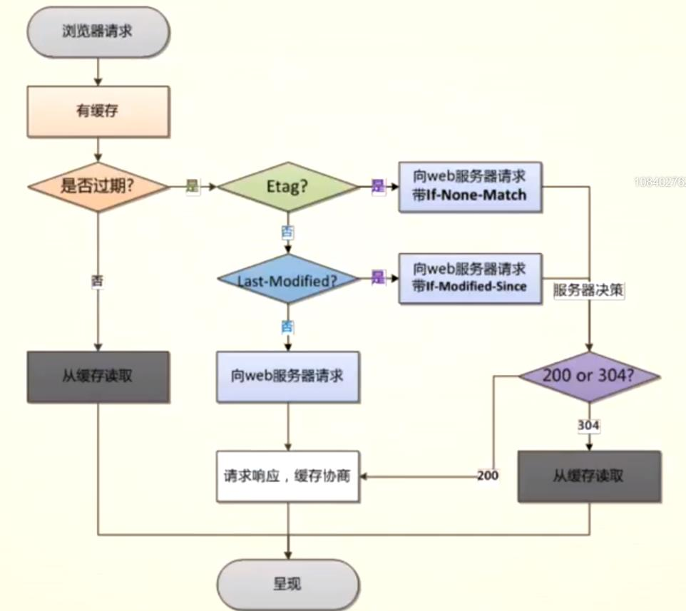

## 缓存优点：减少延迟与带宽消耗

## 缓存分类：强制缓存与对比缓存

> ### Cache-Control

     设置过期的时间⻓度（秒）

在这个时间范围内，浏览器请求都会直接读缓存。当 expires 和 cache-control 都存在时，cache-control 的优先级更⾼

> ### Expires

     用于控制请求文件的有效时间

当缓存中数据失效或过期，才决定从服务器更新数据,或者缓存被情空，否则将不会发出请求。
缺陷在于，服务器时间和用户端时间可能存在不⼀致，所以 HTTP/1.1 加⼊了 cache-control 头来改进这个问题。

> ### Etag / if-none-match

    资源的值的唯一标识（类似MD5）

开启 Etag 后，服务器端返回资源时，如果头部带上了 **etag: "D5FC8B85A045FF720547BC36FC872550"**，那么资源下次请求时就会把值加⼊到请求头**if-none-match: "D5FC8B85A045FF720547BC36FC872550"**，服务器可以对⽐这个值，确定资源是否发⽣变化，如果没有发⽣变化，则返回 304，否则 200（并且返回新的 Etag 进行缓存协商，生成新的规则，并缓存）

> ### Last-modified / if-modified-since

    资源最后一次修改的时间戳

开启 Last-modified 后，服务器端返回资源时，如果头部带上了**last-modified: Wed, 16 May 2018 02:57:16 GMT**，那么资源下次请求时就会把值加⼊到请求头 **if-modified-since：Wed, 16 May 2018 05:55:38 GMT**，服务器可以对⽐这个值，确定资源是否发⽣变化，如果没有发⽣变化，则返回 304

> ### Tips

1. 分布式系统里多台机器间文件的 last-modified 必须保持一致，以免负载均衡到不同机器导致比对失败
2. 分布式系统尽量关闭掉 Etag(每台机器生成的 etag 都会不一样)
3. max-age 和 Expires 同时存在，则被 Cache-Control 的 max-age 覆盖
