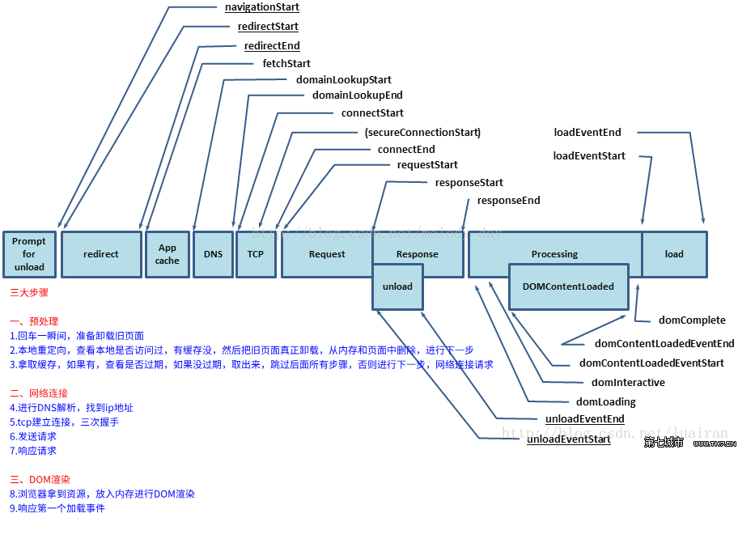
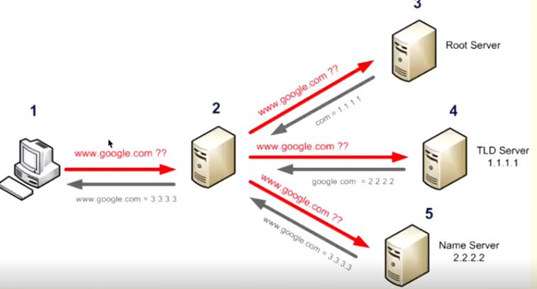

## 时间节点图

    1.  本地重定向
    2.  DNS 解析
    3.  TCP 握手
    4.  http 请求，响应
    5.  浏览器 DOM 解析
    6.  内容显示在屏幕上

> #### DNS 解析

**DNS 的作用就是通过域名查询到具体的 IP**

    因为 IP 存在数字和英文的组合（IPv6），很不利于人类记忆，所以就出现了域名。你可以把域名看成是某个 IP 的别名，DNS 就是去查询这个别名的真正名称是什么。

    在 TCP 握手之前就已经进行了 DNS 查询，这个查询是操作系统自己做的。当你在浏览器中想访问`www.google.com`时，会进行一下操作：

    1.  操作系统会首先在本地缓存中查询 IP
    2.  没有的话会去运营商的 DNS 服务器中查询
    3.  如果这时候还没得话，会直接去 DNS 根服务器（root server）查询，这一步查询会找出负责`com`这个域名的服务器,返回给运营商服务器
    4.  运营商 DNS 服务器拿到这个服务器信息，然后去该服务器（tld server）查询`google.com`顶级域名，（只返回顶级域名信息,下一步还得查找)
    5.  运营商 DNS 服务器拿到这个服务器信息，继续去查找域名服务器（name server）,查找到就会返回二级域名，三级域名等域名的信息 ip，并且缓存

> #### TCP 三次握手

**SYN（synchronize） / ACK（acknowledgement）**

**syn 和 ack 都是用来验证对方信息的标志**

    1.客户端端首先发送一个带 SYN （seq=x） 标志的数据包给对方 (x 属于自己端的编码系统规则,不能和服务端一样，否则会传输混乱)
    2.服务端收到后,回传一个带有 SYN (seq=y) / ACK=x+1 标志的数据包以示传达确认信息
    3.最后，客户端端再回传一个带 ACK =y+1 标志的数据包，代表“握手”结束

**为什么要三次握手：双方保证双方的数据(接收)都正常**

- 第一次握手：服务端确认 自己接收，对方发送正常
- 第二次握手：客户端确认自己发送和接收正常，对方发送和接收正常
- 第三次握手：服务端确认自己发送和接收正常，对方发送和接收正常

> #### TCP 四次挥手

**确保双方都能完全关闭连接**

    1. Client 端发起中断连接请求，也就是发送 FIN (**finish**) 报文。
      Server 端接到 FIN 报文后，知道 Client 端的意思是表示我没有数据要发了，但是如果你还有数据没有发送完成，则不必急着关闭 Socket，可以继续发送数据。
    2. 所以 Server 端先发送 ACK(告诉 Client 端，你的请求我收到了，但是我还没准备好，请继续你等我的消息),这个时候 Client 端就进入 FIN_WAIT 状态，继续等待 Server 端的 FIN 报文。
    3. 当 Server 端确定数据已发送完成，则向 Client 端发送 FIN 报文，"告诉 Client 端，好了，我这边数据发完了，准备好关闭连接了"。
    4. Client 端收到 FIN 报文后，"就知道可以关闭连接了，但是他还是不相信网络，怕 Server 端不知道要关闭，所以发送 ACK 后进入 TIME_WAIT 状态，如果 Server 端没有收到 ACK 则可以重传。“，Server 端收到 ACK 后，"就知道可以断开连接了"。
      Client 端等待了 2MSL 后依然没有收到回复，则证明 Server 端已正常关闭，那好，我 Client 端也可以关闭连接了。
      Ok，TCP 连接就这样关闭了。

> #### DOM 渲染

    浏览器开始解析文件，如果是 gzip 格式的话会先解压一下，然后通过文件的编码格式知道该如何去解码文件。

##### 1. 构建 DOM 树、构建 CSSOM 树、解析 JS

文件解码成功后会正式开始渲染流程，先会根据 HTML 构建 DOM 树，有 CSS 的话会去构建 CSSOM 树。如果遇到 script 标签的话，会判断是否存在 async 或者 defer ，前者会并行进行下载并执行 JS，后者会先下载文件，然后等待 HTML 解析完成后顺序执行。

如果以上都没有，就会阻塞住渲染流程直到 JS 执行完毕。遇到文件下载的会去下载文件，这里如果使用 HTTP/2 协议的话会极大的提高多图的下载效率。

##### 2. 生成 Render 树 

CSSOM 树和 DOM 树构建完成后会开始生成 Render 树，这一步就是确定页面元素的布局、样式等等诸多方面的东西

##### 3. 调用 GPU 绘制，合成图层，将内容显示在屏幕上了

在生成 Render 树的过程中，浏览器就开始调用 GPU 绘制，合成图层，将内容显示在屏幕上了。

#### **过程**

    通过请求response 获取资源后  => 解析HTML与CSS(解析器)   => 生成 DOM Tree与 Style Rules => 合并生成 Render Tree => CPU重排（layout）=> GPU重绘（paint）=> 显示（display）

#### **render Tree** 
    
   1. render Tree  也叫 layout Tree,生成之后由C++ skia 引擎对页面一点点绘制的（类似Canvas绘制，而canvas是基于skia之上封装开放给浏览器的api）

   2. 为什么需要dom Tree 和 css Tree  合并成 render Tree : 因为合并后才知道 css Tree  对  dom Tree 哪些节点进行渲染和隐藏，得出最后需要的节点render Tree,才进行渲染

