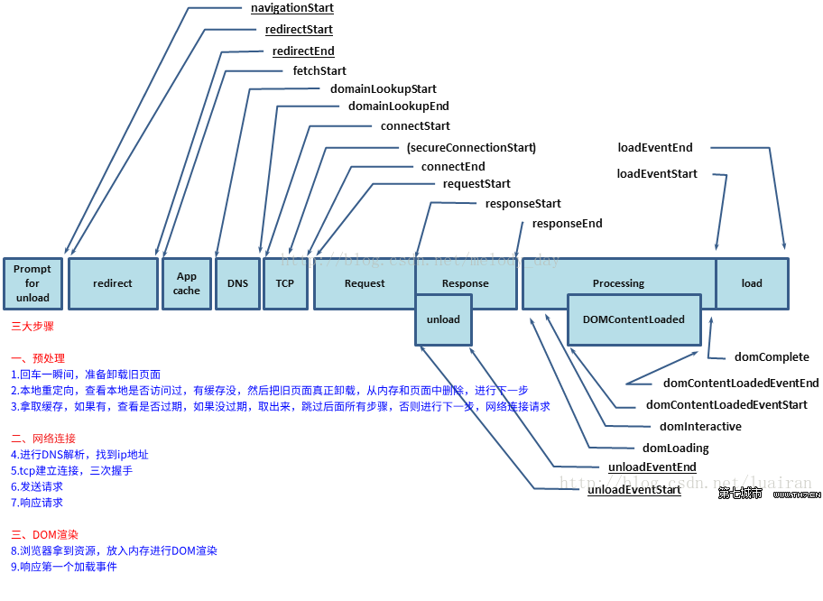

# 时间节点图



      navigationStart：当前浏览器窗口的前一个网页关闭，发生unload事件时的Unix毫秒时间戳。如果没有前一个网页，则等于fetchStart属性。

      unloadEventStart：如果前一个网页与当前网页属于同一个域名，则返回前一个网页的unload事件发生时的Unix毫秒时间戳。如果没有前一个网页，或者之前的网页跳转不是在同一个域名内，则返回值为0。

      unloadEventEnd：如果前一个网页与当前网页属于同一个域名，则返回前一个网页unload事件的回调函数结束时的Unix毫秒时间戳。如果没有前一个网页，或者之前的网页跳转不是在同一个域名内，则返回值为0。

      redirectStart：返回第一个HTTP跳转开始时的Unix毫秒时间戳。如果没有跳转，或者不是同一个域名内部的跳转，则返回值为0。

      redirectEnd：返回最后一个HTTP跳转结束时（即跳转回应的最后一个字节接受完成时）的Unix毫秒时间戳。如果没有跳转，或者不是同一个域名内部的跳转，则返回值为0。

      fetchStart：返回浏览器准备使用HTTP请求读取文档时的Unix毫秒时间戳。该事件在网页查询本地缓存之前发生。

      domainLookupStart：返回域名查询开始时的Unix毫秒时间戳。如果使用持久连接，或者信息是从本地缓存获取的，则返回值等同于fetchStart属性的值。

      domainLookupEnd：返回域名查询结束时的Unix毫秒时间戳。如果使用持久连接，或者信息是从本地缓存获取的，则返回值等同于fetchStart属性的值。

      connectStart：返回HTTP请求开始向服务器发送时的Unix毫秒时间戳。如果使用持久连接（persistent connection），则返回值等同于fetchStart属性的值。

      connectEnd：返回浏览器与服务器之间的连接建立时的Unix毫秒时间戳。如果建立的是持久连接，则返回值等同于fetchStart属性的值。连接建立指的是所有握手和认证过程全部结束。

      secureConnectionStart：返回浏览器与服务器开始安全链接的握手时的Unix毫秒时间戳。如果当前网页不要求安全连接，则返回0。

      requestStart：返回浏览器向服务器发出HTTP请求时（或开始读取本地缓存时）的Unix毫秒时间戳。

      responseStart：返回浏览器从服务器收到（或从本地缓存读取）第一个字节时的Unix毫秒时间戳。

      responseEnd：返回浏览器从服务器收到（或从本地缓存读取）最后一个字节时（如果在此之前HTTP连接已经关闭，则返回关闭时）的Unix毫秒时间戳。

      domLoading：返回当前网页DOM结构开始解析时（即Document.readyState属性变为“loading”、相应的readystatechange事件触发时）的Unix毫秒时间戳。

      domInteractive：返回当前网页DOM结构结束解析、开始加载内嵌资源时（即Document.readyState属性变为“interactive”、相应的readystatechange事件触发时）的Unix毫秒时间戳。

      domContentLoadedEventStart：返回当前网页DOMContentLoaded事件发生时（即DOM结构解析完毕、所有脚本开始运行时）的Unix毫秒时间戳。

      domContentLoadedEventEnd：返回当前网页所有需要执行的脚本执行完成时的Unix毫秒时间戳。

      domComplete：返回当前网页DOM结构生成时（即Document.readyState属性变为“complete”，以及相应的readystatechange事件发生时）的Unix毫秒时间戳。

      loadEventStart：返回当前网页load事件的回调函数开始时的Unix毫秒时间戳。如果该事件还没有发生，返回0。

      loadEventEnd：返回当前网页load事件的回调函数运行结束时的Unix毫秒时间戳。如果该事件还没有发生，返回0。

# 性能指标


> ### PerformanceTiming

```javascript

   let timing = performance.timing
   let performance = {
        // DNS解析时间
        dnst: timing.domainLookupEnd - timing.domainLookupStart || 0,
        //TCP建立时间
        tcpt: timing.connectEnd - timing.connectStart || 0,
        // 白屏时间
        wit: timing.responseStart - timing.navigationStart || 0,
        //dom渲染完成时间
        domt: timing.domContentLoadedEventEnd - timing.navigationStart || 0,
        //页面onload时间
        lodt: timing.loadEventEnd - timing.navigationStart || 0,
        // 页面准备时间
        radt: timing.fetchStart - timing.navigationStart || 0,
        // 页面重定向时间
        rdit: timing.redirectEnd - timing.redirectStart || 0,
        // unload时间
        uodt: timing.unloadEventEnd - timing.unloadEventStart || 0,
        //request请求耗时
        reqt: timing.responseEnd - timing.requestStart || 0,
        //页面解析dom耗时
        andt: timing.domComplete - timing.domInteractive || 0,
    }
```

> ### PerformanceObserver

PerformanceObserver 为我们提供的新功能是，能够在性能事件发生时订阅这些事件，并以异步方式响应事件。 此 API 取代旧的 PerformanceTiming 界面，后者通常需要执行轮询才能查看数据可用的时间

```javascript
 <script>

      const observer = new PerformanceObserver(list => {
        for (const entry of list.getEntries()) {
           if (entry.name === 'first-paint') {
              console.log(`首次绘制 (FP)时间, ${parseInt(entry.startTime) / 1000} s`)
            }
            if (entry.name === 'first-contentful-paint') {
              console.log( `首次内容绘制 (FCP)时间, ${parseInt(entry.startTime) / 1000}  s`)
            }
          console.log(entry.name);
          console.log(entry.startTime);
          console.log(entry.duration);
          console.log(entry.entryType);
          console.log(entry.initiatorType);
          console.log(
            `~~~~~~~~~~~~~~~~~~~~~~~~~~~~~~~~~~~~~~~~~~~~~~~~~~~~~~~~~~~~~~~~~~~`
          );
        }
      });

      //paint 测量绘制 时间
      //longtask 测量js某任务运行耗时最长时间
      observer.observe({
        entryTypes: ['paint', 'longtask']
      });
    </script>
```

> ### 自定义标记测量

```javascript
 <body>
    <script>
      performance.mark('test-start');
    </script>

    <div>
      dom test
    </div>

    <script>
      performance.mark('test-end');
      performance.measure('test', 'test-start', 'test-end');
      // 获取所有名称为mySetTimeout的measures
      var measures = performance.getEntriesByName('test');
      var measure = measures[0];
      console.log('dom test 加载 耗费的时间:', measure.duration);

      // 清除标记
      performance.clearMarks();
      performance.clearMeasures();
      // performance.clearMarks('laoyuan');
    </script>
  </body>
```
