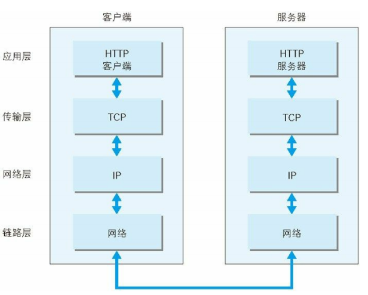
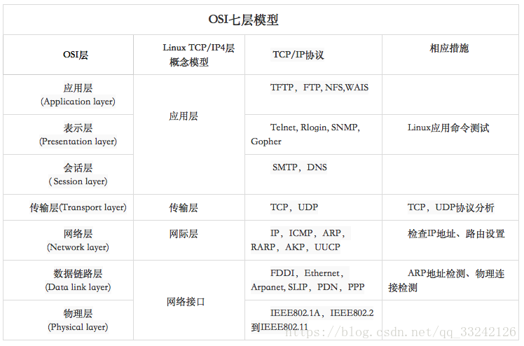

## 一、协议

**协议即：计算机与网络设备相互通信规则，是通信计算机双方必须共同遵从的一组约定**

---

## 二、分层

**分层目的：各层之间的接口部分规划好之后，每个层次内部的设计就能够自由改动**

> ### TCP/IP 四层

**TCP/IP: 互联网相关联的协议集合总称**

1. 数据链路层（网络接口层）
2. 网络层
3. 传输层
4. 应用层

   

   **五层:为了方便理解 将网络接口层划分为了物理层和数据链路层两层**

> ### OSI 七层

**OSI 是一个理论上的网络通信模型，而 TCP/IP 则是实际运行的网络协议。**

1. 物理层
2. 数据链路层
3. 网络层
4. 传输层
5. 会话层
6. 表示层
7. 应用层

   

> ### 模型比较

**共同点**

（1）OSI 参考模型和 TCP/IP 参考模型都采用了层次结构的概念。

（2）都能够提供面向连接和无连接两种通信服务机制。

**不同点**

（1）OSI 采用的七层模型，而 TCP/IP 是四层结构。

（2）TCP/IP 参考模型的网络接口层实际上并没有真正的定义，只是一些概念性的描述。而 OSI 参考模型不仅分了两层，而且每一层的功能都很详尽，甚至在数据链路层又分出一个介质访问子层，专门解决局域网的共享介质问题。

（3）OSI 模型是在协议开发前设计的，具有通用性。TCP/IP 是先有协议集然后建立模型，不适用于非 TCP/IP 网络。

（4）OSI 参考模型与 TCP/IP 参考模型的传输层功能基本相似，都是负责为用户提供真正的端对端的通信服务，也对高层屏蔽了底层网络的实现细节。所不同的是 TCP/IP 参考模型的传输层是建立在网络互联层基础之上的，而网络互联层只提供无连接的网络服务，所以面向连接的功能完全在 TCP 协议中实现，当然 TCP/IP 的传输层还提供无连接的服务，如 UDP；相反 OSI 参考模型的传输层是建立在网络层基础之上的，网络层既提供面向连接的服务，又提供无连接的服务，但传输层只提供面向连接的服务。

（5）OSI 参考模型的抽象能力高，适合与描述各种网络；而 TCP/IP 是先有了协议，才制定 TCP/IP 模型的。

（6）OSI 参考模型的概念划分清晰，但过于复杂；而 TCP/IP 参考模型在服务、接口和协议的 区别上不清楚，功能描述和实现细节混在一起。

（7）TCP/IP 参考模型的网络接口层并不是真正的一层；OSI 参考模型的缺点是层次过多，划分意义不大但增加了复杂性。

（8）OSI 参考模型虽然被看好，由于没把握好时机，技术不成熟，实现困难；相反，TCP/IP 参考模型虽然有许多不尽人意的地方，但还是比较成功的。

---

# 三、HTTP 关系密切的协议

**IP、TCP、DNS**

---

> ### IP 协议

**IP（Internet Protocol）网际协议位于网络层**

1. IP 协议的作用:是把各种数据包传送给对方。而要保证确实传送到对方
   那里，则需要满足各类条件。其中两个重要的条件是 IP 地址和 MAC
   地址（Media Access Control Address）

2. IP 地址指明了节点被分配到的地址，MAC 地址是指网卡所属的固定
   地址。IP 地址可以和 MAC 地址进行配对。IP 地址可变换，但 MAC
   地址基本上不会更改。

3. 使用 ARP 协议凭借 MAC 地址进行通信

4. MAC 地址位于 OSI 第二层，即数据链路层，IP 地址位于 OSI 第三层，即网络层
