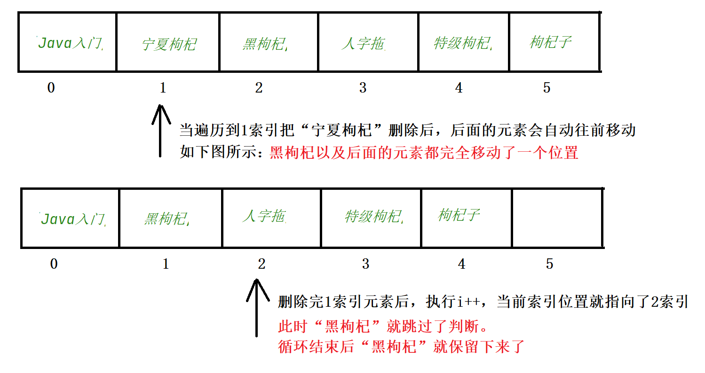
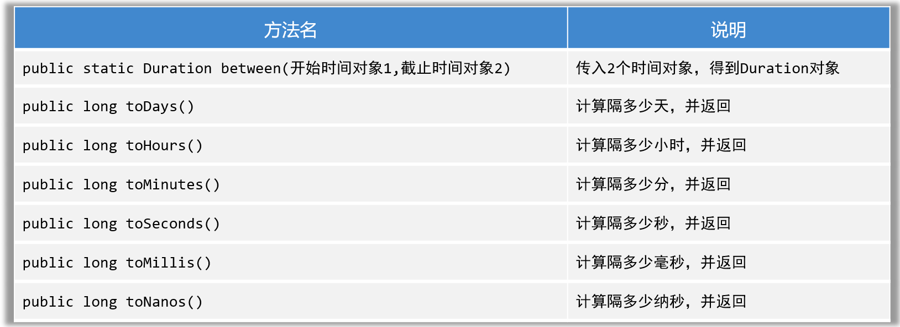

# Java常用API

## 一、包

**1. 什么是包**

在学习API类之前，我们先要学习包。因为Java官方提供的类有很多，为了对这些类进行分门别类的管理，别人把写好的类都是放在不同的包里的。

包其实类似于文件夹，一个包中可以放多个类文件。如下图所示


建包的语法格式：

```java
//类文件的第一行定义包
package com.itheima.javabean;

public class 类名{
    
}
```


**2. 在自己的程序中，调用其他包中的程序，需要注意下面一个问题**

- 如果当前程序中，要调用自己所在包下的其他程序，可以直接调用。（同一个包下的类，互相可以直接调用）

- 如果当前程序中，要调用其他包下的程序，则必须在当前程序中导包, 才可以访问！

  导包格式：` import 包名.类名`

- 如果当前程序中，要调用Java.lang包下的程序，不需要我们导包的，可以直接使用。

- 如果当前程序中，要调用多个不同包下的程序，而这些程序名正好一样，此时默认只能导入一个程序，另一个程序必须带包名访问。


## 二、String类

### 1. String类概述

各位同学，接下来我们学习String这个类，也就是学对字符串进行处理。为什么要学习字符串处理呢？因为在开发中对于字符串的处理还是非常常见的。

比如：在用户登录时，用户输入的用户名和密码送到后台，需要和正确的用户名和密码进行校验，这就需要用到String类提供的比较功能。


再比如：同学们在直播留言时，有些小伙伴可能不太文明说了一些脏话，后台检测到你输入的是脏话，就会用`***`把脏话屏蔽掉。这也需要用到String类提供的替换功能


Java为了方便我们处理字符串，所以给我们提供了一个String类来代表字符串，这个类就是`java.lang`包下。

按照面向对象的编程思想，对于字符串的操作，只需要创建字符串对象，用字符串对象封装字符串数据，然后调用String类的方法就可以了。


----


### 2. String创建对象

接下来我们打开String类的API，看一下String类的对象如何创建。如下图所示


String类的API中，有这么一句话：“Java程序中的所有字符串字面值（如"abc"）都是字符串的实例实现”。这里所说的实例实现，其实指的就是字符串对象。

意思就是：**所有Java的字符串字面值，都是字符串对象。**

- 所以创建String对象的第一种方式就有了

```java
String s1 = "abc"; //这里"abc"就是一个字符串对象，用s1变量接收

String s2 = "黑马程序员"; //这里的“黑马程序员”也是一个字符串对象，用s2变量接收
```

- 创建String对象还有第二种方式，就是利用String类的构造方法创建String类的对象。


我们前面学习过类的构造方法，执行构造方法需要用到new关键字。`new String(参数)`就是在执行String类的构造方法。 

下面我们演示通过String类的构造方法，创建String类的对象

```java
// 1、直接双引号得到字符串对象，封装字符串数据
String name = "黑马666";
System.out.println(name);

// 2、new String创建字符串对象，并调用构造器初始化字符串
String rs1 = new String();
System.out.println(rs1); // ""

String rs2 = new String("itheima");
System.out.println(rs2);

char[] chars = {'a', '黑', '马'};
String rs3 = new String(chars);
System.out.println(rs3);

byte[] bytes = {97, 98, 99};
String rs4 = new String(bytes);
System.out.println(rs4);
```

关于String类是用来干什么的，以及String类对象的创建我们就学习到这里。最后总结一下

```java
1. String是什么，可以做什么？
	答：String代表字符串，可以用来创建对象封装字符串数据，并对其进行处理。

2.String类创建对象封装字符串数据的方式有几种？
	方式一： 直接使用双引号“...” 。
	方式二：new String类，调用构造器初始化字符串对象。
```


### 3. String类的常用方法

各位同学，在上一节课中，我们学习了如何通过字符串对象封装数据，接下来我们学习调用String类的方法对象字符串数据进行处理。

这里已经将String类的常用方法，给同学们挑出来了，我们先快速的认识一下。为什么是快速认识一下呢？因为API真正的作用是来解决业务需求的，如果不解决业务需求，只是记API是很难记住的。


所以API的正确打开方式是，先找到这个类，把这个类中的方法先用代码快速过一遍，有一个大概印象就行。然后再具体的案例中，选择你需要的方法来用就行。

下面我们就把String类中的方法，按照方法的调用规则，先快速过一遍。（注意：第一次调用API方法，都是看着API方法来调用用的，不是背的）

```java
public class StringDemo2 {
    public static void main(String[] args) {
        //目标：快速熟悉String提供的处理字符串的常用方法。
        String s = "黑马Java";
        // 1、获取字符串的长度
        System.out.println(s.length());

        // 2、提取字符串中某个索引位置处的字符
        char c = s.charAt(1);
        System.out.println(c);

        // 字符串的遍历
        for (int i = 0; i < s.length(); i++) {
            // i = 0 1 2 3 4 5
            char ch = s.charAt(i);
            System.out.println(ch);
        }

        System.out.println("-------------------");

        // 3、把字符串转换成字符数组，再进行遍历
        char[] chars = s.toCharArray();
        for (int i = 0; i < chars.length; i++) {
            System.out.println(chars[i]);
        }

        // 4、判断字符串内容，内容一样就返回true
        String s1 = new String("黑马");
        String s2 = new String("黑马");
        System.out.println(s1 == s2); // false
        System.out.println(s1.equals(s2)); // true

        // 5、忽略大小写比较字符串内容
        String c1 = "34AeFG";
        String c2 = "34aEfg";
        System.out.println(c1.equals(c2)); // false
        System.out.println(c1.equalsIgnoreCase(c2)); // true

        // 6、截取字符串内容 (包前不包后的)
        String s3 = "Java是最好的编程语言之一";
        String rs = s3.substring(0, 8);
        System.out.println(rs);

        // 7、从当前索引位置一直截取到字符串的末尾
        String rs2 = s3.substring(5);
        System.out.println(rs2);

        // 8、把字符串中的某个内容替换成新内容，并返回新的字符串对象给我们
        String info = "这个电影简直是个垃圾，垃圾电影！！";
        String rs3 = info.replace("垃圾", "**");
        System.out.println(rs3);

        // 9、判断字符串中是否包含某个关键字
        String info2 = "Java是最好的编程语言之一，我爱Java,Java不爱我！";
        System.out.println(info2.contains("Java"));
        System.out.println(info2.contains("java"));
        System.out.println(info2.contains("Java2"));

        // 10、判断字符串是否以某个字符串开头。
        String rs4 = "张三丰";
        System.out.println(rs4.startsWith("张"));
        System.out.println(rs4.startsWith("张三"));
        System.out.println(rs4.startsWith("张三2"));

        // 11、把字符串按照某个指定内容分割成多个字符串，放到一个字符串数组中返回给我们
        String rs5 = "张无忌,周芷若,殷素素,赵敏";
        String[] names = rs5.split(",");
        for (int i = 0; i < names.length; i++) {
            System.out.println(names[i]);
        }
    }
}
```

演示完String类的这些方法之后，我们对字符串有哪些方法，就已经有一个大致印象了。至少知道String字符串能干哪些事情。

至于String类的这些方法是否都记住了，这个还需要通过一些案例训练，在用的过程中去找哪个方法能够解决你的实际需求，就用哪个方法。同一个方法用的次数多个，自然就记住了。


### 4. String的注意事项

在上一节，我们学习了字符串的一些常用方法，在实际工作中用这些方法解决字符串的常见问题是完全足够的，但是在面试时可能会问一些原理性的东西。

所以把字符串原理性的内容，就当做注意事项来学习一下。一共有下面的2点：


- **注意事项1：String类的对象是不可变的对象**

我们先看一段代码，分析这段代码的结果


以上代码中，先定义了一个String变量 name第一次赋值为`“黑马”;` 然后对`name`变量记录的字符串进行两次拼接，第一次拼接`“程序员”`，第二次拼接`“播妞”`；我们发现得到的结果是：`黑马程序员播妞`

这里问题就来了，你不是是说：**String类的对象是不可变的字符串对象吗？**我看name的值变了呀！！！


下面我们就解释一下，String是不可变对象到底是什么含义。

需要注意的是：只要是以`“”`方式写出的字符串对象，会在堆内存中的**字符串常量池**中存储。

执行第一句话时，会在堆内存的常量池中，创建一个字符串对象`“黑马”`，然后把`“黑马”`的地址赋值给`String name`


当执行第二句话时，又会再堆内存的常量池中创建一个字符串`“程序员”`，和`“黑马”`拼接，拼接之后还会产生一个新的字符串对象`”黑马程序员“`，然后将新产生的`“黑马程序员”`对象的地址赋值给`String name`变量。


此时你会发现，之前创建的字符串对象`“黑马”`内容确实是没有改变的。所以说String的对象是不可变的。


- **注意事项2：字符串字面量和new出来字符串的区别**
  1. 只要是以`“...”`方式写出的字符串对象，会存储到字符串常量池，且相同内容的字符串只存储一份。如下图一所示
  2. 但通过`new`方式创建字符串对象，每new一次都会产生一个新的对象放在堆内存中。如下图二所示


- 总结一下，字符串的注意事项。

```java
1. String是不可变字符串对象
2. 只要是以“...”方式写出的字符串对象，会存储到字符串常量池，且相同内容的字符串只存储一份；
3. 但通过new方式创建字符串对象，每new一次都会产生一个新的对象放在堆内存中。
```


### 5. String案例一：用户登录案例

接下来给大家做一个案例，使用字符串的功能完成登录案例。案例需求如下：


```java
分析一下完成案例的步骤：
	1.首先，从登录界面上可以得出，需要让用户输入登录名和密码
	2.设计一个登录方法，对用户名和密码进行校验
	3.调用登录方法，根据方法的返回结果，判断登录是否成功。
	4.如果登录失败，循环登录3次，结束循环；如果登录成功，跳出循环;
```

案例分析的步骤完成代码

```java
/**
   目标：完成用户的登录案例。
 */
public class StringTest4 {
    public static void main(String[] args) {
        // 1、开发一个登录界面
        for (int i = 0; i < 3; i++) {
            Scanner sc = new Scanner(System.in);
            System.out.println("请您输入登录名称：");
            String loginName = sc.next();
            System.out.println("请您输入登录密码：");
            String passWord = sc.next();

            // 5、开始调用登录方法，判断是否登录成功
            boolean rs = login(loginName, passWord);
            if(rs){
                System.out.println("恭喜您，欢迎进入系统~~");
                break; // 跳出for循环，代表登录完成
            }else {
                System.out.println("登录名或者密码错误，请您确认~~");
            }
        }
    }

    /**
      2、开发一个登录方法，接收用户的登录名和密码，返回认证的结果
     */
    public static boolean login(String loginName, String passWord){
        // 3、准备一份系统正确的登录名和密码
        String okLoginName = "itheima";
        String okPassWord = "123456";

        // 4、开始正式判断用户是否登录成功
        /*if(okLoginName.equals(loginName) && okPassWord.equals(passWord)){
            // 登录成功的
            return true;
        }else {
            return false;
        }*/
        return okLoginName.equals(loginName) && okPassWord.equals(passWord);
    }
}
```

### 6. String案例二：随机产生验证码

接下来学习一个再工作中也比较常见的案例，使用String来开发验证码。需求如下：


```java
根据需求分析，步骤如下：
	1.首先，设计一个方法，该方法接收一个整型参数，最终要返回对应位数的随机验证码。
	2.方法内定义2个字符串变量：
		1个用来记住生成的验证码，1个用来记住要用到的全部字符。
	3.定义for循环控制生成多少位随机字符
	4.每次得到一个字符范围内的随机索引
	5.根据索引提取该字符，把该字符交给code变量连接起
	6.循环结束后，在循环外返回code即可。
	7.在主方法中调用生成验证码的方法
```

根据步骤完成代码

```java
import java.util.Random;
/**
    目标：完成随机产生验证码，验证码的每位可能是数字、大写字母、小写字母
 */
public class StringTest5 {
    public static void main(String[] args) {
        System.out.println(createCode(4));
        System.out.println(createCode(6));
    }
    /**
       1、设计一个方法，返回指定位数的验证码
     */
    public static String createCode(int n){
        // 2、定义2个变量 
        //一个是记住最终产生的随机验证码 
        //一个是记住可能用到的全部字符
        String code = "";
        String data = "abcdefghijklmnopqrstuvwxyzABCDEFGHIJKLMNOPQRSTUVWXYZ0123456789";

        Random r = new Random();
        // 3、开始定义一个循环产生每位随机字符
        for (int i = 0; i < n; i++) {
            // 4、随机一个字符范围内的索引。
            int index = r.nextInt(data.length());
            // 5、根据索引去全部字符中提取该字符
            code += data.charAt(index); // code = code + 字符
        }
        // 6、返回code即可
        return code;
    }
}
```

关于String的案例，我们先练习到这里。以后遇到对字符串进行操作的需求，优先找String类有没有提供对应的方法。


## 三、ArrayList类

### 1. ArrayList快速入门

学习完String类之后，接下来再学习一个类——叫ArrayList。 

ArrayList表示一种集合，它是一个容器，用来装数据的，类似于数组。那有了数组，为什么要有集合呢？

因为数组一旦创建大小不变，比如创建一个长度为3的数组，就只能存储3个元素，想要存储第4个元素就不行。而集合是大小可变的，想要存储几个元素就存储几个元素，在实际工作中用得更多。

然后集合有很多种，而ArrayList只是众多集合中的一种，跟多的集合我们在就业班的课程中再学习。如下图所示：


集合该怎么学呢？1. 首先你要会创建集合对象，2. 然后能够调用集合提供的方法对容器中的数据进行增删改查，3. 最后知道集合的一些特点就可以了。


### 2. ArrayList常用方法

想要使用ArrayList存储数据，并对数据进行操作：

- 第一步：创建ArrayList容器对象。一般使用空参数构造方法，如下图所示：

- 第二步：调用ArrayList类的常用方法对容器中的数据进行操作。常用方法如下：


接下来我们把ArrayList集合的这些方法快速的熟悉一下：

```java
/**
目标：要求同学们掌握如何创建ArrayList集合的对象，并熟悉ArrayList提供的常用方法。
 */
public class ArrayListDemo1 {
    public static void main(String[] args) {
        // 1、创建一个ArrayList的集合对象
        // ArrayList<String> list = new ArrayList<String>();
        // 从jdk 1.7开始才支持的
        ArrayList<String> list = new ArrayList<>();

        list.add("黑马");
        list.add("黑马");
        list.add("Java");
        System.out.println(list);

        // 2、往集合中的某个索引位置处添加一个数据
        list.add(1, "MySQL");
        System.out.println(list);

        // 3、根据索引获取集合中某个索引位置处的值
        String rs = list.get(1);
        System.out.println(rs);

        // 4、获取集合的大小（返回集合中存储的元素个数）
        System.out.println(list.size());

        // 5、根据索引删除集合中的某个元素值，会返回被删除的元素值给我们
        System.out.println(list.remove(1));
        System.out.println(list);

        // 6、直接删除某个元素值，删除成功会返回true，反之
        System.out.println(list.remove("Java"));
        System.out.println(list);

        list.add(1, "html");
        System.out.println(list);

        // 默认删除的是第一次出现的这个黑马的数据的
        System.out.println(list.remove("黑马"));
        System.out.println(list);

        // 7、修改某个索引位置处的数据，修改后会返回原来的值给我们
        System.out.println(list.set(1, "黑马程序员"));
        System.out.println(list);
    }
}
```

### 3. ArrayList应用案例1

接下来，我们学习一个ArrayList的应用案例，需求如下：


我们分析一下这个案例的步骤该如何实现：

```java
1.用户可以选购多个商品，可以创建一个ArrayList集合，存储这些商品
2.按照需求，如果用户选择了"枸杞"批量删除，应该删除包含"枸杞"的所有元素
	1)这时应该遍历集合中每一个String类型的元素
	2)使用String类的方法contains判断字符串中是否包含"枸杞"
    3)包含就把元素删除
3.输出集合中的元素，看是否包含"枸杞"的元素全部删除
```

按照分析的步骤，完成代码

```java
public class ArrayListTest2 {
    public static void main(String[] args) {
        // 1、创建一个ArrayList集合对象
        ArrayList<String> list = new ArrayList<>();
        list.add("枸杞");
        list.add("Java入门");
        list.add("宁夏枸杞");
        list.add("黑枸杞");
        list.add("人字拖");
        list.add("特级枸杞");
        list.add("枸杞子");
        System.out.println(list);
        //运行结果如下： [Java入门, 宁夏枸杞, 黑枸杞, 人字拖, 特级枸杞, 枸杞子]
       
        // 2、开始完成需求：从集合中找出包含枸杞的数据并删除它
        for (int i = 0; i < list.size(); i++) {
            // i = 0 1 2 3 4 5
            // 取出当前遍历到的数据
            String ele = list.get(i);
            // 判断这个数据中包含枸杞
            if(ele.contains("枸杞")){
                // 直接从集合中删除该数据
                list.remove(ele);
            }
        }
        System.out.println(list);
        //删除后结果如下：[Java入门, 黑枸杞, 人字拖, 枸杞子]
    }
}
```

运行完上面代码，我们会发现，删除后的集合中，竟然还有`黑枸杞`，`枸杞子`在集合中。这是为什么呢？



枸杞子被保留下来，原理是一样的。可以自行分析。

那如何解决这个问题呢？这里打算给大家提供两种解决方案：

- **集合删除元素方式一**：每次删除完元素后，让控制循环的变量`i--`就可以了；如下图所示


具体代码如下：

```java
// 方式一：每次删除一个数据后，就让i往左边退一步
for (int i = 0; i < list.size(); i++) {
    // i = 0 1 2 3 4 5
    // 取出当前遍历到的数据
    String ele = list.get(i);
    // 判断这个数据中包含枸杞
    if(ele.contains("枸杞")){
        // 直接从集合中删除该数据
        list.remove(ele);
        i--;
    }
}
System.out.println(list);
```


- **集合删除元素方式二**：我们只需要倒着遍历集合，在遍历过程中删除元素就可以了


具体代码如下：

```java
// 方式二：从集合的后面倒着遍历并删除
// [Java入门, 人字拖]
//   i
for (int i = list.size() - 1; i >= 0; i--) {
    // 取出当前遍历到的数据
    String ele = list.get(i);
    // 判断这个数据中包含枸杞
    if(ele.contains("枸杞")){
        // 直接从集合中删除该数据
        list.remove(ele);
    }
}
System.out.println(list);
```


### 4. ArrayList应用案例2

各位同学，上一个ArrayList应用案例中，我们往集合存储的元素是String类型的元素，实际上在工作中我们经常往集合中自定义存储对象。

接下来我们做个案例，用来往集合中存储自定义的对象，先阅读下面的案例需求：


分析需求发现：

1. 在外卖系统中，每一份菜都包含，菜品的名称、菜品的原价、菜品的优惠价、菜品的其他信息。那我们就可以定义一个菜品类（Food类），用来描述每一个菜品对象要封装那些数据。
2. 接着再写一个菜品管理类（FoodManager类），提供展示操作界面、上架菜品、浏览菜品的功能。

- 首先我们先定义一个菜品类（Food类），用来描述每一个菜品对象要封装那些数据。

```java
public class Food {
    private String name;	//菜品名称
    private double originalPrice; //菜品原价
    private double specialPrice; //菜品优惠价
    private String info; //菜品其他信息

    public Food() {
    }

    public Food(String name, double originalPrice, double specialPrice, String info) {
        this.name = name;
        this.originalPrice = originalPrice;
        this.specialPrice = specialPrice;
        this.info = info;
    }

    public String getName() {
        return name;
    }

    public void setName(String name) {
        this.name = name;
    }

    public double getOriginalPrice() {
        return originalPrice;
    }

    public void setOriginalPrice(double originalPrice) {
        this.originalPrice = originalPrice;
    }

    public double getSpecialPrice() {
        return specialPrice;
    }

    public void setSpecialPrice(double specialPrice) {
        this.specialPrice = specialPrice;
    }

    public String getInfo() {
        return info;
    }

    public void setInfo(String info) {
        this.info = info;
    }
}
```

- 接下来写一个菜品管理类，提供**上架菜品的功能、浏览菜品的功能、展示操作界面的功能。**

```java
public class FoodManager{
    //为了存储多个菜品，预先创建一个ArrayList集合；
    //上架菜品时，其实就是往集合中添加菜品对象
    //浏览菜品时，其实就是遍历集合中的菜品对象，并打印菜品对象的属性信息。
    private ArrayList<Food> foods = new ArrayList<>(); 
    //为了在下面的多个方法中，能够使用键盘录入，提前把Scanner对象创建好；
    private Scanner sc = new Scanner(System.in);
   
    /**
     1、商家上架菜品
     */
    public void add(){
        System.out.println("===菜品上架==");
        // 2、提前创建一个菜品对象，用于封装用户上架的菜品信息
        Food food = new Food();
        System.out.println("请您输入上架菜品的名称：");
        String name = sc.next();
        food.setName(name);

        System.out.println("请您输入上架菜品的原价：");
        double originalPrice = sc.nextDouble();
        food.setOriginalPrice(originalPrice);

        System.out.println("请您输入上架菜品的优惠价：");
        double specialPrice = sc.nextDouble();
        food.setSpecialPrice(specialPrice);

        System.out.println("请您输入上架菜品的其他信息：");
        String info = sc.next();
        food.setInfo(info);

        // 3、把菜品对象添加到集合容器中去
        foods.add(food);
        System.out.println("恭喜您，上架成功~~~");
    }

    /**
       2、菜品；浏览功能
     */
    public void printAllFoods(){
        System.out.println("==当前菜品信息如下：==");
        for (int i = 0; i < foods.size(); i++) {
            Food food = foods.get(i);
            System.out.println("菜品名称：" + food.getName());
            System.out.println("菜品原价：" + food.getOriginalPrice());
            System.out.println("菜品优惠价：" + food.getSpecialPrice());
            System.out.println("其他描述信息：" + food.getInfo());
            System.out.println("------------------------");
        }
    }
    /**
    3、专门负责展示系统界面的
    */
    public void start(){
        while (true) {
            System.out.println("====欢迎进入商家后台管理系统=====");
            System.out.println("1、上架菜品（add）");
            System.out.println("2、浏览菜品（query）");
            System.out.println("3、退出系统（exit）");
            System.out.println("请您选择操作命令：");
            String command = sc.next();
            switch (command) {
                case "add":
                    add();
                    break;
                case "query":
                    printAllFoods();
                    break;
                case "exit":
                    return; // 结束当前方法！
                default:
                    System.out.println("您输入的操作命令有误~~");
            }
        }
	}
}
```

- 最后在写一个测试类Test，在测试类中进行测试。其实测试类，只起到一个启动程序的作用。

```java
public class Test {
    public static void main(String[] args) {
        FoodManager manager = new FoodManager();
        manager.start();
    }
}
```

运行结果如下：需要用户输入add、query或者exit，选择进入不同的功能。


好了，如果你能够把这个案例写出来，说明你对面向对象的思维封装数据，以及使用ArrayList容器存储数据，并对数据进行处理这方面的知识已经运用的很熟悉了。


## 四、 Object类

各位小伙伴，我们要学习的第一个API就是Object类。Object类是Java中所有类的祖宗类，因此，Java中所有类的对象都可以直接使用Object类中提供的一些方法。

按照下图的提示，可以搜索到你想要找的类


我们找到Object类的下面两个方法


- **4.1.1 toString()方法**

我们先来学习toString()方法。

```java
public String toString()
    调用toString()方法可以返回对象的字符串表示形式。
    默认的格式是：“包名.类名@哈希值16进制”
```

假设有一个学生类如下

```java
public class Student{
    private String name;
    private int age;
    
    public Student(String name, int age){
        this.name=name;
        this.age=age;
    }
}
```

再定义一个测试类

```java
public class Test{
    public static void main(String[] args){
        Student s1 = new Student("赵敏",23);
        System.out.println(s1.toString()); 
    }
}
```

打印结果如下


如果，在Student类重写toString()方法，那么我们可以返回对象的属性值，代码如下

```java
public class Student{
    private String name;
    private int age;
    
    public Student(String name, int age){
        this.name=name;
        this.age=age;
    }
    
    @Override
    public String toString(){
        return "Student{name=‘"+name+"’, age="+age+"}";
    }
}
```

运行测试类，结果如下


> **4.1.2 equals(Object o)方法**

接下来，我们学习一下Object类的equals方法

```java
public boolean equals(Object o)
    判断此对象与参数对象是否"相等"
```

我们写一个测试类，测试一下

```java
public class Test{
	public static void main(String[] args){
        Student s1 = new Student("赵薇",23);
        Student s2 = new Student("赵薇",23);
        
        //equals本身也是比较对象的地址，和"=="没有区别
        System.out.println(s1.equals(s2)); //false
         //"=="比较对象的地址
        System.out.println(s1==s2); //false
    }
}
```

但是如果我们在Student类中，把equals方法重写了，就按照对象的属性值进行比较

```java
public class Student{
    private String name;
    private int age;
    
    public Student(String name, int age){
        this.name=name;
        this.age=age;
    }
    
    @Override
    public String toString(){
        return "Student{name=‘"+name+"’, age="+age+"}";
    }
    
    //重写equals方法，按照对象的属性值进行比较
    @Override
    public boolean equals(Object o) {
        if (this == o) return true;
        if (o == null || getClass() != o.getClass()) return false;

        Student student = (Student) o;

        if (age != student.age) return false;
        return name != null ? name.equals(student.name) : student.name == null;
    }
}
```

再运行测试类，效果如下


总结一下Object的toString方法和equals方法

```java
public String toString()
   	返回对象的字符串表示形式。默认的格式是：“包名.类名@哈希值16进制”
   	【子类重写后，返回对象的属性值】
   	
public boolean equals(Object o)
    判断此对象与参数对象是否"相等"。默认比较对象的地址值，和"=="没有区别
    【子类重写后，比较对象的属性值】
```


> **4.1.3 clone() 方法**

接下来，我们学习Object类的clone()方法，克隆。意思就是某一个对象调用这个方法，这个方法会复制一个一模一样的新对象，并返回。

```java
public Object clone()
    克隆当前对象，返回一个新对象
```

想要调用clone()方法，必须让被克隆的类实现Cloneable接口。如我们准备克隆User类的对象，代码如下

```java
public class User implements Cloneable{
    private String id; //编号
    private String username; //用户名
    private String password; //密码
    private double[] scores; //分数

    public User() {
    }

    public User(String id, String username, String password, double[] scores) {
        this.id = id;
        this.username = username;
        this.password = password;
        this.scores = scores;
    }

    //...get和set...方法自己加上

    @Override
    protected Object clone() throws CloneNotSupportedException {
        return super.clone();
    }
}
```

接着，我们写一个测试类，克隆User类的对象。并观察打印的结果

```java
public class Test {
    public static void main(String[] args) throws CloneNotSupportedException {
        User u1 = new User(1,"zhangsan","wo666",new double[]{99.0,99.5});
		//调用方法克隆得到一个新对象
        User u2 = (User) u1.clone();
        System.out.println(u2.getId());
        System.out.println(u2.getUsername());
        System.out.println(u2.getPassword());
        System.out.println(u2.getScores()); 
    }
}
```

我们发现，克隆得到的对象u2它的属性值和原来u1对象的属性值是一样的。


上面演示的克隆方式，是一种浅克隆的方法，浅克隆的意思：**拷贝出来的对象封装的数据与原对象封装的数据一模一样（引用类型拷贝的是地址值）**。如下图所示


还有一种拷贝方式，称之为深拷贝，拷贝原理如下图所示


下面演示一下深拷贝User对象

```java
public class User implements Cloneable{
    private String id; //编号
    private String username; //用户名
    private String password; //密码
    private double[] scores; //分数

    public User() {
    }

    public User(String id, String username, String password, double[] scores) {
        this.id = id;
        this.username = username;
        this.password = password;
        this.scores = scores;
    }

    //...get和set...方法自己加上

	@Override
    protected Object clone() throws CloneNotSupportedException {
        //先克隆得到一个新对象
        User u = (User) super.clone();
        //再将新对象中的引用类型数据，再次克隆
        u.scores = u.scores.clone();
        return u;
    }
}
```


## 五、 Objects类

Objects是一个工具类，提供了一些方法可以对任意对象进行操作。主要方法如下


下面写代码演示一下这几个方法

```java
public class Test{
    public static void main(String[] args){
        String s1 = null;
        String s2 = "itheima";
        
        //这里会出现NullPointerException异常，调用者不能为null
        System.out.println(s1.equals(s2));
        //此时不会有NullPointerException异常，底层会自动先判断空
        System.out.println(Objects.equals(s1,s2));
        
        //判断对象是否为null，等价于==
        System.out.println(Objects.isNull(s1)); //true
        System.out.println(s1==null); //true
        
        //判断对象是否不为null，等价于!=
        System.out.println(Objects.nonNull(s2)); //true
        System.out.println(s2!=null); //true
    }
}
```


## 六、 基本类型包装类

同学们，接下来我们学习一下包装类。为什么要学习包装类呢？因为在Java中有一句很经典的话，万物皆对象。Java中的8种基本数据类型还不是对象，所以要把它们变成对象，变成对象之后，可以提供一些方法对数据进行操作。

Java中8种基本数据类型都用一个包装类与之对一个，如下图所示


我们学习包装类，主要学习两点：

- 1. 创建包装类的对象方式、自动装箱和拆箱的特性；
- 2. 利用包装类提供的方法对字符串和基本类型数据进行相互转换


> **4.2.1 创建包装类对象**

我们先来学习，创建包装类对象的方法，以及包装类的一个特性叫自动装箱和自动拆箱。我们以Integer为例，其他的可以自己学，都是类似的。

```java
//1.创建Integer对象，封装基本类型数据10
Integer a = new Integer(10);

//2.使用Integer类的静态方法valueOf(数据)
Integer b = Integer.valueOf(10);

//3.还有一种自动装箱的写法（意思就是自动将基本类型转换为引用类型）
Integer c = 10;

//4.有装箱肯定还有拆箱（意思就是自动将引用类型转换为基本类型）
int d = c;

//5.装箱和拆箱在使用集合时就有体现
ArrayList<Integer> list = new ArrayList<>();
//添加的元素是基本类型，实际上会自动装箱为Integer类型
list.add(100);
//获取元素时，会将Integer类型自动拆箱为int类型
int e = list.get(0);
```


> **4.2.2 包装类数据类型转换**

在开发中，经常使用包装类对字符串和基本类型数据进行相互转换。

- 把字符串转换为数值型数据：包装类.parseXxx(字符串)

```java
public static int parseInt(String s)
    把字符串转换为基本数据类型
```

- 将数值型数据转换为字符串：包装类.valueOf(数据);

```java
public static String valueOf(int a)
    把基本类型数据转换为
```

- 写一个测试类演示一下

```java
//1.字符串转换为数值型数据
String ageStr = "29";
int age1 = Integer.parseInt(ageStr);

String scoreStr = 3.14;
double score = Double.prarseDouble(scoreStr);

//2.整数转换为字符串，以下几种方式都可以（挑中你喜欢的记一下）
Integer a = 23;
String s1 = Integer.toString(a);
String s2 = a.toString();
String s3 = a+"";
String s4 = String.valueOf(a);
```


## 一、 StringBuilder类

- StringBuilder代表可变字符串对象，相当于是一个容器，它里面的字符串是可以改变的，就是用来操作字符串的。
- 好处：StringBuilder比String更合适做字符串的修改操作，效率更高，代码也更加简洁。

**1.1 StringBuilder方法演示**

接下来我们用代码演示一下StringBuilder的用法

```java
public class Test{
    public static void main(String[] args){
        StringBuilder sb = new StringBuilder("itehima");
        
        //1.拼接内容
        sb.append(12);
        sb.append("黑马");
        sb.append(true);
        
        //2.append方法，支持临时编程
        sb.append(666).append("黑马2").append(666);
        System.out.println(sb); //打印：12黑马666黑马2666
        
        //3.反转操作
        sb.reverse();
        System.out.println(sb); //打印：6662马黑666马黑21
        
        //4.返回字符串的长度
        System.out.println(sb.length());
        
        //5.StringBuilder还可以转换为字符串
        String s = sb.toString();
        System.out.println(s); //打印：6662马黑666马黑21
    }
}
```

为什么要用StringBuilder对字符串进行操作呢？因为它的效率比String更高，我们可以下面两段代码验证一下。


经过我的验证，直接使用Stirng拼接100万次，等了1分钟，还没结束，我等不下去了；但是使用StringBuilder做拼接，不到1秒钟出结果了。

**1.2 StringBuilder应用案例**

接下来，我们通过一个案例把StringBuilder运用下，案例需求如下图所示

代码如下

```java
public class Test{
    public static void main(String[] args){
        String str = getArrayData( new int[]{11,22,33});
        System.out.println(str);
    }
    
    //方法作用：将int数组转换为指定格式的字符串
    public static String getArrayData(int[] arr){
        //1.判断数组是否为null
        if(arr==null){
            return null;
        }
        //2.如果数组不为null，再遍历，并拼接数组中的元素
        StringBuilder sb = new StringBuilder("[");
        for(int i=0; i<arr.length; i++){
            if(i==arr.legnth-1){
                sb.append(arr[i]).append("]");;
            }else{
                sb.append(arr[i]).append(",");
            }
        }
        //3、把StirngBuilder转换为String，并返回。
        return sb.toString();
    }
}
```


## 二、StringJoiner类

接下来，我们学习一个类叫做StringJoiner，学习这个类干嘛用呢？是因为我们前面使用StringBuilder拼接字符串的时，代码写起来还是有一点麻烦，而StringJoiner号称是拼接神器，不仅效率高，而且代码简洁。

下面演示一下StringJoiner的基本使用

```java
public class Test{
    public static void main(String[] args){
        StringJoiner s = new StringJoiner(",");
        s.add("java1");
        s.add("java2");
        s.add("java3");
        System.out.println(s); //结果为： java1,java2,java3
        
        //参数1：间隔符
        //参数2：开头
        //参数3：结尾
        StringJoiner s1 = new StringJoiner(",","[","]");
        s1.add("java1");
        s1.add("java2");
        s1.add("java3");
        System.out.println(s1); //结果为： [java1,java2,java3]
    }
}
```

使用StirngJoiner改写前面把数组转换为字符串的案例

```java
public class Test{
    public static void main(String[] args){
        String str = getArrayData( new int[]{11,22,33});
        System.out.println(str);
    }
    
    //方法作用：将int数组转换为指定格式的字符串
    public static String getArrayData(int[] arr){
        //1.判断数组是否为null
        if(arr==null){
            return null;
        }
        //2.如果数组不为null，再遍历，并拼接数组中的元素
        StringJoiner s = new StringJoiner(", ","[","]");
        for(int i=0; i<arr.length; i++){
            //加""是因为add方法的参数要的是String类型
            s.add(String.valueOf(arr[i]));
        }
        //3、把StringJoiner转换为String，并返回。
        return s.toString();
    }
}
```


## 三、Math类

Math是数学的意思，该类提供了很多个进行数学运算的方法，如求绝对值，求最大值，四舍五入等，话不多说，直接上代码。

```java
public class MathTest {
    public static void main(String[] args) {
        // 目标：了解下Math类提供的常见方法。
        // 1、public static int abs(int a)：取绝对值（拿到的结果一定是正数）
        //    public static double abs(double a)
        System.out.println(Math.abs(-12)); // 12
        System.out.println(Math.abs(123)); // 123
        System.out.println(Math.abs(-3.14)); // 3.14

        // 2、public static double ceil(double a): 向上取整
        System.out.println(Math.ceil(4.0000001)); // 5.0
        System.out.println(Math.ceil(4.0)); // 4.0

        // 3、public static double floor(double a): 向下取整
        System.out.println(Math.floor(4.999999)); // 4.0
        System.out.println(Math.floor(4.0)); // 4.0

        // 4、public static long round(double a)：四舍五入
        System.out.println(Math.round(3.4999)); // 3
        System.out.println(Math.round(3.50001)); // 4

        // 5、public static int max(int a, int b)：取较大值
        //   public static int min(int a, int b)：取较小值
        System.out.println(Math.max(10, 20)); // 20
        System.out.println(Math.min(10, 20)); // 10

        // 6、 public static double pow(double a, double b)：取次方
        System.out.println(Math.pow(2, 3)); // 2的3次方   8.0
        System.out.println(Math.pow(3, 2)); // 3的2次方   9.0

        // 7、public static double random()： 取随机数 [0.0 , 1.0) (包前不包后)
        System.out.println(Math.random());
    }
}
```


## 四、 System类

接下来，学习一个System类，这是系统类，提供了一些获取获取系统数据的方法。比如获取系统时间。

```java
/**
 * 目标：了解下System类的常见方法。
 */
public class SystemTest {
    public static void main(String[] args) {

        // 1、public static void exit(int status):
        //   终止当前运行的Java虚拟机。
        //   该参数用作状态代码; 按照惯例，非零状态代码表示异常终止。
        System.exit(0); // 人为的终止虚拟机。(不要使用)

        // 2、public static long currentTimeMillis():
        //    获取当前系统的时间
        //    返回的是long类型的时间毫秒值：指的是从1970-1-1 0:0:0开始走到此刻的总的毫秒值，1s = 1000ms
        long time = System.currentTimeMillis();
        System.out.println(time);

        for (int i = 0; i < 1000000; i++) {
            System.out.println("输出了：" + i);
        }

        long time2 = System.currentTimeMillis();
        System.out.println((time2 - time) / 1000.0 + "s");
    }
}
```


## 五、Runtime类

接下来，我们再学习一个Java的运行时类，叫Runtime类。这个类可以用来获取JVM的一些信息，也可以用这个类去执行其他的程序。话不多少，上代码。

```java
/**
 *  目标：了解下Runtime的几个常见方法。
 */
public class RuntimeTest {
    public static void main(String[] args) throws IOException, InterruptedException {

        // 1、public static Runtime getRuntime() 返回与当前Java应用程序关联的运行时对象。
        Runtime r = Runtime.getRuntime();

        // 2、public void exit(int status) 终止当前运行的虚拟机,该参数用作状态代码; 按照惯例，非零状态代码表示异常终止。
        // r.exit(0);

        // 3、public int availableProcessors(): 获取虚拟机能够使用的处理器数。
        System.out.println(r.availableProcessors());

        // 4、public long totalMemory() 返回Java虚拟机中的内存总量。
        System.out.println(r.totalMemory()/1024.0/1024.0 + "MB"); // 1024 = 1K     1024 * 1024 = 1M

        // 5、public long freeMemory() 返回Java虚拟机中的可用内存量
        System.out.println(r.freeMemory()/1024.0/1024.0 + "MB");

        // 6、public Process exec(String command) 启动某个程序，并返回代表该程序的对象。
        // r.exec("D:\\soft\\XMind\\XMind.exe");
        Process p = r.exec("QQ");
        Thread.sleep(5000); // 让程序在这里暂停5s后继续往下走！！
        p.destroy(); // 销毁！关闭程序！
    }
}
```


## 六、BigDecimal类

各位同学，接下来我们学习的这个类叫BigDecimal，至于它是干什么用的，我们先不说。我们先看一段代码，看这个代码有什么问题？再说BigDeimal这个类是干什么用的，这样会更好理解一些。

```java
public class Test {
    public static void main(String[] args) {
        System.out.println(0.1 + 0.2);
        System.out.println(1.0 - 0.32);
        System.out.println(1.015 * 100);
        System.out.println(1.301 / 100);
    }
}
```

运行以上代码，我们会发现，结果并和我们想看到的不太一样。如下图所示


为了解决计算精度损失的问题，Java给我们提供了BigDecimal类，它提供了一些方法可以对数据进行四则运算，而且不丢失精度，同时还可以保留指定的小数位。下面看代码，演示一下

```java
public class Test2 {
    public static void main(String[] args) {
        // 目标：掌握BigDecimal进行精确运算的方案。
        double a = 0.1;
        double b = 0.2;

        // 1、把浮点型数据封装成BigDecimal对象，再来参与运算。
        // a、public BigDecimal(double val) 得到的BigDecimal对象是无法精确计算浮点型数据的。 注意：不推荐使用这个，
        // b、public BigDecimal(String val)  得到的BigDecimal对象是可以精确计算浮点型数据的。 可以使用。
        // c、public static BigDecimal valueOf(double val): 通过这个静态方法得到的BigDecimal对象是可以精确运算的。是最好的方案。
        BigDecimal a1 = BigDecimal.valueOf(a);
        BigDecimal b1 = BigDecimal.valueOf(b);

        // 2、public BigDecimal add(BigDecimal augend): 加法
        BigDecimal c1 = a1.add(b1);
        System.out.println(c1);

        // 3、public BigDecimal subtract(BigDecimal augend): 减法
        BigDecimal c2 = a1.subtract(b1);
        System.out.println(c2);

        // 4、public BigDecimal multiply(BigDecimal augend): 乘法
        BigDecimal c3 = a1.multiply(b1);
        System.out.println(c3);

        // 5、public BigDecimal divide(BigDecimal b): 除法
        BigDecimal c4 = a1.divide(b1);
        System.out.println(c4);

//        BigDecimal d1 = BigDecimal.valueOf(0.1);
//        BigDecimal d2 = BigDecimal.valueOf(0.3);
//        BigDecimal d3 = d1.divide(d2);
//        System.out.println(d3);

        // 6、public BigDecimal divide(另一个BigDecimal对象，精确几位，舍入模式) : 除法，可以设置精确几位。
        BigDecimal d1 = BigDecimal.valueOf(0.1);
        BigDecimal d2 = BigDecimal.valueOf(0.3);
        BigDecimal d3 = d1.divide(d2,  2, RoundingMode.HALF_UP); // 0.33
        System.out.println(d3);

        // 7、public double doubleValue() : 把BigDecimal对象又转换成double类型的数据。
        //print(d3);
        //print(c1);
        double db1 = d3.doubleValue();
        double db2 = c1.doubleValue();
        print(db1);
        print(db2);
    }

    public static void print(double a){
        System.out.println(a);
    }
}

```


## 五、Date类

接下来，我们学习一下Date类，Java中是由这个类的对象用来表示日期或者时间。

Date对象记录的时间是用毫秒值来表示的。Java语言规定，1970年1月1日0时0分0秒认为是时间的起点，此时记作0，那么1000（1秒=1000毫秒）就表示1970年1月1日0时0分1秒，依次内推。


下面是Date类的构造方法，和常见的成员方法，利用这些API写代码尝试一下


```java
public class Test1Date {
    public static void main(String[] args) {
        // 目标：掌握Date日期类的使用。
        // 1、创建一个Date的对象：代表系统当前时间信息的。
        Date d = new Date();
        System.out.println(d);

        // 2、拿到时间毫秒值。
        long time = d.getTime();
        System.out.println(time);

        // 3、把时间毫秒值转换成日期对象： 2s之后的时间是多少。
        time += 2 * 1000;
        Date d2 = new Date(time);
        System.out.println(d2);

        // 4、直接把日期对象的时间通过setTime方法进行修改
        Date d3 = new Date();
        d3.setTime(time);
        System.out.println(d3);
    }
}
```


## 六、SimpleDateFormat类

各位同学，前面我们打印Date对象时，发现打印输出的日期格式我们并不喜欢，是不是？你们喜欢那种格式呢？是不是像下面页面中这种格式啊？接下来我们学习的SimpleDateFormat类就可以转换Date对象表示日期时间的显示格式。

- 我们把Date对象转换为指定格式的日期字符串这个操作，叫做**日期格式化，**

- 反过来把指定格式的日期符串转换为Date对象的操作，叫做**日期解析。**


接下来，我们先演示一下日期格式化，需要用到如下的几个方法


注意：创建SimpleDateFormat对象时，在构造方法的参数位置传递日期格式，而日期格式是由一些特定的字母拼接而来的。我们需要记住常用的几种日期/时间格式

```java
字母	   表示含义
yyyy	年
MM		月
dd		日
HH		时
mm		分
ss		秒
SSS		毫秒

"2022年12月12日" 的格式是 "yyyy年MM月dd日"
"2022-12-12 12:12:12" 的格式是 "yyyy-MM-dd HH:mm:ss"
按照上面的格式可以任意拼接，但是字母不能写错
```

最后，上代码演示一下

```java
public class Test2SimpleDateFormat {
    public static void main(String[] args) throws ParseException {
        // 目标：掌握SimpleDateFormat的使用。
        // 1、准备一些时间
        Date d = new Date();
        System.out.println(d);

        long time = d.getTime();
        System.out.println(time);

        // 2、格式化日期对象，和时间 毫秒值。
        SimpleDateFormat sdf = new SimpleDateFormat("yyyy年MM月dd日 HH:mm:ss EEE a");

        String rs = sdf.format(d);
        String rs2 = sdf.format(time);
        System.out.println(rs);
        System.out.println(rs2);
        System.out.println("----------------------------------------------");

        // 目标：掌握SimpleDateFormat解析字符串时间 成为日期对象。
        String dateStr = "2022-12-12 12:12:11";
        // 1、创建简单日期格式化对象 , 指定的时间格式必须与被解析的时间格式一模一样，否则程序会出bug.
        SimpleDateFormat sdf2 = new SimpleDateFormat("yyyy-MM-dd HH:mm:ss");
        Date d2 = sdf2.parse(dateStr);
        System.out.println(d2);
    }
}
```


> **日期格式化&解析案例**
>
> 

```java
public class Test3 {
    public static void main(String[] args) throws ParseException {
        // 目标：完成秒杀案例。
        // 1、把开始时间、结束时间、小贾下单时间、小皮下单时间拿到程序中来。
        String start = "2023年11月11日 0:0:0";
        String end = "2023年11月11日 0:10:0";
        String xj = "2023年11月11日 0:01:18";
        String xp = "2023年11月11日 0:10:57";

        // 2、把字符串的时间解析成日期对象。
        SimpleDateFormat sdf = new SimpleDateFormat("yyyy年MM月dd日 HH:mm:ss");
        Date startDt = sdf.parse(start);
        Date endDt = sdf.parse(end);
        Date xjDt = sdf.parse(xj);
        Date xpDt = sdf.parse(xp);

        // 3、开始判断小皮和小贾是否秒杀成功了。
        // 把日期对象转换成时间毫秒值来判断
        long startTime = startDt.getTime();
        long endTime = endDt.getTime();
        long xjTime = xjDt.getTime();
        long xpTime = xpDt.getTime();

        if(xjTime >= startTime && xjTime <= endTime){
            System.out.println("小贾您秒杀成功了~~");
        }else {
            System.out.println("小贾您秒杀失败了~~");
        }

        if(xpTime >= startTime && xpTime <= endTime){
            System.out.println("小皮您秒杀成功了~~");
        }else {
            System.out.println("小皮您秒杀失败了~~");
        }
    }
}
```


## 七、Calendar类

学完Date类和SimpleDateFormat类之后，我们再学习一个和日期相关的类，它是Calendar类。Calendar类表示日历，它提供了一些比Date类更好用的方法。

比如下面的案例，用Date类就不太好做，而用Calendar就特别方便。因为Calendar类提供了方法可以直接对日历中的年、月、日、时、分、秒等进行运算。


```java
public class Test4Calendar {
    public static void main(String[] args) {
        // 目标：掌握Calendar的使用和特点。
        // 1、得到系统此刻时间对应的日历对象。
        Calendar now = Calendar.getInstance();
        System.out.println(now);

        // 2、获取日历中的某个信息
        int year = now.get(Calendar.YEAR);
        System.out.println(year);

        int days = now.get(Calendar.DAY_OF_YEAR);
        System.out.println(days);

        // 3、拿到日历中记录的日期对象。
        Date d = now.getTime();
        System.out.println(d);

        // 4、拿到时间毫秒值
        long time = now.getTimeInMillis();
        System.out.println(time);

        // 5、修改日历中的某个信息
        now.set(Calendar.MONTH, 9); // 修改月份成为10月份。
        now.set(Calendar.DAY_OF_YEAR, 125); // 修改成一年中的第125天。
        System.out.println(now);

        // 6、为某个信息增加或者减少多少
        now.add(Calendar.DAY_OF_YEAR, 100);
        now.add(Calendar.DAY_OF_YEAR, -10);
        now.add(Calendar.DAY_OF_MONTH, 6);
        now.add(Calendar.HOUR, 12);
        now.set(2026, 11, 22);
        System.out.println(now);
    }
}
```


## 八、为什么JDK8要新增日期类

```java
/**
 *  目标：搞清楚为什么要用JDK 8开始新增的时间类。
 */
public class Test {
    public static void main(String[] args) {
        // 传统的时间类（Date、SimpleDateFormat、Calendar）存在如下问题：
        // 1、设计不合理，使用不方便，很多都被淘汰了。
        Date d = new Date();
        //System.out.println(d.getYear() + 1900);

        Calendar c = Calendar.getInstance();
        int year = c.get(Calendar.YEAR);
        System.out.println(year);

        // 2、都是可变对象，修改后会丢失最开始的时间信息。

        // 3、线程不安全。

        // 4、不能精确到纳秒，只能精确到毫秒。
        // 1秒 = 1000毫秒
        // 1毫秒 = 1000微妙
        // 1微妙 = 1000纳秒
    }
}
```


## 九、JDK8日期、时间、日期时间

接下来，我们学习一下JDK8新增的日期类。为什么以前的Date类就可以表示日期，为什么要有新增的日期类呢？原因如下


JDK8新增的日期类分得更细致一些，比如表示年月日用LocalDate类、表示时间秒用LocalTime类、而表示年月日时分秒用LocalDateTime类等；除了这些类还提供了对时区、时间间隔进行操作的类等。它们几乎把对日期/时间的所有操作都通过了API方法，用起来特别方便。


先学习表示日期、时间、日期时间的类；有LocalDate、LocalTime、以及LocalDateTime类。仔细阅读代码，你会发现这三个类的用法套路都是一样的。

- LocalDate类的基本使用

```java
public class Test1_LocalDate {
    public static void main(String[] args) {
        // 0、获取本地日期对象(不可变对象)
        LocalDate ld = LocalDate.now(); // 年 月 日
        System.out.println(ld);

        // 1、获取日期对象中的信息
        int year = ld.getYear(); // 年
        int month = ld.getMonthValue(); // 月(1-12)
        int day = ld.getDayOfMonth(); // 日
        int dayOfYear = ld.getDayOfYear();  // 一年中的第几天
        int dayOfWeek = ld.getDayOfWeek().getValue(); // 星期几
        System.out.println(year);
        System.out.println(day);
        System.out.println(dayOfWeek);

        // 2、直接修改某个信息: withYear、withMonth、withDayOfMonth、withDayOfYear
        LocalDate ld2 = ld.withYear(2099);
        LocalDate ld3 = ld.withMonth(12);
        System.out.println(ld2);
        System.out.println(ld3);
        System.out.println(ld);

        // 3、把某个信息加多少: plusYears、plusMonths、plusDays、plusWeeks
        LocalDate ld4 = ld.plusYears(2);
        LocalDate ld5 = ld.plusMonths(2);

        // 4、把某个信息减多少：minusYears、minusMonths、minusDays、minusWeeks
        LocalDate ld6 = ld.minusYears(2);
        LocalDate ld7 = ld.minusMonths(2);

        // 5、获取指定日期的LocalDate对象： public static LocalDate of(int year, int month, int dayOfMonth)
        LocalDate ld8 = LocalDate.of(2099, 12, 12);
        LocalDate ld9 = LocalDate.of(2099, 12, 12);

        // 6、判断2个日期对象，是否相等，在前还是在后： equals isBefore isAfter
        System.out.println(ld8.equals(ld9));// true
        System.out.println(ld8.isAfter(ld)); // true
        System.out.println(ld8.isBefore(ld)); // false
    }
}
```

- LocalTime类的基本使用

```java
public class Test2_LocalTime {
    public static void main(String[] args) {
        // 0、获取本地时间对象
        LocalTime lt = LocalTime.now(); // 时 分 秒 纳秒 不可变的
        System.out.println(lt);

        // 1、获取时间中的信息
        int hour = lt.getHour(); //时
        int minute = lt.getMinute(); //分
        int second = lt.getSecond(); //秒
        int nano = lt.getNano(); //纳秒

        // 2、修改时间：withHour、withMinute、withSecond、withNano
        LocalTime lt3 = lt.withHour(10);
        LocalTime lt4 = lt.withMinute(10);
        LocalTime lt5 = lt.withSecond(10);
        LocalTime lt6 = lt.withNano(10);

        // 3、加多少：plusHours、plusMinutes、plusSeconds、plusNanos
        LocalTime lt7 = lt.plusHours(10);
        LocalTime lt8 = lt.plusMinutes(10);
        LocalTime lt9 = lt.plusSeconds(10);
        LocalTime lt10 = lt.plusNanos(10);

        // 4、减多少：minusHours、minusMinutes、minusSeconds、minusNanos
        LocalTime lt11 = lt.minusHours(10);
        LocalTime lt12 = lt.minusMinutes(10);
        LocalTime lt13 = lt.minusSeconds(10);
        LocalTime lt14 = lt.minusNanos(10);

        // 5、获取指定时间的LocalTime对象：
        // public static LocalTime of(int hour, int minute, int second)
        LocalTime lt15 = LocalTime.of(12, 12, 12);
        LocalTime lt16 = LocalTime.of(12, 12, 12);

        // 6、判断2个时间对象，是否相等，在前还是在后： equals isBefore isAfter
        System.out.println(lt15.equals(lt16)); // true
        System.out.println(lt15.isAfter(lt)); // false
        System.out.println(lt15.isBefore(lt)); // true

    }
}
```

- LocalDateTime类的基本使用

```java
public class Test3_LocalDateTime {
    public static void main(String[] args) {
        // 0、获取本地日期和时间对象。
        LocalDateTime ldt = LocalDateTime.now(); // 年 月 日 时 分 秒 纳秒
        System.out.println(ldt);

        // 1、可以获取日期和时间的全部信息
        int year = ldt.getYear(); // 年
        int month = ldt.getMonthValue(); // 月
        int day = ldt.getDayOfMonth(); // 日
        int dayOfYear = ldt.getDayOfYear();  // 一年中的第几天
        int dayOfWeek = ldt.getDayOfWeek().getValue();  // 获取是周几
        int hour = ldt.getHour(); //时
        int minute = ldt.getMinute(); //分
        int second = ldt.getSecond(); //秒
        int nano = ldt.getNano(); //纳秒

        // 2、修改时间信息：
        // withYear withMonth withDayOfMonth withDayOfYear withHour
        // withMinute withSecond withNano
        LocalDateTime ldt2 = ldt.withYear(2029);
        LocalDateTime ldt3 = ldt.withMinute(59);

        // 3、加多少:
        // plusYears  plusMonths plusDays plusWeeks plusHours plusMinutes plusSeconds plusNanos
        LocalDateTime ldt4 = ldt.plusYears(2);
        LocalDateTime ldt5 = ldt.plusMinutes(3);

        // 4、减多少：
        // minusDays minusYears minusMonths minusWeeks minusHours minusMinutes minusSeconds minusNanos
        LocalDateTime ldt6 = ldt.minusYears(2);
        LocalDateTime ldt7 = ldt.minusMinutes(3);


        // 5、获取指定日期和时间的LocalDateTime对象：
        // public static LocalDateTime of(int year, Month month, int dayOfMonth, int hour,
        //                                  int minute, int second, int nanoOfSecond)
        LocalDateTime ldt8 = LocalDateTime.of(2029, 12, 12, 12, 12, 12, 1222);
        LocalDateTime ldt9 = LocalDateTime.of(2029, 12, 12, 12, 12, 12, 1222);

        // 6、 判断2个日期、时间对象，是否相等，在前还是在后： equals、isBefore、isAfter
        System.out.println(ldt9.equals(ldt8));
        System.out.println(ldt9.isAfter(ldt));
        System.out.println(ldt9.isBefore(ldt));

        // 7、可以把LocalDateTime转换成LocalDate和LocalTime
        // public LocalDate toLocalDate()
        // public LocalTime toLocalTime()
        // public static LocalDateTime of(LocalDate date, LocalTime time)
        LocalDate ld = ldt.toLocalDate();
        LocalTime lt = ldt.toLocalTime();
        LocalDateTime ldt10 = LocalDateTime.of(ld, lt);

    }
}
```


## 十、JDK8日期（时区）

接着，我们学习代表时区的两个类。由于世界各个国家与地区的经度不同，各地区的时间也有所不同，因此会划分为不同的时区。每一个时区的时间也不太一样。


```java
public class Test4_ZoneId_ZonedDateTime {
    public static void main(String[] args) {
        // 目标：了解时区和带时区的时间。
        // 1、ZoneId的常见方法：
        // public static ZoneId systemDefault(): 获取系统默认的时区
        ZoneId zoneId = ZoneId.systemDefault();
        System.out.println(zoneId.getId());
        System.out.println(zoneId);

        // public static Set<String> getAvailableZoneIds(): 获取Java支持的全部时区Id
        System.out.println(ZoneId.getAvailableZoneIds());

        // public static ZoneId of(String zoneId) : 把某个时区id封装成ZoneId对象。
        ZoneId zoneId1 = ZoneId.of("America/New_York");

        // 2、ZonedDateTime：带时区的时间。
        // public static ZonedDateTime now(ZoneId zone): 获取某个时区的ZonedDateTime对象。
        ZonedDateTime now = ZonedDateTime.now(zoneId1);
        System.out.println(now);

        // 世界标准时间了
        ZonedDateTime now1 = ZonedDateTime.now(Clock.systemUTC());
        System.out.println(now1);

        // public static ZonedDateTime now()：获取系统默认时区的ZonedDateTime对象
        ZonedDateTime now2 = ZonedDateTime.now();
        System.out.println(now2);

        // Calendar instance = Calendar.getInstance(TimeZone.getTimeZone(zoneId1));
    }
}
```


## 十一、JDK8日期（Instant类）

接下来，我们来学习Instant这个类。通过获取Instant的对象可以拿到此刻的时间，该时间由两部分组成：从1970-01-01 00:00:00 开始走到此刻的总秒数+不够1秒的纳秒数。


该类提供的方法如下图所示，可以用来获取当前时间，也可以对时间进行加、减、获取等操作。


**作用：可以用来记录代码的执行时间，或用于记录用户操作某个事件的时间点。**

```java
/**
 * 目标：掌握Instant的使用。
 */
public class Test5_Instant {
    public static void main(String[] args) {
       // 1、创建Instant的对象，获取此刻时间信息
        Instant now = Instant.now(); // 不可变对象

        // 2、获取总秒数
        long second = now.getEpochSecond();
        System.out.println(second);

        // 3、不够1秒的纳秒数
        int nano = now.getNano();
        System.out.println(nano);

        System.out.println(now);

        Instant instant = now.plusNanos(111);

        // Instant对象的作用：做代码的性能分析，或者记录用户的操作时间点
        Instant now1 = Instant.now();
        // 代码执行。。。。
        Instant now2 = Instant.now();

        LocalDateTime l = LocalDateTime.now();
    }
}
```


## 十二、JDK8日期（格式化器）

接下来，我们学习一个新增的日期格式化类，叫DateTimeFormater。它可以从来对日期进行格式化和解析。它代替了原来的SimpleDateFormat类。


需要用到的方法，如下图所示


接下来，将上面的方法用代码来演示一下

```java
/**
 *  目标：掌握JDK 8新增的DateTimeFormatter格式化器的用法。
 */
public class Test6_DateTimeFormatter {
    public static void main(String[] args) {
        // 1、创建一个日期时间格式化器对象出来。
        DateTimeFormatter formatter = DateTimeFormatter.ofPattern("yyyy年MM月dd日 HH:mm:ss");

        // 2、对时间进行格式化
        LocalDateTime now = LocalDateTime.now();
        System.out.println(now);

        String rs = formatter.format(now); // 正向格式化
        System.out.println(rs);

        // 3、格式化时间，其实还有一种方案。
        String rs2 = now.format(formatter); // 反向格式化
        System.out.println(rs2);

        // 4、解析时间：解析时间一般使用LocalDateTime提供的解析方法来解析。
        String dateStr = "2029年12月12日 12:12:11";
        LocalDateTime ldt = LocalDateTime.parse(dateStr, formatter);
        System.out.println(ldt);
    }
}

```


## 十三、JDK8日期（Period类）

除以了上新增的类，JDK8还补充了两个类，一个叫Period类、一个叫Duration类；这两个类可以用来对计算两个时间点的时间间隔。

其中Period用来计算日期间隔（年、月、日），Duration用来计算时间间隔（时、分、秒、纳秒）


先来演示Period类的用法，它的方法如下图所示。可以用来计算两个日期之间相隔的年、相隔的月、相隔的日。**只能两个计算LocalDate对象之间的间隔**


```java
/**
 * 目标：掌握Period的作用：计算机两个日期相差的年数，月数、天数。
 */
public class Test7_Period {
    public static void main(String[] args) {
        LocalDate start = LocalDate.of(2029, 8, 10);
        LocalDate end = LocalDate.of(2029, 12, 15);

        // 1、创建Period对象，封装两个日期对象。
        Period period = Period.between(start, end);

        // 2、通过period对象获取两个日期对象相差的信息。
        System.out.println(period.getYears());
        System.out.println(period.getMonths());
        System.out.println(period.getDays());
    }
}
```


## 十四、JDK8日期（Duration类）

接下来，我们学习Duration类。它是用来表示两个时间对象的时间间隔。**可以用于计算两个时间对象相差的天数、小时数、分数、秒数、纳秒数；支持LocalTime、LocalDateTime、Instant等时间**



```java
public class Test8_Duration {
    public static void main(String[] args) {
        LocalDateTime start = LocalDateTime.of(2025, 11, 11, 11, 10, 10);
        LocalDateTime end = LocalDateTime.of(2025, 11, 11, 11, 11, 11);
        // 1、得到Duration对象
        Duration duration = Duration.between(start, end);

        // 2、获取两个时间对象间隔的信息
        System.out.println(duration.toDays());// 间隔多少天
        System.out.println(duration.toHours());// 间隔多少小时
        System.out.println(duration.toMinutes());// 间隔多少分
        System.out.println(duration.toSeconds());// 间隔多少秒
        System.out.println(duration.toMillis());// 间隔多少毫秒
        System.out.println(duration.toNanos());// 间隔多少纳秒

    }
}
```

