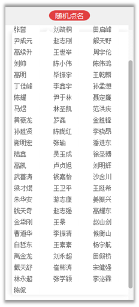
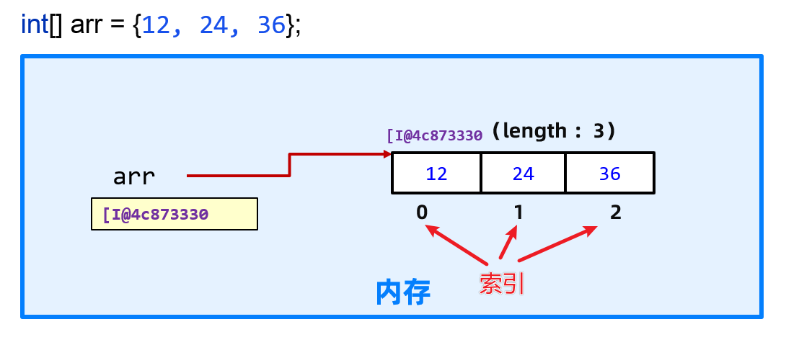
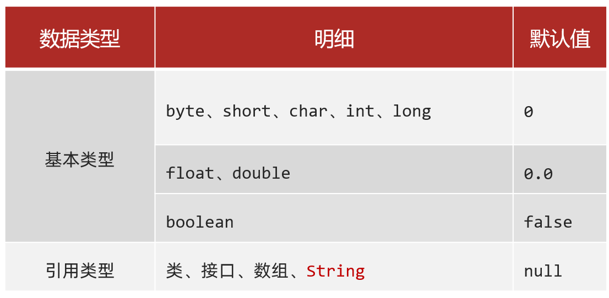
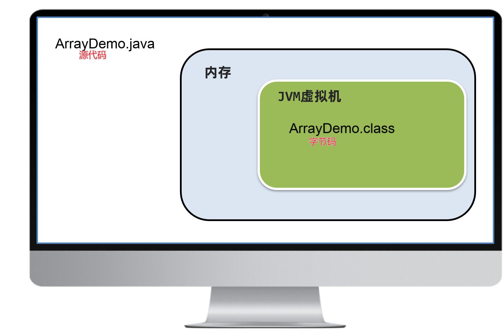
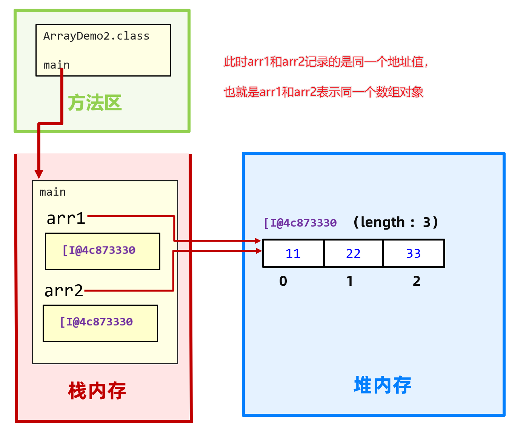
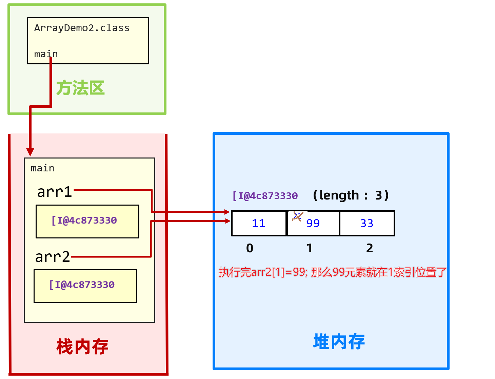
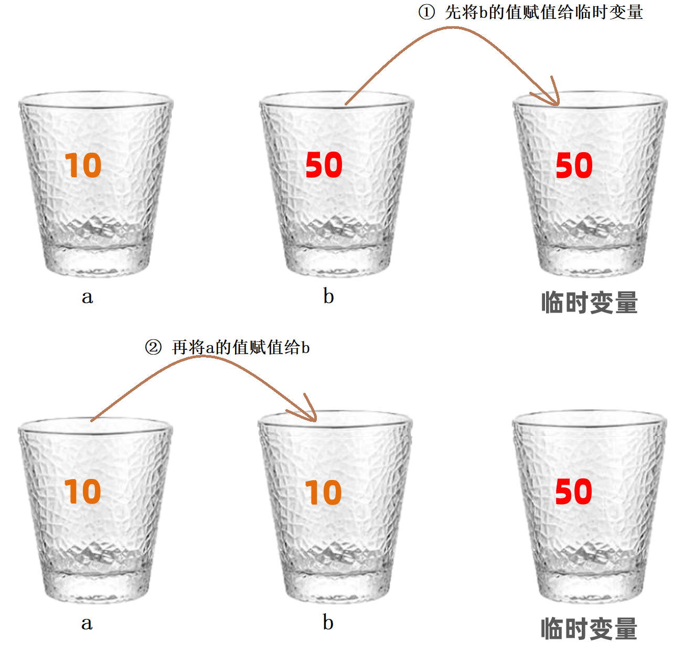
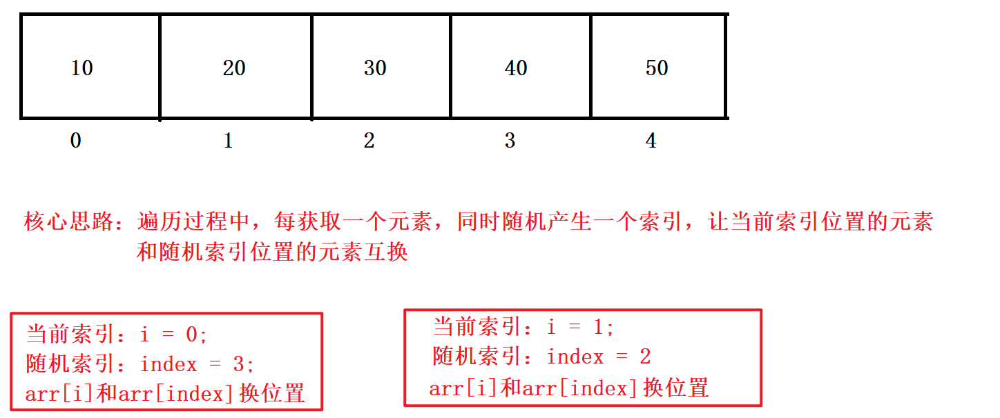
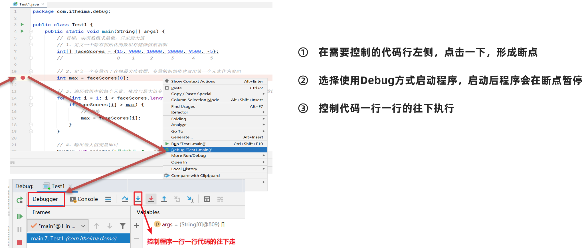

# Java数组

各位同学，今天我们学习一个Java中非常重要的技术——数组。

## 一、认识数组

先来认识一下什么数组

### 1. 什么数组

数组就是一个容器，用来存一批同种类型的数据的。

比如：想要存储 20,10,80,60,90 这些数据。 我们可以把代码写成这样

```java
int[] array = {20,10,80,60,90};
```

比如：想要存储 “牛二“,“西门“,“全蛋“ 这些数据。我们可以把代码写成这样

```java
String[] names = {"牛二", "西门", "全蛋"};
```


### 2. 数组的应用场景

有变量，为什么还要有数组呢？ 比如，我们要做一个点名器



如果用变量来做的话，代码是这样子的


如果用数组来做的话，代码是这样子的


一对比我们发现数组的写法比变量的写法更加简洁，所以我们可以得出一个结论

**结论：遇到批量数据的存储和操作时，数组比变量更适合**


## 二、数组的定义和访问

各位同学，我们已经知道数组是用来干什么的。那么如何使用Java语言写一个数组呢？这里就需要学习一下数组的初始化格式。

数组有两种初始化的方式，一种是静态初始化、一种是动态初始化。我们先用静态初始化来学习数组的操作。

### 2.1 数组的静态初始化

所谓静态初始化指的是：在定义数组时直接给数组中的数据赋值。

**1. 静态初始化标准格式：**

```java
数据类型[] 变量名 = new 数据类型[]{元素1,元素2,元素3};
```

按照格式定义int类型、double类型数组

```java
//定义数组，用来存储多个年龄
int[] ages = new int[]{12, 24, 36}
//定义数组，用来存储多个成绩
double[] scores = new double[]{89.9, 99.5, 59.5, 88.0};
```


**2. 静态初始化简化格式**

Java语言的设计者为了简化定义数组的写法，还为静态初始化提供了一种简化写法

```java
数据类型[] 变量名 = {元素1,元素2,元素3};
```

使用简化格式定义int类型、double类型数组

```java
//定义数组，用来存储多个年龄
int[] ages = {12, 24, 36}
//定义数组，用来存储多个成绩
double[] scores = {89.9, 99.5, 59.5, 88.0};
```

**3. 注意哟！！**

- 定义数组时， `数据类型[] 数组名` 也可写成 `数据类型 数组名[]` 

```java
//以下两种写法是等价的。但是建议大家用第一种，因为这种写法更加普遍
int[] ages = {12, 24, 36};
int ages[] = {12, 24, 36}
```


**4. 数组在计算机中的基本原理**

我们知道数组是怎么定义的之后，那么接下来看一下数组在计算机中的基本原理。

我们以`int[] ages = {12,24,36};`这句话为例，看一下这句话到底在计算机中做了那些事情。

- 首先，左边`int[] ages` 表示定义了一个数组类型的变量，变量名叫ages
- 其次，右边`{12,24,36}`表示创建一个数组对象，你完全可以把它理解成一个能装数据的东西。这个对象在内存中会有一个地址值`[I@4c873330`，每次创建一个数组对象都会有不用的地址值。
- 然后，把右边的地址值`[I@4c873330`赋值给左边的ages变量
- 所以，ages变量就可以通过地址值，找到数组这个东西。


### 2.2 数组的元素访问

各位同学，通过刚才的学习，我们知道数组是用来存储数据的。那么数组中存储的数据又如何访问呢？这里所说的访问，意思就是获取中数组中数据的值、或者给数组中的数据赋值。

这里先给大家统一几个概念，数组中存储的数据我们叫做元素；而且数组中的每一个元素都有一个编号与之对应，我们把这个编号叫做索引，这个索引是从0依次递增的整数。如下图所示



要想访问数组中的元素，格式如下

```java
//数组名可以找到数组对象的地址，再通过索引就可以定位到具体的元素了
数组名[索引]
```

接下来用代码来演示一下

```java
//索引：	   0   1   2
int[] arr = {12, 24, 36};
// 1、访问数组的全部数据
System.out.println(arr[0]); //12
System.out.println(arr[1]); //24
System.out.println(arr[2]); //36
//下面代码没有3索引，会出现ArrayIndexOutOfBoundsException 索引越界异常
//System.out.println(arr[3]); 

// 2、修改数组中的数据
arr[0] = 66;
arr[2] = 100;
System.out.println(arr[0]); //66
System.out.println(arr[1]); 0
System.out.println(arr[2]); //100
```

除了访问数组中的元素，我们可以获取数组中元素的个数，后面我们统称为数组的长度。

```java
// 3、访问数组的元素个数：数组名.length
System.out.println(arr.length);

// 技巧：获取数组的最大索引: arr.length - 1(前提是数组中存在数据)
System.out.println(arr.length - 1);

int[] arr2 = {};
System.out.println(arr2.length - 1);
```


### 2.3 数组的遍历

各位同学，接下来我们学习一个对数组最最最常见的操作——数组遍历。所谓遍历意思就是将数组中的元素一个一个的取出来。

我们刚才学习了数组中元素的访问，访问元素必须用到索引，如下列代码。

```java
int[] ages = {12, 24, 36};
System.out.println(ages[0]);
System.out.println(ages[1]);
System.out.println(ages[2]);
```

但是，如果数组中有很多很多元素，索引靠自己一个一个数肯定是不行的！我们可以使用for循环从0开始一直遍历到长度-1的位置，就可以获取所有的索引了。 

当你获取到每一个索引，那么每一个元素不就获取到了吗？上代码吧

```java
int[] ages = {12, 24, 36};
for (int i = 0; i < ages.length; i++) {
    // i的取值 = 0,1,2
    System.out.println(ages[i]); 
}
```


### 2.4 数组静态初始化案例

学习完数组的静态初始化之后，接下来我们做一个练习题来巩固一下。

```java
需求：某部门5名员工的销售额分别是：16、26、36、6、100，请计算出他们部门的总销售额。

需求分析：
	1.看到有16、26、36、6、100这5个数据数据，而且数据值很明确;
		1)想到,可以使用数组静态初始化把这5个数据存起来
	
	2.请计算出他们部门的总销售额（这不就是求数组中数据的和吗？）
		2)必须先将数组中所有的元素遍历出来
		3)想要求和，得先有一个求和变量sum
		4)再将每一个元素和求和变量sum进行累加（求和思想）
```

按照分析的思路来写代码

```java
// 1、定义一个数组存储5名员工的销售额
//索引          0   1    2  3   4
int[] money = {16, 26, 36, 6, 100};

// 3、定义一个变量用于累加求和
int sum = 0;

// 2、遍历这个数组中的每个数据。
for (int i = 0; i < money.length; i++) {
    // i = 0  1  2  3  4
    sum += money[i];
}
System.out.println("员工的销售总额：" + sum);
```


### 2.5 数组的动态初始化

各位同学，刚才我们初始化数组时，都是直接将元素写出来。但是还有另一个初始化数组的方式叫 **动态初始化**。

动态初始化不需要我们写出具体的元素，而是指定元素类型和长度就行。格式如下

```java
//数据类型[]  数组名 = new 数据类型[长度];
int[] arr = new int[3];
```

下面是动态初始化数组的原理图。我们发现`int[] arr` 其实就是一个变量，它记录了数组对象的地址值，而且数组中的元素默认值是0。


**注意：**

使用动态初始化定义数组时，根据元素类型不同，默认值也有所不同。



关于数组动态初始化的格式和原理，咱们就先学习到这里。


### 2.6 数组动态初始化案例

各位同学，接下来我们做一个数组动态初始化的案例。

```java
案例需求：
	某歌唱比赛，需要开发一个系统：可以录入6名评委的打分，录入完毕后立即输出平均分做
	选手得分

需求分析：
	1.需要录入6名评委的分数，可以用一个数组来保存。
	   因为在评委没有录入分数之前，还不确定数组中应该存哪些数据。
	   所以可以使用数组的动态初始化
	2.遍历数组中的每一个位置，并录入分数，将分数存入数组中
	3.遍历数组中的每一个元素，对元素求和
```

代码如下

```java
// 1、定义一个动态初始化的数组，负责后期存储6个评委的打分。
double[] scores = new double[6];

Scanner sc  = new Scanner(System.in);

// 2、遍历数组中的每个位置，录入评委的分数，存入到数组中去
for (int i = 0; i < scores.length; i++) {
    // i = 0 1 2 3 4 5
    System.out.println("请您输入当前第" + (i + 1) +"个评委的分数：");
    double score = sc.nextDouble();
    scores[i] = score;
}

// 3、遍历数组中的每个元素进行求和
double sum  = 0;
for (int i = 0; i < scores.length; i++) {
    sum += scores[i];
}
System.out.println("选手最终得分是：" + sum / scores.length);
```


## 三、数组在计算机中的执行原理

好的各位同学，在前面我们已经学习了数组的基本使用，也理解了数组的基本原理。由于数组是一个容器，变量也是一个容器，在理解他们执行原理的时候，有些同学就容易搞混，现在我把他们放在一起带着大家回顾一下他们的会执行原理，顺便带着大家详细理解一下Java程序的执行的内存原理。

### 3.1 数组的执行原理，Java程序的执行原理

我们以下面的代码，来讲解变量、数组的执原理。

```java
public class ArrayDemo1 {
    public static void main(String[] args) {
        int a = 10;
        System.out.println(a);

        int[] arr = new int[]{11, 22, 33};
        System.out.println(arr);

        System.out.println(arr[1]);

        arr[0] = 44;
        arr[1] = 55;
        arr[2] = 66;

        System.out.println(arr[0]);
        System.out.println(arr[1]);
        System.out.println(arr[2]);
    }
}
```

前面我们给大家讲过，程序是在内存中执行的。实际上Java程序是把编译后的字节码加载到Java虚拟机中执行的。



Java为了便于虚拟机执行Java程序，将虚拟机的内存划分为 方法区、栈、堆、本地方法栈、寄存器 这5块区域。同学们需要重点关注的是  **方法区、栈、堆**。

下面把每一个块内存区域作用介绍一下，我们大致只需要知道每一部分存储什么内容就行。

- **方法区**：字节码文件先加载到这里
- **栈**：方法运行时所进入的内存区域，由于变量在方法中，所以变量也在这一块区域中
- **堆**：存储new出来的东西，并分配地址。由于数组是new 出来的，所以数组也在这块区域。

下面是上面案例执行的内存原理如下图所示，按照① ② ③ ④ ⑤ ⑥ 的标记的顺序来看


**总结一下`int a = 10`与 `int[] arr = new int[]{11,22,33}的区别`**

- **a**是一个变量，在栈内存中，**a**变量中存储的数据就是**10**这个值。
- **arr**也是一个变量，在栈中，存储的是数组对象在堆内存中的地址值

```java
// 这里的int a是一个基本类型变量，存储的是一个数值
int a = 10 ; 
//这里的int[] arr是一个引用类型的变量，存储的是一个地址值
int[] arr = new int[]{44,55,66};
```


### 3.2 多个变量指向同一个数组的问题

各位同学，我们了解了数组在内存中的执行原理。我们知道数组类型的变量，指向的是堆内存中数组对象的地址。但是在实际开发中可能存在一种特殊情况，就是多个变量指向同一个数组对象的形式。

讲解这个知识点的目的，是让同学们注意多个变量指向同一个数组对象存在什么问题？

我们先看一段代码

```java
public class ArrayDemo2 {
    public static void main(String[] args) {
        // 目标：认识多个变量指向同一个数组对象的形式，并掌握其注意事项。
        int[] arr1 = {11, 22, 33};

        // 把int类型的数组变量arr1赋值给int类型的数组变量arr2
        int[] arr2 = arr1;

        System.out.println(arr1);
        System.out.println(arr2);

        arr2[1] = 99;
        System.out.println(arr1[1]);

        arr2 = null; // 拿到的数组变量中存储的值是null
        System.out.println(arr2);

        //System.out.println(arr2[0]);
        //System.out.println(arr2.length);
    }
}
```

我们重点关注这一段代码


刚执行完`int[] arr1 = {11,22,33};`时，内存原理如下


当执行完`int[] arr2 = arr1;`后，内存原理如下



当执行到`arr2[1]=99;时`，内存原理如下



**总结一下：**

- 两个变量指向同一个数组时，两个变量记录的是同一个地址值。

- 当一个变量修改数组中的元素时，另一个变量去访问数组中的元素，元素已经被修改过了。

到这里有关数组的基本操作，和内存原理我们就全部学习完了。

## 四、数组专项练习

接下来我们做一些专项练习题，把数组的常见操作练习一下。在学习这个案例时，重点掌握数组求最值的思路，代码只是用来表达你的思路的。

### 4.1 数组求最值

```java
需求：定义一个int类型数组，求数组中元素的最大值，并打印最大值
```

我们先看一下选美比赛，是怎么选出颜值最高的人的。然后再以此思路，来写代码找出数组中元素的最大值。


```java
数组求最大值思路：
	1)先找出数组中0索引的元素，假设为最大值，用max表示【擂主】
	2)遍历后面的每一个元素和max比较，把较大的元素值重新赋值给max(擂主换人)
    3)最后max就是所有元素的最大值(最后站在台上的擂主)
```

```java
public class Test1 {
    public static void main(String[] args) {
        // 1、把颜值数据拿到程序中来，用数组装起来
        int[] faceScores = {15, 9000, 10000, 20000, 9500, -5};

        // 2、定义一个变量用于最终记住最大值。
        int max = faceScores[0];

        // 3、从数组的第二个位置开始遍历。
        for (int i = 1; i < faceScores.length; i++) {
            // i = 1  2  3  4  5
            // 判断一下当前遍历的这个数据，是否大于最大值变量max存储的数据，
            //如果大于，当前遍历的数据需要赋值给max
            if(faceScores[i] > max ){
                max = faceScores[i];
            }
        }
        System.out.println("最高颜值是：" + max);
    }
}
```

**总结一下：**

通过这个案例，我们主要掌握求最值的思路，以后不管遇到求最大值还是最小值，编程思路都是一样的，不同的可能是数据不同。


### 4.2 数组元素反转

```java
需求：某个数组有5个数据：10,20,30,40,50，请将这个数组中的数据进行反转。
      [10, 20, 30, 40, 50]  反转后 [50, 40, 30, 20, 10]
```

数组元素反转的核心，其实是数组中两个数据的交换。我们可以认为两个数据分别存储在两个水杯中。想要交换两个水杯中的东西，我们得借助第三个水杯，如下图所示




数组中元素交换，就是用的借用第三方变量的思想。 我们把数组中的每一个元素当做一个水杯，然后索引控制哪两个元素互换位置。

怎么样，才能达到元素反转的效果呢？我们只需将第一个和最后一个元素互换、第二个和倒数第二个互换、依次内推.... 如下图所示


怎么样写代码，才能达到上面的效果呢？我们继续分析

```java
1.每次交换，需要有左右两边的两个索引，我们可以用i和j表示
	刚开始i=0，j=数组长度-1;
2.每次让i和j索引位置的两个元素互换位置
	arr[i]和arr[j]互换位置
3.每次还完位置之后，让i往右移动一位，让j往前移动一位
```

具体代码如下

```java
public class Test2 {
    public static void main(String[] args) {
        // 目标：完成数组反转。
        // 1、准备一个数组
        int[] arr = {10, 20, 30, 40, 50};  

        // 2、定义一个循环，设计2个变量，一个在前，一个在后
        for (int i = 0, j = arr.length - 1; i < j; i++, j--) {
            // arr[i]   arr[j]
            // 交换
            // 1、定义一个临时变量记住后一个位置处的值
            int temp = arr[j];
            // 2、把前一个位置处的值赋值给后一个位置了
            arr[j] = arr[i];
            // 3、把临时变量中记住的后一个位置处的值赋值给前一个位置处
            arr[i] = temp;
        }

        // 3、遍历数组中的每个数据，看是否反转成功了
        for (int i = 0; i < arr.length; i++) {
            System.out.print(arr[i] + " ");
        }
    }
}
```

**总结一下：**

通过上面的案例，需要我们掌握元素互换位置的编程思路；以后遇到数据互换问题，都这样做。

### 4.3 随机排名

各位同学，通过数组元素反转的案例，我们学会了如何对两个数据进行交换。接下来，我们再学习随机排名案例，将数据交换的思路再巩固一下。

先来看一下需求

```java
需求：某公司开发部5名开发人员，要进行项目进展汇报演讲，现在采取随机排名后进行汇报。请先依次录入5名员工的工号，然后展示出一组随机的排名顺序。
```

分析一下随机排名的思路

```java
1.在程序中录入5名员工的工号存储起来 ---> 使用动态初始化数组的方式。
2.依次遍历数组中的每个数据。
3.每遍历到一个数据，都随机一个索引值出来，让当前数据与该索引位置处的数据进行交换。
```

如下图所示，每次遍历到一个元素，随机将当前位置元素和随机索引元素换位置。



代码如下

```java
public class Test3 {
    public static void main(String[] args) {
        // 目标：完成随机排名
        // 1、定义一个动态初始化的数组用于存储5名员工的工号
        int[] codes = new int[5];

        // 2、提示用户录入5名员工的工号。
        Scanner sc = new Scanner(System.in);
        for (int i = 0; i < codes.length; i++) {
            // i = 0 1 2 3 4
            System.out.println("请您输入第" + (i + 1) +"个员工的工号：");
            int code = sc.nextInt();
            codes[i] = code;
        }

        // 3、打乱数组中的元素顺序。
        // [12, 33, 54, 26, 8]
        //  i       index
        Random r =  new Random();
        for (int i = 0; i < codes.length; i++) {
            // codes[i]
            // 每遍历到一个数据，都随机一个数组索引范围内的值。
            //然后让当前遍历的数据与该索引位置处的值交换。
            int index = r.nextInt(codes.length); // 0 - 4
            // 定义一个临时变量记住index位置处的值
            int temp = codes[index];
            // 把i位置处的值赋值给index位置处
            codes[index] = codes[i];
            // 把index位置原来的值赋值给i位置处
            codes[i] = temp;
        }

        // 4、遍历数组中的工号输出即可
        for (int i = 0; i < codes.length; i++) {
            System.out.print(codes[i] + " ");
        }
    }
}
```


到这有关数组的常见练习题我们就讲完了，待会我们在给同学们讲一个开发中用得比较多的工具叫做Debug调试。

## 五、Debug调试工具

各位同学，为了让大家更好的理解代码的执行流程，这里给大家讲一个在开发中非常重要的工具——叫做Debug调试。 

通过Debug调试，我们可以查看代码的执行流程。当你代码中有Bug但是又发现不了的时候，你就可以用Debug调试工具，查看执行流程，逐步分析是哪一行出现了问题。

Debug调试工具的使用步骤如下：

```java
第一步：打断点，如下图的红色小圆点
第二步：右键Debug方式启动程序，如下图右键菜单
	  启动后，代码会停留在打断点的这一行
第三步：点击箭头按钮，一行一行往下执行
```




