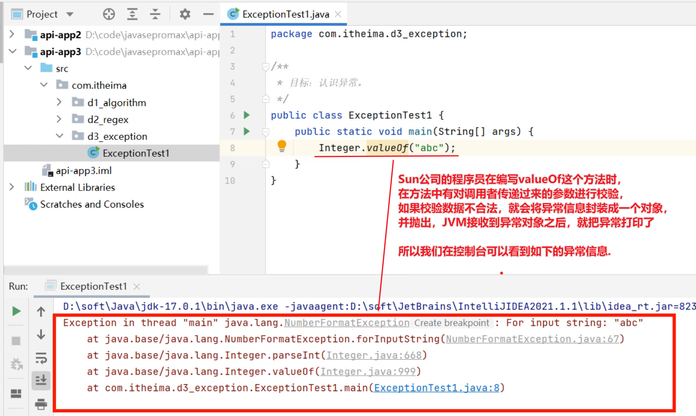
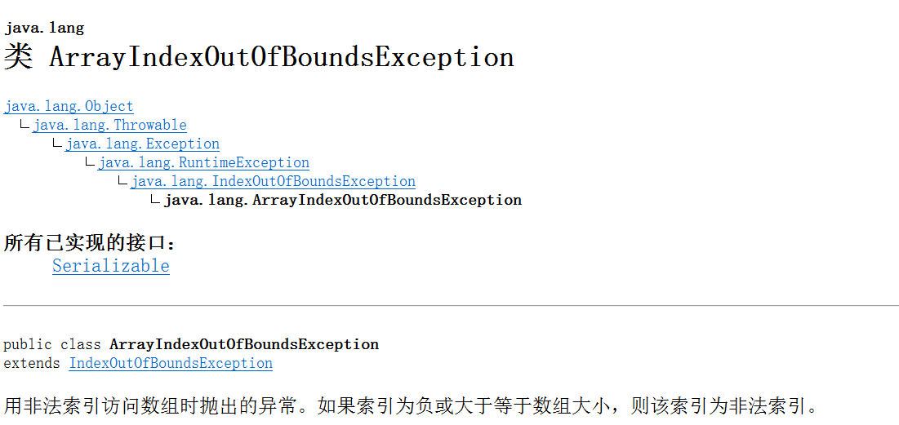
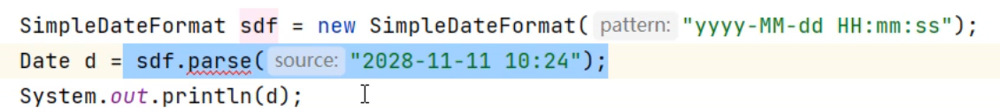
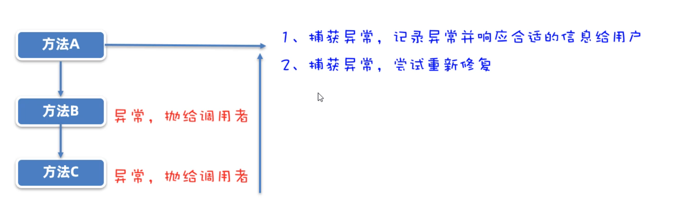

# 异常

### 1.1 认识异常

接下来，我们学习一下异常，学习异常有利于我们处理程序中可能出现的问题。我先带着同学们认识一下，什么是异常？

我们阅读下面的代码，通过这段代码来认识异常。 我们调用一个方法时，经常一部小心就出异常了，然后在控制台打印一些异常信息。其实打印的这些异常信息，就叫做异常。

那肯定有同学就纳闷了，我写代码天天出异常，我知道这是异常啊！我们这里学习异常，其实是为了告诉你异常是怎么产生的？只有你知道异常是如何产生的，才能避免出现异常。以及产生异常之后如何处理。




因为写代码时经常会出现问题，Java的设计者们早就为我们写好了很多个异常类，来描述不同场景下的问题。而有些类是有共性的所以就有了异常的继承体系


> **先来演示一个运行时异常产生**

```java
int[] arr = {11,22,33};
//5是一个不存在的索引，所以此时产生ArrayIndexOutOfBoundsExcpetion
System.out.println(arr[5]); 
```

下图是API中对ArrayIndexOutOfBoundsExcpetion类的继承体系，以及告诉我们它在什么情况下产生。



> **再来演示一个编译时异常**

我们在调用SimpleDateFormat对象的parse方法时，要求传递的参数必须和指定的日期格式一致，否则就会出现异常。 Java比较贴心，它为了更加强烈的提醒方法的调用者，设计了编译时异常，它把异常的提醒提前了，你调用方法是否真的有问题，只要可能有问题就给你报出异常提示（红色波浪线）。

 **编译时异常的目的：意思就是告诉你，你小子注意了！！，这里小心点容易出错，仔细检查一下**



有人说，我检查过了，我确认我的代码没问题，为了让它不报错，继续将代码写下去。我们这里有两种解决方案。

- 第一种：使用throws在方法上声明，意思就是告诉下一个调用者，这里面可能有异常啊，你调用时注意一下。

```java
/**
 * 目标：认识异常。
 */
public class ExceptionTest1 {
    public static void main(String[] args) throws ParseException{
        SimpleDateFormat sdf = new SimpleDateFormat("yyyy-MM-dd HH:mm:ss");
        Date d = sdf.parse("2028-11-11 10:24");
        System.out.println(d);
    }
}
```

- 第二种：使用try...catch语句块异常进行处理。

```java
public class ExceptionTest1 {
    public static void main(String[] args) throws ParseException{
        try {
            SimpleDateFormat sdf = new SimpleDateFormat("yyyy-MM-dd HH:mm:ss");
            Date d = sdf.parse("2028-11-11 10:24");
            System.out.println(d);
        } catch (ParseException e) {
            e.printStackTrace();
        }
    }
}
```

好了，关于什么是异常，我们就先认识到这里。


### 1.2 自定义异常

同学们经过刚才的学习已经认识了什么是异常了，但是无法为这个世界上的全部问题都提供异常类，如果企业自己的某种问题，想通过异常来表示，那就需要自己来定义异常类了。

我们通过一个实际场景，来给大家演示自定义异常。

> 需求：写一个saveAge(int age)方法，在方法中对参数age进行判断，如果age<0或者>=150就认为年龄不合法，如果年龄不合法，就给调用者抛出一个年龄非法异常。
>
> 分析：Java的API中是没有年龄非常这个异常的，所以我们可以自定义一个异常类，用来表示年龄非法异常，然后再方法中抛出自定义异常即可。

- 先写一个异常类AgeIllegalException（这是自己取的名字，名字取得很奈斯），继承

```java
// 1、必须让这个类继承自Exception，才能成为一个编译时异常类。
public class AgeIllegalException extends Exception{
    public AgeIllegalException() {
    }

    public AgeIllegalException(String message) {
        super(message);
    }
}
```

- 再写一个测试类，在测试类中定义一个saveAge(int age)方法，对age判断如果年龄不在0~150之间，就抛出一个AgeIllegalException异常对象给调用者。

```java
public class ExceptionTest2 {
    public static void main(String[] args) {
        // 需求：保存一个合法的年
        try {
            saveAge2(225);
            System.out.println("saveAge2底层执行是成功的！");
        } catch (AgeIllegalException e) {
            e.printStackTrace();
            System.out.println("saveAge2底层执行是出现bug的！");
        }
    }

	//2、在方法中对age进行判断，不合法则抛出AgeIllegalException
    public static void saveAge(int age){
        if(age > 0 && age < 150){
            System.out.println("年龄被成功保存： " + age);
        }else {
            // 用一个异常对象封装这个问题
            // throw 抛出去这个异常对象
            throw new AgeIllegalRuntimeException("/age is illegal, your age is " + age);
        }
    }
}
```

- 注意咯，自定义异常可能是编译时异常，也可以是运行时异常

```java
1.如果自定义异常类继承Excpetion，则是编译时异常。
	特点：方法中抛出的是编译时异常，必须在方法上使用throws声明，强制调用者处理。
	
2.如果自定义异常类继承RuntimeException，则运行时异常。
	特点：方法中抛出的是运行时异常，不需要在方法上用throws声明。
```


### 1.3 异常处理

同学们，通过前面两小节的学习，我们已经认识了什么是异常，以及异常的产生过程。接下来就需要告诉同学们，出现异常该如何处理了。

比如有如下的场景：A调用用B，B调用C；C中有异常产生抛给B，B中有异常产生又抛给A；异常到了A这里就不建议再抛出了，因为最终抛出被JVM处理程序就会异常终止，并且给用户看异常信息，用户也看不懂，体验很不好。

此时比较好的做法就是：1.将异常捕获，将比较友好的信息显示给用户看；2.尝试重新执行，看是是否能修复这个问题。



我们看一个代码，main方法调用test1方法，test1方法调用test2方法，test1和test2方法中多有扔异常。

- 第一种处理方式是，在main方法中对异常进行try...catch捕获处理了，给出友好提示。

```java
public class ExceptionTest3 {
    public static void main(String[] args)  {
        try {
            test1();
        } catch (FileNotFoundException e) {
            System.out.println("您要找的文件不存在！！");
            e.printStackTrace(); // 打印出这个异常对象的信息。记录下来。
        } catch (ParseException e) {
            System.out.println("您要解析的时间有问题了！");
            e.printStackTrace(); // 打印出这个异常对象的信息。记录下来。
        }
    }

    public static void test1() throws FileNotFoundException, ParseException {
        SimpleDateFormat sdf = new SimpleDateFormat("yyyy-MM-dd HH:mm:ss");
        Date d = sdf.parse("2028-11-11 10:24:11");
        System.out.println(d);
        test2();
    }

    public static void test2() throws FileNotFoundException {
        // 读取文件的。
        InputStream is = new FileInputStream("D:/meinv.png");
    }
}
```

- 第二种处理方式是：在main方法中对异常进行捕获，并尝试修复

```java
/**
 * 目标：掌握异常的处理方式：捕获异常，尝试修复。
 */
public class ExceptionTest4 {
    public static void main(String[] args) {
        // 需求：调用一个方法，让用户输入一个合适的价格返回为止。
        // 尝试修复
        while (true) {
            try {
                System.out.println(getMoney());
                break;
            } catch (Exception e) {
                System.out.println("请您输入合法的数字！！");
            }
        }
    }

    public static double getMoney(){
        Scanner sc = new Scanner(System.in);
        while (true) {
            System.out.println("请您输入合适的价格：");
            double money = sc.nextDouble();
            if(money >= 0){
                return money;
            }else {
                System.out.println("您输入的价格是不合适的！");
            }
        }
    }
}
```

好了，到此我们关于异常的知识就全部学习完了。


