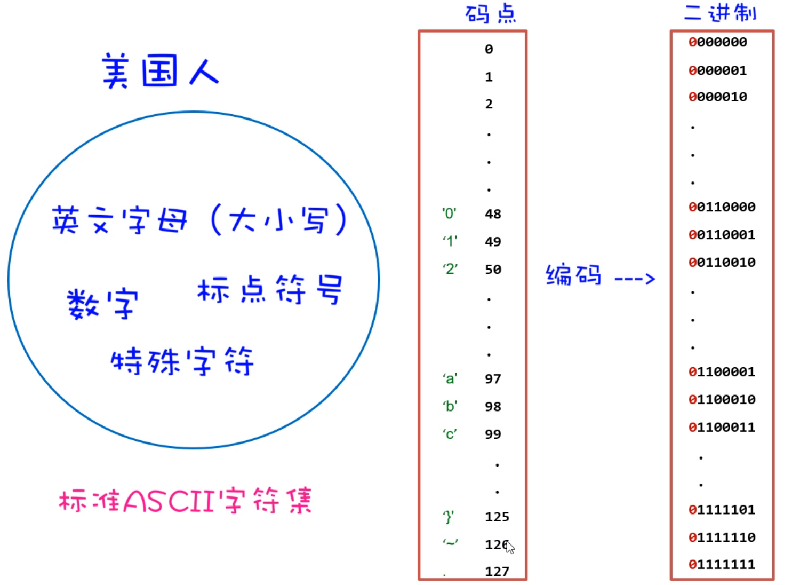
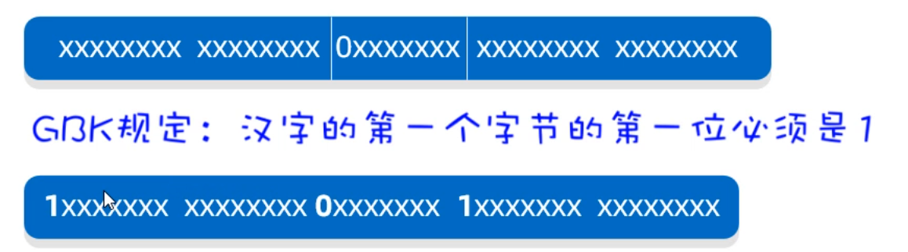

# day09-字符集

各位同学，前面我们已经学习了File类，通过File类的对象可以对文件进行操作，但是不能操作文件中的内容。要想操作文件中的内容，我们还得学习IO流。但是在正式学习IO流之前，我们还需要学习一个前置知识叫做字符集，只有我们把字符集搞明白了，再学习IO流才会更加丝滑。

## 一、字符集

### 1.1 字符集的来历

所以，接下来我们正式学习一下字符集。先来带着同学们，了解一下字符集的来历。

我们知道计算机是美国人发明的，由于计算机能够处理的数据只能是0和1组成的二进制数据，为了让计算机能够处理字符，于是美国人就把他们会用到的每一个字符进行了编码（**所谓编码，就是为一个字符编一个二进制数据**），如下图所示：



美国人常用的字符有英文字母、标点符号、数字以及一些特殊字符，这些字符一共也不到128个，所以他们用1个字节来存储1字符就够了。 美国人把他们用到的字符和字符对应的编码总结成了一张码表，这张码表叫做ASCII码表（也叫ASCII字符集）。

其实计算机只在美国用是没有问题的，但是计算机慢慢的普及到全世界，当普及到中国的时候，在计算机中想要存储中文，那ASCII字符集就不够用了，因为中文太多了，随便数一数也有几万个字符。

于是中国人为了在计算机中存储中文，也编了一个中国人用的字符集叫做GBK字符集，这里面包含2万多个汉字字符，**GBK中一个汉字采用两个字节来存储**，为了能够显示英文字母，GBK字符集也兼容了ASCII字符集，**在GBK字符集中一个字母还是采用一个字节来存储**。

### 1.2 汉字和字母的编码特点

讲到这里，可能有同学有这么一个疑问： 如果一个文件中既有中文，也有英文，那计算机怎么知道哪几个字节表示一个汉字，哪几个字节表示一个字母呢？

其实这个问题问当想当有水平，接下来，就带着同学们了解一下，计算机是怎么识别中文和英文的。

比如：在文件中存储一个`我a你`，底层其实存储的是这样的二进制数据。

**需要我们注意汉字和字母的编码特点：**

- 1. 如果是存储字母，采用1个字节来存储，一共8位，其中第1位是0
  2. 如果是存储汉字，采用2个字节来存储，一共16位，其中第1位是1



**当读取文件中的字符时，通过识别读取到的第1位是0还是1来判断是字母还是汉字**

- 如果读取到第1位是0，就认为是一个字母，此时往后读1个字节。
- 如果读取到第1位是1，就认为是一个汉字，此时往后读2个字节。


### 1.3 Unicode字符集

同学们注意了，咱们国家可以用GBK字符集来表示中国人使用的文字，那世界上还有很多其他的国家，他们也有自己的文字，他们也想要自己国家的文字在计算机中处理，于是其他国家也在搞自己的字符集，就这样全世界搞了上百个字符集，而且各个国家的字符集互不兼容。 这样其实很不利于国际化的交流，可能一个文件在我们国家的电脑上打开好好的，但是在其他国家打开就是乱码了。

为了解决各个国家字符集互不兼容的问题，由国际化标准组织牵头，设计了一套全世界通用的字符集，叫做Unicode字符集。在Unicode字符集中包含了世界上所有国家的文字，一个字符采用4个自己才存储。

在Unicode字符集中，采用一个字符4个字节的编码方案，又造成另一个问题：如果是说英语的国家，他们只需要用到26大小写字母，加上一些标点符号就够了，本身一个字节就可以表示完，用4个字节就有点浪费。

于是又对Unicode字符集中的字符进行了重新编码，一共设计了三种编码方案。分别是UTF-32、UTF-16、UTF-8;  **其中比较常用的编码方案是UTF-8**

下面我们详细介绍一下UTF-8这种编码方案的特点。

```java
1.UTF-8是一种可变长的编码方案，工分为4个长度区
2.英文字母、数字占1个字节兼容(ASCII编码)
3.汉字字符占3个字节
4.极少数字符占4个字节
```


### 1.4 字符集小结

最后，我们将前面介绍过的字符集小结一下

```java
ASCII字符集：《美国信息交换标准代码》，包含英文字母、数字、标点符号、控制字符
	特点：1个字符占1个字节

GBK字符集：中国人自己的字符集，兼容ASCII字符集，还包含2万多个汉字
	特点：1个字母占用1个字节；1个汉字占用2个字节

Unicode字符集：包含世界上所有国家的文字，有三种编码方案，最常用的是UTF-8
    UTF-8编码方案：英文字母、数字占1个字节兼容(ASCII编码)、汉字字符占3个字节
```


### 1.5 编码和解码

搞清楚字符集的知识之后，我们接下来再带着同学们使用Java代码完成编码和解码的操作。

其实String类类中就提供了相应的方法，可以完成编码和解码的操作。

- 编码：把字符串按照指定的字符集转换为字节数组
- 解码：把字节数组按照指定的字符集转换为字符串

```java
/**
 * 目标：掌握如何使用Java代码完成对字符的编码和解码。
 */
public class Test {
    public static void main(String[] args) throws Exception {
        // 1、编码
        String data = "a我b";
        byte[] bytes = data.getBytes(); // 默认是按照平台字符集（UTF-8）进行编码的。
        System.out.println(Arrays.toString(bytes));

        // 按照指定字符集进行编码。
        byte[] bytes1 = data.getBytes("GBK");
        System.out.println(Arrays.toString(bytes1));

        // 2、解码
        String s1 = new String(bytes); // 按照平台默认编码（UTF-8）解码
        System.out.println(s1);

        String s2 = new String(bytes1, "GBK");
        System.out.println(s2);
    }
}
```


