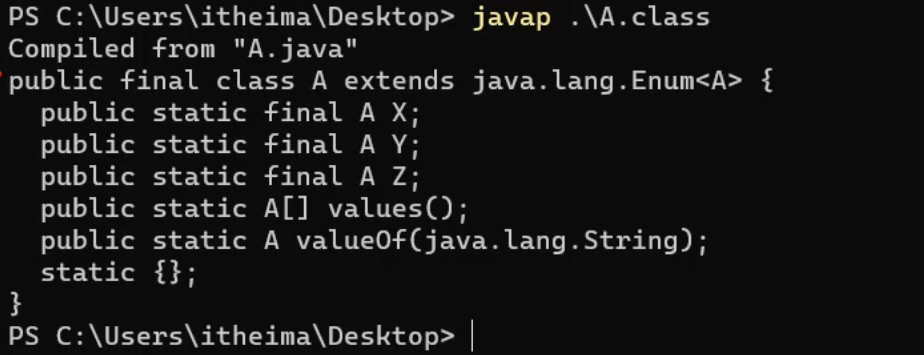

## 二、枚举

### 2.1 认识枚举

> **2.1.1 认识枚举、枚举的原理**

同学们，接下来我们学习一个新的知识点，枚举。枚举是我们以后在项目开发中偶尔会用到的知识。话不多说，我们还是先来认识一下枚举。

枚举是一种特殊的类，它的格式是：

```java
public enum 枚举类名{
    枚举项1,枚举项2,枚举项3;
}
```

其实枚举项就表示枚举类的对象，只是这些对象在定义枚举类时就预先写好了，以后就只能用这几个固定的对象。

我们用代码演示一下，定义一个枚举类A，在枚举类中定义三个枚举项X, Y, Z

```java
public enum A{
    X,Y,Z;
}
```

想要获取枚举类中的枚举项，只需要用类名调用就可以了

```java
public class Test{
    public static void main(String[] args){
        //获取枚举A类的，枚举项
        A a1 = A.X;
        A a2 = A.Y;
        A a3 = A.Z;
    }
}
```

刚才说，枚举项实际上是枚举类的对象，这一点其实可以通过反编译的形式来验证（需要用到反编译的命令，这里不能直接将字节码拖进idea反编译）



我们会看到，枚举类A是用class定义的，说明枚举确实是一个类，而且X，Y，Z都是A类的对象；而且每一个枚举项都是被`public static final `修饰，所以被可以类名调用，而且不能更改。

> **2.1.2 枚举深入**

既然枚举是一个类的话，我们能不能在枚举类中定义构造器、成员变量、成员方法呢？答案是可以的。来看一下代码吧

```java
public enum A{
    //定义枚举项
    X,Y,Z("张三"); //枚举项后面加括号，就是在执行枚举类的带参数构造方法。
    
    //定义空构造器
    public A(){
        
    }
    
    //成员变量
    private String name;
    //定义带参数构造器
    public A(String name){
        this.name=name;
    }
    
    //成员方法
    public String getName(){
        return name;
    }
    ...
}
```

虽然枚举类中可以像类一样，写一些类的其他成员，但是一般不会这么写，如果你真要这么干的话，到不如直接写普通类来的直接。


### 2.2 枚举的应用场景

刚才我们认识了一下什么是枚举，接下来我们看一下枚举在实际中的运用，枚举的应用场景是这样的：**枚举一般表示一组信息，然后作为参数进行传输。**

我们来看一个案例。比如我们现在有这么一个应用，用户进入应用时，需要让用户选择是女生、还是男生，然后系统会根据用户选择的是男生，还是女生推荐不同的信息给用户观看。


这里我们就可以先定义一个枚举类，用来表示男生、或者女生

```java
public class Constant{
    BOY,GRIL
}
```

再定义一个测试类，完成用户进入系统后的选择

```java
public class Test{
    public static void main(String[] args){
        //调用方法，传递男生
        provideInfo(Constant.BOY);
    }
    
    public static void provideInfo(Constant c){
        switch(c){
            case BOY:
                System.out.println("展示一些信息给男生看");
                break;
            case GRIL:
                System.out.println("展示一些信息给女生看");
                break;
        }
    }
}
```

最终再总结一下枚举的应用场景：**枚举一般表示几个固定的值，然后作为参数进行传输**。


