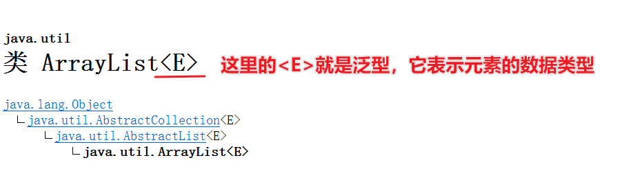
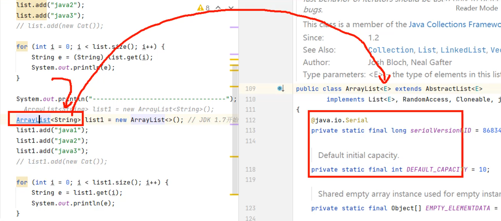
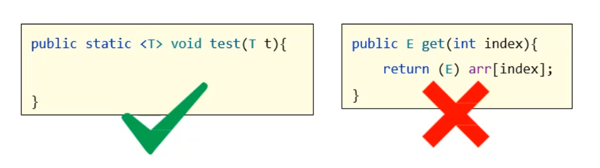
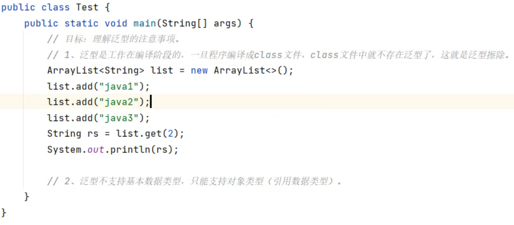
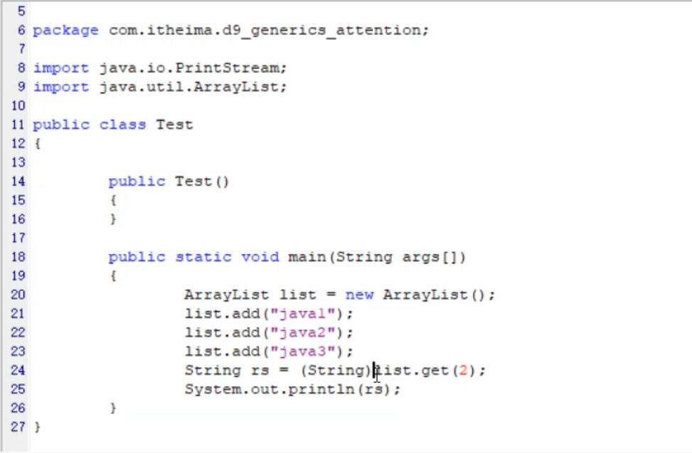

### 3.1 认识泛型

所谓泛型指的是，在定义类、接口、方法时，同时声明了一个或者多个类型变量（如：`<E>`），称为泛型类、泛型接口、泛型方法、它们统称为泛型。

比如我们前面学过的ArrayList类就是一个泛型类，我们可以打开API文档看一下ArrayList类的声明。



ArrayList集合的设计者在定义ArrayList集合时，就已经明确ArrayList集合时给别人装数据用的，但是别人用ArrayList集合时候，装什么类型的数据他不知道，所以就用一个`<E>`表示元素的数据类型。

当别人使用ArrayList集合创建对象时，`new ArrayList<String> `就表示元素为String类型，`new ArrayList<Integer>`表示元素为Integer类型。


我们总结一下泛型的作用、本质：

- **泛型的好处：在编译阶段可以避免出现一些非法的数据。**

- **泛型的本质：把具体的数据类型传递给类型变量。**


### 3.2 自定义泛型类

接下来我们学习一下自定义泛型类，但是有一些话需要给大家提前交代一下：泛型类，在实际工作中一般都是源代码中写好，我们直接用的，就是ArrayList`<E>`这样的，自己定义泛型类是非常少的。

自定义泛型类的格式如下

```java
//这里的<T,W>其实指的就是类型变量，可以是一个，也可以是多个。
public class 类名<T,W>{
    
}
```

接下来，我们自己定义一个MyArrayList`<E>`泛型类，模拟一下自定义泛型类的使用。注意这里重点仅仅只是模拟泛型类的使用，所以方法中的一些逻辑是次要的，也不会写得太严谨。

```java
//定义一个泛型类，用来表示一个容器
//容器中存储的数据，它的类型用<E>先代替用着，等调用者来确认<E>的具体类型。
public class MyArrayList<E>{
    private Object[] array = new Object[10];
    //定一个索引，方便对数组进行操作
    private int index;
    
    //添加元素
    public void add(E e){
        array[index]=e;
        index++;
    }
    
    //获取元素
    public E get(int index){
        return (E)array[index];
    }
}
```

接下来，我们写一个测试类，来测试自定义的泛型类MyArrayList是否能够正常使用

```java
public class Test{
    public static void main(String[] args){
        //1.确定MyArrayList集合中，元素类型为String类型
        MyArrayList<String> list = new MyArrayList<>();
        //此时添加元素时，只能添加String类型
        list.add("张三");
        list.add("李四");
        
         //2.确定MyArrayList集合中，元素类型为Integer类型
        MyArrayList<Integer> list1 = new MyArrayList<>();
        //此时添加元素时，只能添加String类型
        list.add(100);
        list.add(200);
        
    }
}
```

关于自定义泛型类，你们把这个案例理解，对于初学者来说，就已经非常好了。


### 3.3 自定义泛型接口

在上一节中，我们已经学习了自定义泛型类，接下来我们学习一下泛型接口。泛型接口其实指的是在接口中把不确定的数据类型用`<类型变量>`表示。定义格式如下：

```java
//这里的类型变量，一般是一个字母，比如<E>
public interface 接口名<类型变量>{
    
}
```

比如，我们现在要做一个系统要处理学生和老师的数据，需要提供2个功能，保存对象数据、根据名称查询数据，要求：这两个功能处理的数据既能是老师对象，也能是学生对象。

首先我们得有一个学生类和老师类

```java
public class Teacher{

}
```

```java
public class Student{
    
}
```

我们定义一个`Data<T>`泛型接口，T表示接口中要处理数据的类型。

```java
public interface Data<T>{
    public void add(T t);
    
    public ArrayList<T> getByName(String name);
}
```

接下来，我们写一个处理Teacher对象的接口实现类

```java
//此时确定Data<E>中的E为Teacher类型，
//接口中add和getByName方法上的T也都会变成Teacher类型
public class TeacherData implements Data<Teacher>{
   	public void add(Teacher t){
        
    }
    
    public ArrayList<Teacher> getByName(String name){
        
    }
}
```

接下来，我们写一个处理Student对象的接口实现类

```java
//此时确定Data<E>中的E为Student类型，
//接口中add和getByName方法上的T也都会变成Student类型
public class StudentData implements Data<Student>{
   	public void add(Student t){
        
    }
    
    public ArrayList<Student> getByName(String name){
        
    }
}
```

再啰嗦几句，在实际工作中，一般也都是框架底层源代码把泛型接口写好，我们实现泛型接口就可以了。


### 3.4 泛型方法

同学们，接下来我们学习一下泛型方法。下面就是泛型方法的格式

```java
public <泛型变量,泛型变量> 返回值类型 方法名(形参列表){
    
}
```

下图中在返回值类型和修饰符之间有`<T>`定义的才是泛型方法。



接下我们看一个泛型方法的案例

```java
public class Test{
    public static void main(String[] args){
        //调用test方法，传递字符串数据，那么test方法的泛型就是String类型
        String rs = test("test");
    
        //调用test方法，传递Dog对象，那么test方法的泛型就是Dog类型
    	Dog d = test(new Dog()); 
    }
    
    //这是一个泛型方法<T>表示一个不确定的数据类型，由调用者确定
    public static <T> test(T t){
        return t;
    }
}
```

### 3.5 泛型限定

接着，我们来学习一个泛型的特殊用法，叫做泛型限定。泛型限定的意思是对泛型的数据类型进行范围的限制。有如下的三种格式

- <?> 表示任意类型
- <? extends 数据类型> 表示指定类型或者指定类型的子类
- <? super 数据类型> 表示指定类型或者指定类型的父类

下面我们演示一下，假设有Car作为父类，BENZ，BWM两个类作为Car的子类，代码如下

```java
class Car{}
class BENZ extends Car{}
class BWN extends Car{}

public class Test{
    public static void main(String[] args){
        //1.集合中的元素不管是什么类型，test1方法都能接收
        ArrayList<BWM> list1 = new ArrayList<>();
        ArrayList<Benz> list2 = new ArrayList<>();
        ArrayList<String> list3 = new ArrayList<>();
        test1(list1);
        test1(list2);
        test1(list3);
        
        //2.集合中的元素只能是Car或者Car的子类类型，才能被test2方法接收
        ArrayList<Car> list4 = new ArrayList<>();
        ArrayList<BWM> list5 = new ArrayList<>();
        test2(list4);
        test2(list5);
        
        //2.集合中的元素只能是Car或者Car的父类类型，才能被test3方法接收
        ArrayList<Car> list6 = new ArrayList<>();
        ArrayList<Object> list7 = new ArrayList<>();
        test3(list6);
        test3(list7);
    }
    
    public static void test1(ArrayList<?> list){
        
    }
    
    public static void test2(ArrayList<? extends Car> list){
        
    }
    
   	public static void test3(ArrayList<? super Car> list){
        
    }
}
```

### 3.6 泛型擦除

最后，关于泛型还有一个特点需要给同学们介绍一下，就是泛型擦除。什么意思呢？**也就是说泛型只能编译阶段有效，一旦编译成字节码，字节码中是不包含泛型的**。而且泛型只支持引用数据类型，不支持基本数据类型。

把下面的代码的字节码进行反编译



下面是反编译之后的代码，我们发现ArrayList后面没有泛型




