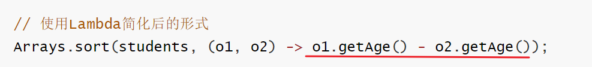

# Lambda

## 一、Arrays类

接下来我们学习的类叫做Arrays，其实Arrays并不是重点，但是我们通过Arrays这个类的学习有助于我们理解下一个知识点Lambda的学习。所以我们这里先学习Arrays，再通过Arrays来学习Lamdba这样学习会更丝滑一些^_^.

### 1.1 Arrays基本使用

我们先认识一下Arrays是干什么用的，Arrays是操作数组的工具类，它可以很方便的对数组中的元素进行遍历、拷贝、排序等操作。

下面我们用代码来演示一下：**遍历、拷贝、排序等操作**。需要用到的方法如下


```java
/**
 * 目标：掌握Arrays类的常用方法。
 */
public class ArraysTest1 {
    public static void main(String[] args) {
        // 1、public static String toString(类型[] arr): 返回数组的内容
        int[] arr = {10, 20, 30, 40, 50, 60};
        System.out.println(Arrays.toString(arr));

        // 2、public static 类型[] copyOfRange(类型[] arr, 起始索引, 结束索引) ：拷贝数组（指定范围，包前不包后）
        int[] arr2 = Arrays.copyOfRange(arr, 1, 4);
        System.out.println(Arrays.toString(arr2));

        // 3、public static copyOf(类型[] arr, int newLength)：拷贝数组，可以指定新数组的长度。
        int[] arr3 = Arrays.copyOf(arr, 10);
        System.out.println(Arrays.toString(arr3));

        // 4、public static setAll(double[] array, IntToDoubleFunction generator)：把数组中的原数据改为新数据又存进去。
        double[] prices = {99.8, 128, 100};
        //                  0     1    2
        // 把所有的价格都打八折，然后又存进去。
        Arrays.setAll(prices, new IntToDoubleFunction() {
            @Override
            public double applyAsDouble(int value) {
                // value = 0  1  2
                return prices[value] * 0.8;
            }
        });
        System.out.println(Arrays.toString(prices));

        // 5、public static void sort(类型[] arr)：对数组进行排序(默认是升序排序)
        Arrays.sort(prices);
        System.out.println(Arrays.toString(prices));
    }
}
```


### 1.2 Arrays操作对象数组

刚才我们使用Arrays操作数组时，数组中存储存储的元素是int类型、double类型，是可以直接排序的，而且默认是升序排列。

如果数组中存储的元素类型是自定义的对象，如何排序呢？接下来，我们就学习一下Arrays如何对对象数组进行排序。

首先我们要准备一个Student类，代码如下：

```java
public class Student implements Comparable<Student>{
    private String name;
    private double height;
    private int age;
	
    public Student(String name, double height, int age) {
        this.name = name;
        this.height = height;
        this.age = age;
    }

	@Override
    public String toString() {
        return "Student{" +
                "name='" + name + '\'' +
                ", height=" + height +
                ", age=" + age +
                '}';
    }
}

```

然后再写一个测试类，往数组中存储4个学生对象，代码如下。此时，运行代码你会发现是会报错的。

```java
public class ArraysTest2 {
    public static void main(String[] args) {
        // 目标：掌握如何对数组中的对象进行排序。
        Student[] students = new Student[4];
        students[0] = new Student("蜘蛛精", 169.5, 23);
        students[1] = new Student("紫霞", 163.8, 26);
        students[2] = new Student("紫霞", 163.8, 26);
        students[3] = new Student("至尊宝", 167.5, 24);

        // 1、public static void sort(类型[] arr)：对数组进行排序。
		Arrays.sort(students);
		System.out.println(Arrays.toString(students));
    }
}
```


上面的代码为什么会报错呢？因为Arrays根本就不知道按照什么规则进行排序。为了让Arrays知道按照什么规则排序，我们有如下的两种办法。

- **排序方式1：**让Student类实现Comparable接口，同时重写compareTo方法。Arrays的sort方法底层会根据compareTo方法的返回值是正数、负数、还是0来确定谁大、谁小、谁相等。代码如下：

```java
public class Student implements Comparable<Student>{
    private String name;
    private double height;
    private int age;
    
    //...get、set、空参数构造方法、有参数构造方法...自己补全

    // 指定比较规则
    // this  o
    @Override
    public int compareTo(Student o) {
        // 约定1：认为左边对象 大于 右边对象 请您返回正整数
        // 约定2：认为左边对象 小于 右边对象 请您返回负整数
        // 约定3：认为左边对象 等于 右边对象 请您一定返回0
		/* if(this.age > o.age){
            return 1;
        }else if(this.age < o.age){
            return -1;
        }
        return 0;*/

        //上面的if语句，也可以简化为下面的一行代码
        return this.age - o.age; // 按照年龄升序排列
        // return o.age - this.age; // 按照年龄降序排列
    }
    
    @Override
    public String toString() {
        return "Student{" +
                "name='" + name + '\'' +
                ", height=" + height +
                ", age=" + age +
                '}';
    }
}
```

- **排序方式2：**在调用`Arrays.sort(数组,Comparator比较器);`时，除了传递数组之外，传递一个Comparator比较器对象。Arrays的sort方法底层会根据Comparator比较器对象的compare方法方法的返回值是正数、负数、还是0来确定谁大、谁小、谁相等。代码如下

```java
public class ArraysTest2 {
    public static void main(String[] args) {
        // 目标：掌握如何对数组中的对象进行排序。
        Student[] students = new Student[4];
        students[0] = new Student("蜘蛛精", 169.5, 23);
        students[1] = new Student("紫霞", 163.8, 26);
        students[2] = new Student("紫霞", 163.8, 26);
        students[3] = new Student("至尊宝", 167.5, 24);

		// 2、public static <T> void sort(T[] arr, Comparator<? super T> c)
        // 参数一：需要排序的数组
        // 参数二：Comparator比较器对象（用来制定对象的比较规则）
        Arrays.sort(students, new Comparator<Student>() {
            @Override
            public int compare(Student o1, Student o2) {
                // 制定比较规则了：左边对象 o1   右边对象 o2
                // 约定1：认为左边对象 大于 右边对象 请您返回正整数
                // 约定2：认为左边对象 小于 右边对象 请您返回负整数
                // 约定3：认为左边对象 等于 右边对象 请您一定返回0
//                if(o1.getHeight() > o2.getHeight()){
//                    return 1;
//                }else if(o1.getHeight() < o2.getHeight()){
//                    return -1;
//                }
//                return 0; // 升序
                 return Double.compare(o1.getHeight(), o2.getHeight()); // 升序
                // return Double.compare(o2.getHeight(), o1.getHeight()); // 降序
            }
        });
        System.out.println(Arrays.toString(students));
    }
}
```


## 二、Lambda表达式

接下来，我们学习一个JDK8新增的一种语法形式，叫做Lambda表达式。**作用：用于简化匿名内部类代码的书写。**

### 2.1 Lambda表达式基本使用

怎么去简化呢？Lamdba是有特有的格式的，按照下面的格式来编写Lamdba。

```java
(被重写方法的形参列表) -> {
    被重写方法的方法体代码;
}
```

需要给说明一下的是，在使用Lambda表达式之前，必须先有一个接口，而且接口中只能有一个抽象方法。**（注意：不能是抽象类，只能是接口）**

像这样的接口，我们称之为函数式接口，只有基于函数式接口的匿名内部类才能被Lambda表达式简化。

```java
public interface Swimming{
    void swim();
}
```

有了以上的Swimming接口之后，接下来才能再演示，使用Lambda表达式，简化匿名内部类书写。

```java
public class LambdaTest1 {
    public static void main(String[] args) {
        // 目标：认识Lambda表达式.
        //1.创建一个Swimming接口的匿名内部类对象
		Swimming s = new Swimming(){
             @Override
             public void swim() {
                 System.out.println("学生快乐的游泳~~~~");
             }
         };
         s.swim();
		
        //2.使用Lambda表达式对Swimming接口的匿名内部类进行简化
        Swimming s1 = () -> {
              System.out.println("学生快乐的游泳~~~~");
        };
        s1.swim();
    }
}
```

好的，我们现在已经知道Lamdba表达式可以简化基于函数式接口的匿名内部类的书写。接下来，我们可以把刚才使用Arrays方法时的代码，使用Lambda表达式简化一下了。

```java
public class LambdaTest2 {
    public static void main(String[] args) {
        // 目标：使用Lambda简化函数式接口。
        double[] prices = {99.8, 128, 100};
		//1.把所有元素*0.8: 先用匿名内部类写法
        Arrays.setAll(prices, new IntToDoubleFunction() {
            @Override
            public double applyAsDouble(int value) {
                // value = 0  1  2
                return prices[value] * 0.8;
            }
        });
		//2.把所有元素*0.8: 改用Lamdba表达式写法
        Arrays.setAll(prices, (int value) -> {
                return prices[value] * 0.8;
        });

        System.out.println(Arrays.toString(prices));
        System.out.println("-----------------------------------------------");
		
        Student[] students = new Student[4];
        students[0] = new Student("蜘蛛精", 169.5, 23);
        students[1] = new Student("紫霞", 163.8, 26);
        students[2] = new Student("紫霞", 163.8, 26);
        students[3] = new Student("至尊宝", 167.5, 24);
		//3.对数组中的元素按照年龄升序排列: 先用匿名内部类写法
        Arrays.sort(students, new Comparator<Student>() {
            @Override
            public int compare(Student o1, Student o2) {
                return Double.compare(o1.getHeight(), o2.getHeight()); // 升序
            }
        });
		//4.对数组中的元素按照年龄升序排列: 改用Lambda写法
        Arrays.sort(students, (Student o1, Student o2) -> {
                return Double.compare(o1.getHeight(), o2.getHeight()); // 升序
        });
        System.out.println(Arrays.toString(students));
    }
}
```

好的，各位同学，恭喜大家！到这里，你已经学会了Lambda表达式的基本使用了。


### 2.2 Lambda表达式省略规则

刚才我们学习了Lambda表达式的基本使用。Java觉得代码还不够简单，于是还提供了Lamdba表达式的几种简化写法。具体的简化规则如下

```java
1.Lambda的标准格式
	(参数类型1 参数名1, 参数类型2 参数名2)->{
		...方法体的代码...
		return 返回值;
	}

2.在标准格式的基础上()中的参数类型可以直接省略
	(参数名1, 参数名2)->{
		...方法体的代码...
		return 返回值;
	}
	
3.如果{}总的语句只有一条语句，则{}可以省略、return关键字、以及最后的“;”都可以省略
	(参数名1, 参数名2)-> 结果
	
4.如果()里面只有一个参数，则()可以省略
	(参数名)->结果
```

接下来从匿名内部类开始、到Lambda标准格式、再到Lambda简化格式，一步一步来简化一下。同学们体会一下简化的过程。

```java
public class LambdaTest2 {
    public static void main(String[] args) {
        // 目标：使用Lambda简化函数式接口。
        double[] prices = {99.8, 128, 100};
		//1.对数组中的每一个元素*0.8: 匿名内部类写法
        Arrays.setAll(prices, new IntToDoubleFunction() {
            @Override
            public double applyAsDouble(int value) {
                // value = 0  1  2
                return prices[value] * 0.8;
            }
        });
		//2.需求：对数组中的每一个元素*0.8,使用Lambda表达式标准写法
        Arrays.setAll(prices, (int value) -> {
                return prices[value] * 0.8;
        });
		//3.使用Lambda表达式简化格式1——省略参数类型
        Arrays.setAll(prices, (value) -> {
            return prices[value] * 0.8;
        });
		//4.使用Lambda表达式简化格式2——省略()
        Arrays.setAll(prices, value -> {
            return prices[value] * 0.8;
        });
        //5.使用Lambda表达式简化格式3——省略{}
        Arrays.setAll(prices, value -> prices[value] * 0.8 );

        System.out.println(Arrays.toString(prices));
        
        System.out.println("------------------------------------

        Student[] students = new Student[4];
        students[0] = new Student("蜘蛛精", 169.5, 23);
        students[1] = new Student("紫霞", 163.8, 26);
        students[2] = new Student("紫霞", 163.8, 26);
        students[3] = new Student("至尊宝", 167.5, 24);
		
        //1.使用匿名内部类
        Arrays.sort(students, new Comparator<Student>() {
            @Override
            public int compare(Student o1, Student o2) {
                return Double.compare(o1.getHeight(), o2.getHeight()); // 升序
            }
        });
		//2.使用Lambda表达式表达式——标准格式
        Arrays.sort(students, (Student o1, Student o2) -> {
                return Double.compare(o1.getHeight(), o2.getHeight()); // 升序
        });
		//3.使用Lambda表达式表达式——省略参数类型
        Arrays.sort(students, ( o1,  o2) -> {
            return Double.compare(o1.getHeight(), o2.getHeight()); // 升序
        });
		//4.使用Lambda表达式表达式——省略{}
        Arrays.sort(students, ( o1,  o2) -> Double.compare(o1.getHeight(), o2.getHeight()));


        System.out.println(Arrays.toString(students));
    }
}
```

到这里，恭喜你，对Lamdba表达式的所有写法，就学习完毕了。


## 三、JDK8新特性（方法引用）

各位小伙伴，接下来我们学习JDK8的另一个新特性，叫做方法引用。我们知道Lambda是用来简化匿名代码的书写格式的，而方法引用是用来进一步简化Lambda表达式的，它简化的更加过分。

到这里有小伙伴可能就想慰问Java爸爸了：“之前的代码挺好的呀！好不容易学会，你又来搞这些，把我都搞晕了。“    说句大实话，确实有这样的问题，学习新的东西肯定会增加我们的学习成本，从心理上来说多少是有写抗拒的。但是从另一个角度想，一旦我们学会了，会大大简化我们的代码书写，提高我们编写代码的效率，而且这些新的语法都是有前提条件的，遇到的时候就简化得了。再退一步想，就算你没有学会，还是用以前的办法一点问题也没有。

给大家交代清楚了，学习方法引用可能存在的一些心理特点之后，接下来我们再正式学习方法引用的代码怎么编写。

### 3.1 静态方法引用

我们先学习静态方法的引用，还是用之前Arrays代码来做演示。现在准备好下面的代码

```java
public class Test1 {
    public static void main(String[] args) {
        Student[] students = new Student[4];
        students[0] = new Student("蜘蛛精", 169.5, 23);
        students[1] = new Student("紫霞", 163.8, 26);
        students[2] = new Student("紫霞", 163.8, 26);
        students[3] = new Student("至尊宝", 167.5, 24);

        // 原始写法：对数组中的学生对象，按照年龄升序排序
        Arrays.sort(students, new Comparator<Student>() {
            @Override
            public int compare(Student o1, Student o2) {
                return o1.getAge() - o2.getAge(); // 按照年龄升序排序
            }
        });

        // 使用Lambda简化后的形式
        Arrays.sort(students, (o1, o2) -> o1.getAge() - o2.getAge());
    }
}
```

现在，我想要把下图中Lambda表达式的方法体，用一个静态方法代替



准备另外一个类CompareByData类，用于封装Lambda表达式的方法体代码；

```java
public class CompareByData {
    public static int compareByAge(Student o1, Student o2){
        return o1.getAge() - o2.getAge(); // 升序排序的规则
    }
}
```

现在我们就可以把Lambda表达式的方法体代码，改为下面的样子

```java
Arrays.sort(students, (o1, o2) -> CompareByData.compareByAge(o1, o2));
```

Java为了简化上面Lambda表达式的写法，利用方法引用可以改进为下面的样子。**实际上就是用类名调用方法，但是把参数给省略了。**这就是静态方法引用

```java
//静态方法引用：类名::方法名
Arrays.sort(students, CompareByData::compareByAge);
```

### 3.2 实例方法引用

还是基于上面的案例，我们现在来学习一下实例方法的引用。现在，我想要把下图中Lambda表达式的方法体，用一个实例方法代替。


在CompareByData类中，再添加一个实例方法，用于封装Lambda表达式的方法体


接下来，我们把Lambda表达式的方法体，改用对象调用方法

```java
CompareByData compare = new CompareByData();
Arrays.sort(students, (o1, o2) -> compare.compareByAgeDesc(o1, o2)); // 降序
```

最后，再将Lambda表达式的方法体，直接改成方法引用写法。**实际上就是用类名调用方法，但是省略的参数**。这就是实例方法引用

```java
CompareByData compare = new CompareByData();
Arrays.sort(students, compare::compareByAgeDesc); // 降序
```

> 给小伙伴的寄语：一定要按照老师写的步骤，一步一步来做，你一定能学会的！！！ 


### 3.2 特定类型的方法引用

各位小伙伴，我们继续学习特定类型的方法引用。在学习之前还是需要给大家说明一下，这种特定类型的方法引用是没有什么道理的，只是语法的一种约定，遇到这种场景，就可以这样用。

```java
Java约定：
    如果某个Lambda表达式里只是调用一个实例方法，并且前面参数列表中的第一个参数作为方法的主调，	后面的所有参数都是作为该实例方法的入参时，则就可以使用特定类型的方法引用。
格式：
	类型::方法名
```

```java
public class Test2 {
    public static void main(String[] args) {
        String[] names = {"boby", "angela", "Andy" ,"dlei", "caocao", "Babo", "jack", "Cici"};
        
        // 要求忽略首字符大小写进行排序。
        Arrays.sort(names, new Comparator<String>() {
            @Override
            public int compare(String o1, String o2) {
                // 制定比较规则。o1 = "Andy"  o2 = "angela"
                return o1.compareToIgnoreCase(o2);
            }
        });
		
        //lambda表达式写法
        Arrays.sort(names, ( o1,  o2) -> o1.compareToIgnoreCase(o2) );
        //特定类型的方法引用！
        Arrays.sort(names, String::compareToIgnoreCase);

        System.out.println(Arrays.toString(names));
    }
}
```


### 3.3 构造器引用

各位小伙伴，我们学习最后一种方法引用的形式，叫做构造器引用。还是先说明一下，构造器引用在实际开发中应用的并不多，目前还没有找到构造器的应用场景。所以大家在学习的时候，也只是关注语法就可以了。

现在，我们准备一个JavaBean类，Car类

```java
public class Car {
    private String name;
    private double price;

    public Car() {

    }

    public Car(String name, double price) {
        this.name = name;
        this.price = price;
    }

    public String getName() {
        return name;
    }

    public void setName(String name) {
        this.name = name;
    }

    public double getPrice() {
        return price;
    }

    public void setPrice(double price) {
        this.price = price;
    }

    @Override
    public String toString() {
        return "Car{" +
                "name='" + name + '\'' +
                ", price=" + price +
                '}';
    }
}
```

因为方法引用是基于Lamdba表达式简化的，所以也要按照Lamdba表达式的使用前提来用，需要一个函数式接口，接口中代码的返回值类型是Car类型

```java
interface CreateCar{
    Car create(String name, double price);
}
```

最后，再准备一个测试类，在测试类中创建CreateCar接口的实现类对象，先用匿名内部类创建、再用Lambda表达式创建，最后改用方法引用创建。同学们只关注格式就可以，不要去想为什么（语法就是这么设计的）。

```java
public class Test3 {
    public static void main(String[] args) {
        // 1、创建这个接口的匿名内部类对象。
        CreateCar cc1 = new CreateCar(){
            @Override
            public Car create(String name, double price) {
                return new Car(name, price);
            }
        };
		//2、使用匿名内部类改进
        CreateCar cc2 = (name,  price) -> new Car(name, price);

        //3、使用方法引用改进：构造器引用
        CreateCar cc3 = Car::new;
        
        //注意：以上是创建CreateCar接口实现类对象的几种形式而已，语法一步一步简化。
        
        //4、对象调用方法
        Car car = cc3.create("奔驰", 49.9);
        System.out.println(car);
    }
}
```


