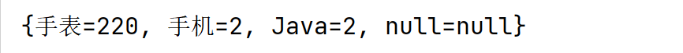
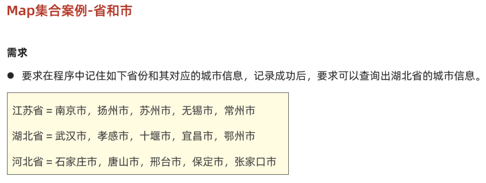

# 一、Map集合

同学们，在前面几节课我们已经学习了Map集合的常用方法，以及遍历方式。

下面我们要学习的是Map接口下面的是三个实现类HashMap、LinkedHashMap、TreeMap。实际上这三个实现类并没有什么特有方法需要我们学习，它们的方法就是前面学习Map的方法。这里我们主要学习它们的底层原理。

### 1.1 HashMap

首先，我们学习HashMap集合的底层原理。前面我们学习过HashSet的底层原理，实际上HashMap底层原理和HashSet是一样的。为什么这么说呢？因为我们往HashSet集合中添加元素时，实际上是把元素作为添加添加到了HashMap集合中。

下面是Map集合的体系结构，HashMap集合的特点是由键决定的： **它的键是无序、不能重复，而且没有索引的**。再各种Map集合中也是用得最多的一种集合。


刚才我们说，HashSet底层就是HashMap，我们可以看源码验证这一点，如下图所示，我们可以看到，创建HashSet集合时，底层帮你创建了HashMap集合；往HashSet集合中添加添加元素时，底层却是调用了Map集合的put方法把元素作为了键来存储。所以实际上根本没有什么HashSet集合，把HashMap的集合的值忽略不看就是HashSet集合。


HashSet的原理我们之前已经学过了，所以HashMap是一样的，底层是哈希表结构。


```java
HashMap底层数据结构: 哈希表结构
	JDK8之前的哈希表 = 数组+链表
	JDK8之后的哈希表 = 数组+链表+红黑树
	哈希表是一种增删改查数据，性能相对都较好的数据结构
	
往HashMap集合中键值对数据时，底层步骤如下
	第1步：当你第一次往HashMap集合中存储键值对时，底层会创建一个长度为16的数组
	第2步：把键然后将键和值封装成一个对象，叫做Entry对象
	第3步：再根据Entry对象的键计算hashCode值（和值无关）
	第4步：利用hashCode值和数组的长度做一个类似求余数的算法，会得到一个索引位置
	第5步：判断这个索引的位置是否为null，如果为null,就直接将这个Entry对象存储到这个索引位置
		   如果不为null，则还需要进行第6步的判断
	第6步：继续调用equals方法判断两个对象键是否相同
		  如果equals返回false，则以链表的形式往下挂
		  如果equals方法true,则认为键重复，此时新的键值对会替换就的键值对。
	
HashMap底层需要注意这几点：
	1.底层数组默认长度为16，如果数组中有超过12个位置已经存储了元素，则会对数组进行扩容2倍
	  数组扩容的加载因子是0.75，意思是：16*0.75=12 	
   	
    2.数组的同一个索引位置有多个元素、并且在8个元素以内(包括8)，则以链表的形式存储
    	JDK7版本：链表采用头插法（新元素往链表的头部添加）
    	JDK8版本：链表采用尾插法（新元素我那个链表的尾部添加）
    	
    3.数组的同一个索引位置有多个元素、并且超过了8个，则以红黑树形式存储
    
```

从HashMap底层存储键值对的过程中我们发现：决定键是否重复依赖与两个方法，一个是hashCode方法、一个是equals方法。有两个键计算得到的hashCode值相同，并且两个键使用equals比较为true，就认为键重复。

**所以，往Map集合中存储自定义对象作为键，为了保证键的唯一性，我们应该重写hashCode方法和equals方法。**

比如有如下案例：往HashMap集合中存储Student对象作为键，学生的家庭住址当做值。要求，当学生对象的姓名和年龄相同时就认为键重复。

```java
public class Student implements Comparable<Student> {
    private String name;
    private int age;
    private double height;

    // this  o
    @Override
    public int compareTo(Student o) {
        return this.age - o.age; // 年龄升序排序
    }

    @Override
    public boolean equals(Object o) {
        if (this == o) return true;
        if (o == null || getClass() != o.getClass()) return false;
        Student student = (Student) o;
        return age == student.age && Double.compare(student.height, height) == 0 && Objects.equals(name, student.name);
    }

    @Override
    public int hashCode() {
        return Objects.hash(name, age, height);
    }

    public Student() {
    }

    public Student(String name, int age, double height) {
        this.name = name;
        this.age = age;
        this.height = height;
    }

	//...get,set方法自己补全....

    @Override
    public String toString() {
        return "Student{" +
                "name='" + name + '\'' +
                ", age=" + age +
                ", height=" + height +
                '}';
    }
}
```

写一个测试类，在测试类中，创建HashMap集合，键是Student类型，值是Stirng类型

```java
/**
 * 目标：掌握Map集合下的实现类：HashMap集合的底层原理。
 */
public class Test1HashMap {
    public static void main(String[] args) {
        Map<Student, String> map = new HashMap<>();
        map.put(new Student("蜘蛛精", 25, 168.5), "盘丝洞");
        map.put(new Student("蜘蛛精", 25, 168.5), "水帘洞");
        map.put(new Student("至尊宝", 23, 163.5), "水帘洞");
        map.put(new Student("牛魔王", 28, 183.5), "牛头山");
        System.out.println(map);
    }
}
```

上面存储的键，有两个蜘蛛精，但是打印出只会有最后一个。


### 1.2 LinkedHashMap

学习完HashMap集合的特点，以及底层原理。接下来我们学习一下LinkedHashMap集合。

- LinkedHashMap集合的特点也是由键决定的：**有序的、不重复、无索引**。


```java
/**
 * 目标：掌握LinkedHashMap的底层原理。
 */
public class Test2LinkedHashMap {
    public static void main(String[] args) {
        // Map<String, Integer> map = new HashMap<>();    //  按照键 无序，不重复，无索引。
        LinkedHashMap<String, Integer> map = new LinkedHashMap<>(); //  按照键 有序，不重复，无索引。
        map.put("手表", 100);
        map.put("手表", 220);
        map.put("手机", 2);
        map.put("Java", 2);
        map.put(null, null);
        System.out.println(map);
    }
}
```

运行上面代码发现，如果是LinedHashMap集合键存储和取出的顺序是一样的



如果是HashMap，键存储和取出的顺序是不一致的


- LinkedHashMap的底层原理，和LinkedHashSet底层原理是一样的。底层多个一个双向链表来维护键的存储顺序。

​      取元素时，先取头节点元素，然后再依次取下一个几点，一直到尾结点。所以是有序的。


### 1.3 TreeMap

最后，我们再学习Map集合下面的另一个子类叫TreeMap。根据我们前面学习其他Map集合的经验，我们应该可以猜出TreeMap有什么特点。

- TreeMap集合的特点也是由键决定的，默认按照键的升序排列，键不重复，也是无索引的。


- TreeMap集合的底层原理和TreeSet也是一样的，底层都是红黑树实现的。所以可以对键进行排序。

  比如往TreeMap集合中存储Student对象作为键，排序方法有两种。直接看代码吧

**排序方式1：**写一个Student类，让Student类实现Comparable接口

```java
//第一步：先让Student类，实现Comparable接口
public class Student implements Comparable<Student>{
    private String name;
    private int age;
    private double height;
	//无参数构造方法
    public Student(){}
    //全参数构造方法
    public Student(String name, int age, double height){
        this.name=name;
        this.age=age;
        this.height=height;
    }
    //...get、set、toString()方法自己补上..
    
    //按照年龄进行比较，只需要在方法中让this.age和o.age相减就可以。
    /*
    原理：
    在往TreeSet集合中添加元素时，add方法底层会调用compareTo方法，根据该方法的
    结果是正数、负数、还是零，决定元素放在后面、前面还是不存。
    */
    @Override
    public int compareTo(Student o) {
        //this：表示将要添加进去的Student对象
        //o: 表示集合中已有的Student对象
        return this.age-o.age;
    }
}
```

**排序方式2：**在创建TreeMap集合时，直接传递Comparator比较器对象。

```java
/**
 * 目标：掌握TreeMap集合的使用。
 */
public class Test3TreeMap {
    public static void main(String[] args) {
        Map<Student, String> map = new TreeMap<>(new Comparator<Student>() {
            @Override
            public int compare(Student o1, Student o2) {
                return Double.compare(o1.getHeight(), o2.getHeight());
            }
        });
//        Map<Student, String> map = new TreeMap<>(( o1,  o2) ->   Double.compare(o2.getHeight(), o1.getHeight()));
        map.put(new Student("蜘蛛精", 25, 168.5), "盘丝洞");
        map.put(new Student("蜘蛛精", 25, 168.5), "水帘洞");
        map.put(new Student("至尊宝", 23, 163.5), "水帘洞");
        map.put(new Student("牛魔王", 28, 183.5), "牛头山");
        System.out.println(map);
    }
}
```

这种方式都可以对TreeMap集合中的键排序。**注意：只有TreeMap的键才能排序，HashMap键不能排序。**


### 1.4 集合嵌套

各位同学，到现在为止我们把Map集合和Collection集合的都已经学习完了。但是在实际开发中可能还会存在一种特殊的用法。就是把一个集合当做元素，存储到另一个集合中去，我们把这种用法称之为集合嵌套。

下面通过一个案例给大家演示一下



- 案例分析

```java
1.从需求中我们可以看到，有三个省份，每一个省份有多个城市
	我们可以用一个Map集合的键表示省份名称，而值表示省份有哪些城市
2.而又因为一个身份有多个城市，同一个省份的多个城市可以再用一个List集合来存储。
	所以Map集合的键是String类型，而指是List集合类型
	HashMap<String, List<String>> map = new HashMap<>();
```

- 代码如下

```java
/**
 * 目标：理解集合的嵌套。
 * 江苏省 = "南京市","扬州市","苏州市“,"无锡市","常州市"
 * 湖北省 = "武汉市","孝感市","十堰市","宜昌市","鄂州市"
 * 河北省 = "石家庄市","唐山市", "邢台市", "保定市", "张家口市"
 */
public class Test {
    public static void main(String[] args) {
        // 1、定义一个Map集合存储全部的省份信息，和其对应的城市信息。
        Map<String, List<String>> map = new HashMap<>();

        List<String> cities1 = new ArrayList<>();
        Collections.addAll(cities1, "南京市","扬州市","苏州市" ,"无锡市","常州市");
        map.put("江苏省", cities1);

        List<String> cities2 = new ArrayList<>();
        Collections.addAll(cities2, "武汉市","孝感市","十堰市","宜昌市","鄂州市");
        map.put("湖北省", cities2);

        List<String> cities3 = new ArrayList<>();
        Collections.addAll(cities3, "石家庄市","唐山市", "邢台市", "保定市", "张家口市");
        map.put("河北省", cities3);
        System.out.println(map);

        List<String> cities = map.get("湖北省");
        for (String city : cities) {
            System.out.println(city);
        }

        map.forEach((p, c) -> {
            System.out.println(p + "----->" + c);
        });
    }
}
```


