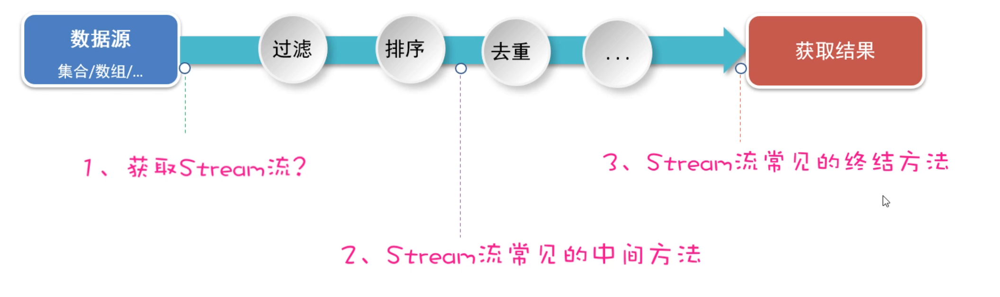
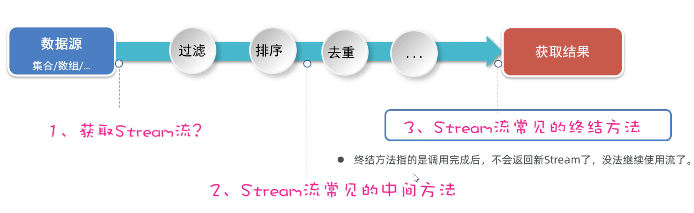

# Stream流、File类

## 二、JDK8新特性（Stream流）

各位同学，接下来我们学习一个全新的知识，叫做Stream流（也叫Stream API）。它是从JDK8以后才有的一个新特性，是专业用于对集合或者数组进行便捷操作的。有多方便呢？我们用一个案例体验一下，然后再详细学习。

### 2.1 Stream流体验

案例需求：有一个List集合，元素有`"张三丰","张无忌","周芷若","赵敏","张强"`，找出姓张，且是3个字的名字，存入到一个新集合中去。

```java
List<String> names = new ArrayList<>();
Collections.addAll(names, "张三丰","张无忌","周芷若","赵敏","张强");
System.out.println(names);
```

- 用传统方式来做，代码是这样的

```java
// 找出姓张，且是3个字的名字，存入到一个新集合中去。
List<String> list = new ArrayList<>();
for (String name : names) {
    if(name.startsWith("张") && name.length() == 3){
        list.add(name);
    }
}
System.out.println(list);
```

- 用Stream流来做，代码是这样的（ps: 是不是想流水线一样，一句话就写完了）

```java
List<String> list2 = names.stream().filter(s -> s.startsWith("张")).filter(a -> a.length()==3).collect(Collectors.toList());
System.out.println(list2);
```

先不用知道这里面每一句话是什么意思，具体每一句话的含义，待会再一步步学习。现在只是体验一下。

学习Stream流我们接下来，会按照下面的步骤来学习。




### 2.2 Stream流的创建

好，接下来我们正式来学习Stream流。先来学习如何创建Stream流、或者叫获取Stream流。


```java
主要掌握下面四点：
	1、如何获取List集合的Stream流？
	2、如何获取Set集合的Stream流？
	3、如何获取Map集合的Stream流？
	4、如何获取数组的Stream流？
```

直接上代码演示

```java
/**
 * 目标：掌握Stream流的创建。
 */
public class StreamTest2 {
    public static void main(String[] args) {
        // 1、如何获取List集合的Stream流？
        List<String> names = new ArrayList<>();
        Collections.addAll(names, "张三丰","张无忌","周芷若","赵敏","张强");
        Stream<String> stream = names.stream();

        // 2、如何获取Set集合的Stream流？
        Set<String> set = new HashSet<>();
        Collections.addAll(set, "刘德华","张曼玉","蜘蛛精","马德","德玛西亚");
        Stream<String> stream1 = set.stream();
        stream1.filter(s -> s.contains("德")).forEach(s -> System.out.println(s));

        // 3、如何获取Map集合的Stream流？
        Map<String, Double> map = new HashMap<>();
        map.put("古力娜扎", 172.3);
        map.put("迪丽热巴", 168.3);
        map.put("马尔扎哈", 166.3);
        map.put("卡尔扎巴", 168.3);

        Set<String> keys = map.keySet();
        Stream<String> ks = keys.stream();

        Collection<Double> values = map.values();
        Stream<Double> vs = values.stream();

        Set<Map.Entry<String, Double>> entries = map.entrySet();
        Stream<Map.Entry<String, Double>> kvs = entries.stream();
        kvs.filter(e -> e.getKey().contains("巴"))
                .forEach(e -> System.out.println(e.getKey()+ "-->" + e.getValue()));

        // 4、如何获取数组的Stream流？
        String[] names2 = {"张翠山", "东方不败", "唐大山", "独孤求败"};
        Stream<String> s1 = Arrays.stream(names2);
        Stream<String> s2 = Stream.of(names2);
    }
}

```


### 2.3 Stream流中间方法

在上一节，我们学习了创建Stream流的方法。接下来我们再来学习，Stream流中间操作的方法。

**中间方法指的是：调用完方法之后其结果是一个新的Stream流，于是可以继续调用方法，这样一来就可以支持链式编程**（或者叫流式编程）。


话不多说，直接上代码演示

```java
/**
 * 目标：掌握Stream流提供的常见中间方法。
 */
public class StreamTest3 {
    public static void main(String[] args) {
        List<Double> scores = new ArrayList<>();
        Collections.addAll(scores, 88.5, 100.0, 60.0, 99.0, 9.5, 99.6, 25.0);
        // 需求1：找出成绩大于等于60分的数据，并升序后，再输出。
        scores.stream().filter(s -> s >= 60).sorted().forEach(s -> System.out.println(s));

        List<Student> students = new ArrayList<>();
        Student s1 = new Student("蜘蛛精", 26, 172.5);
        Student s2 = new Student("蜘蛛精", 26, 172.5);
        Student s3 = new Student("紫霞", 23, 167.6);
        Student s4 = new Student("白晶晶", 25, 169.0);
        Student s5 = new Student("牛魔王", 35, 183.3);
        Student s6 = new Student("牛夫人", 34, 168.5);
        Collections.addAll(students, s1, s2, s3, s4, s5, s6);
        // 需求2：找出年龄大于等于23,且年龄小于等于30岁的学生，并按照年龄降序输出.
        students.stream().filter(s -> s.getAge() >= 23 && s.getAge() <= 30)
                .sorted((o1, o2) -> o2.getAge() - o1.getAge())
                .forEach(s -> System.out.println(s));

        // 需求3：取出身高最高的前3名学生，并输出。
        students.stream().sorted((o1, o2) -> Double.compare(o2.getHeight(), o1.getHeight()))
                .limit(3).forEach(System.out::println);
        System.out.println("-----------------------------------------------");

        // 需求4：取出身高倒数的2名学生，并输出。   s1 s2 s3 s4 s5 s6
        students.stream().sorted((o1, o2) -> Double.compare(o2.getHeight(), o1.getHeight()))
                .skip(students.size() - 2).forEach(System.out::println);

        // 需求5：找出身高超过168的学生叫什么名字，要求去除重复的名字，再输出。
        students.stream().filter(s -> s.getHeight() > 168).map(Student::getName)
               .distinct().forEach(System.out::println);

        // distinct去重复，自定义类型的对象（希望内容一样就认为重复，重写hashCode,equals）
        students.stream().filter(s -> s.getHeight() > 168)
                .distinct().forEach(System.out::println);

        Stream<String> st1 = Stream.of("张三", "李四");
        Stream<String> st2 = Stream.of("张三2", "李四2", "王五");
        Stream<String> allSt = Stream.concat(st1, st2);
        allSt.forEach(System.out::println);
    }
}
```


### 2.5 Stream流终结方法

最后，我们再学习Stream流的终结方法。这些方法的特点是，调用完方法之后，其结果就不再是Stream流了，所以不支持链式编程。



我列举了下面的几个终结方法，接下来用几个案例来一个一个给同学们演示。


话不多说，直接上代码

```java
/**
 * 目标：Stream流的终结方法
 */
public class StreamTest4 {
    public static void main(String[] args) {
        List<Student> students = new ArrayList<>();
        Student s1 = new Student("蜘蛛精", 26, 172.5);
        Student s2 = new Student("蜘蛛精", 26, 172.5);
        Student s3 = new Student("紫霞", 23, 167.6);
        Student s4 = new Student("白晶晶", 25, 169.0);
        Student s5 = new Student("牛魔王", 35, 183.3);
        Student s6 = new Student("牛夫人", 34, 168.5);
        Collections.addAll(students, s1, s2, s3, s4, s5, s6);
        // 需求1：请计算出身高超过168的学生有几人。
        long size = students.stream().filter(s -> s.getHeight() > 168).count();
        System.out.println(size);

        // 需求2：请找出身高最高的学生对象，并输出。
        Student s = students.stream().max((o1, o2) -> Double.compare(o1.getHeight(), o2.getHeight())).get();
        System.out.println(s);

        // 需求3：请找出身高最矮的学生对象，并输出。
        Student ss = students.stream().min((o1, o2) -> Double.compare(o1.getHeight(), o2.getHeight())).get();
        System.out.println(ss);

        // 需求4：请找出身高超过170的学生对象，并放到一个新集合中去返回。
        // 流只能收集一次。
        List<Student> students1 = students.stream().filter(a -> a.getHeight() > 170).collect(Collectors.toList());
        System.out.println(students1);

        Set<Student> students2 = students.stream().filter(a -> a.getHeight() > 170).collect(Collectors.toSet());
        System.out.println(students2);

        // 需求5：请找出身高超过170的学生对象，并把学生对象的名字和身高，存入到一个Map集合返回。
        Map<String, Double> map =
                students.stream().filter(a -> a.getHeight() > 170)
                        .distinct().collect(Collectors.toMap(a -> a.getName(), a -> a.getHeight()));
        System.out.println(map);

        // Object[] arr = students.stream().filter(a -> a.getHeight() > 170).toArray();
        Student[] arr = students.stream().filter(a -> a.getHeight() > 170).toArray(len -> new Student[len]);
        System.out.println(Arrays.toString(arr));
    }
}
```

到这里，关于Stream流的操常见操作我们就已经学习完了。当然Stream流还有一些其他的方法，同学们遇到了也可以自己再研究一下。


## 三、File类

接下来，我们要学习的知识是一个File类。但是在讲这个知识点之前，我想先和同学们聊点别的，聊完之后再回过来学习File你会更容易理解一些。

- 先问大家一个问题，目前你写代码时存储数据，可以用哪些方案?  

  答案如下图所示：可以是变量、可以是数组、可以是对象、可以是集合，但是这些数据都是存储在内存中的，只要程序执行结束，或者断点了，数据就消失了。不能永久存储。


- 有些数据要长久保存，该怎么办呢？

  答案如下图所示：可以将数据以文件的形式存在硬盘里，即使程序结束了，断点了只要硬盘没坏，数据就永久存在。

  

**而现在要学习的File类，它的就用来表示当前系统下的文件（也可以是文件夹）**，通过File类提供的方法可以获取文件大小、判断文件是否存在、创建文件、创建文件夹等。


**但是需要我们注意：**File对象只能对文件进行操作，不能操作文件中的内容。


### 3.1 File对象的创建

学习File类和其他类一样，第一步是创建File类的对象。 想要创建对象，我们得看File类有哪些构造方法。


下面我们演示一下，File类创建对象的代码

```java
需求我们注意的是：路径中"\"要写成"\\"， 路径中"/"可以直接用
```

```java
/**
 * 目标：掌握File创建对象，代表具体文件的方案。
 */
public class FileTest1 {
    public static void main(String[] args) {
        // 1、创建一个File对象，指代某个具体的文件。
        // 路径分隔符
        // File f1 = new File("D:/resource/ab.txt");
        // File f1 = new File("D:\\resource\\ab.txt");
        File f1 = new File("D:" + File.separator +"resource" + File.separator + "ab.txt");
        System.out.println(f1.length()); // 文件大小

        File f2 = new File("D:/resource");
        System.out.println(f2.length());

        // 注意：File对象可以指代一个不存在的文件路径
        File f3 = new File("D:/resource/aaaa.txt");
        System.out.println(f3.length());
        System.out.println(f3.exists()); // false

        // 我现在要定位的文件是在模块中，应该怎么定位呢？
        // 绝对路径：带盘符的
        // File f4 = new File("D:\\code\\javasepromax\\file-io-app\\src\\itheima.txt");
        // 相对路径（重点）：不带盘符，默认是直接去工程下寻找文件的。
        File f4 = new File("file-io-app\\src\\itheima.txt");
        System.out.println(f4.length());
    }
}
```


### 3.2 File判断和获取方法

各位同学，刚才我们创建File对象的时候，会传递一个文件路径过来。但是File对象封装的路径是存在还是不存在，是文件还是文件夹其实是不清楚的。好在File类提供了方法可以帮我们做判断。


话不多少，直接上代码

```java
/**
     目标：掌握File提供的判断文件类型、获取文件信息功能
 */
public class FileTest2 {
    public static void main(String[] args) throws UnsupportedEncodingException {
        // 1.创建文件对象，指代某个文件
        File f1 = new File("D:/resource/ab.txt");
        //File f1 = new File("D:/resource/");

        // 2、public boolean exists()：判断当前文件对象，对应的文件路径是否存在，存在返回true.
        System.out.println(f1.exists());

        // 3、public boolean isFile() : 判断当前文件对象指代的是否是文件，是文件返回true，反之。
        System.out.println(f1.isFile());

        // 4、public boolean isDirectory()  : 判断当前文件对象指代的是否是文件夹，是文件夹返回true，反之。
        System.out.println(f1.isDirectory());
    }
}
```

除了判断功能还有一些获取功能，看代码

```java
File f1 = new File("D:/resource/ab.txt");

// 5.public String getName()：获取文件的名称（包含后缀）
System.out.println(f1.getName());

// 6.public long length()：获取文件的大小，返回字节个数
System.out.println(f1.length());

// 7.public long lastModified()：获取文件的最后修改时间。
long time = f1.lastModified();
SimpleDateFormat sdf = new SimpleDateFormat("yyyy/MM/dd HH:mm:ss");
System.out.println(sdf.format(time));

// 8.public String getPath()：获取创建文件对象时，使用的路径
File f2 = new File("D:\\resource\\ab.txt");
File f3 = new File("file-io-app\\src\\itheima.txt");
System.out.println(f2.getPath());
System.out.println(f3.getPath());

// 9.public String getAbsolutePath()：获取绝对路径
System.out.println(f2.getAbsolutePath());
System.out.println(f3.getAbsolutePath());
```


### 3.3 创建和删除方法

刚才有同学问老师，我们不能不用Java代码创建一个文件或者文件夹呀？答案是有的，不光可以创建还可以删除。

File类提供了创建和删除文件的方法，话不多少，看代码。

```java
/**
 * 目标：掌握File创建和删除文件相关的方法。
 */
public class FileTest3 {
    public static void main(String[] args) throws Exception {
        // 1、public boolean createNewFile()：创建一个新文件（文件内容为空），创建成功返回true,反之。
        File f1 = new File("D:/resource/itheima2.txt");
        System.out.println(f1.createNewFile());

        // 2、public boolean mkdir()：用于创建文件夹，注意：只能创建一级文件夹
        File f2 = new File("D:/resource/aaa");
        System.out.println(f2.mkdir());

        // 3、public boolean mkdirs()：用于创建文件夹，注意：可以创建多级文件夹
        File f3 = new File("D:/resource/bbb/ccc/ddd/eee/fff/ggg");
        System.out.println(f3.mkdirs());

        // 3、public boolean delete()：删除文件，或者空文件，注意：不能删除非空文件夹。
        System.out.println(f1.delete());
        System.out.println(f2.delete());
        File f4 = new File("D:/resource");
        System.out.println(f4.delete());
    }
}
```

需要注意的是：

```java
1.mkdir(): 只能创建单级文件夹、
2.mkdirs(): 才能创建多级文件夹
3.delete(): 文件可以直接删除，但是文件夹只能删除空的文件夹，文件夹有内容删除不了。
```


### 3.4 遍历文件夹方法

有人说，想获取到一个文件夹中的内容，有没有方法呀？也是有的，下面我们就学习两个这样的方法。


话不多少上代码，演示一下

```java
/**
 * 目标：掌握File提供的遍历文件夹的方法。
 */
public class FileTest4 {
    public static void main(String[] args) {
        // 1、public String[] list()：获取当前目录下所有的"一级文件名称"到一个字符串数组中去返回。
        File f1 = new File("D:\\course\\待研发内容");
        String[] names = f1.list();
        for (String name : names) {
            System.out.println(name);
        }

        // 2、public File[] listFiles():（重点）获取当前目录下所有的"一级文件对象"到一个文件对象数组中去返回（重点）
        File[] files = f1.listFiles();
        for (File file : files) {
            System.out.println(file.getAbsolutePath());
        }

        File f = new File("D:/resource/aaa");
        File[] files1 = f.listFiles();
        System.out.println(Arrays.toString(files1));
    }
}
```

这里需要注意几个问题

```java
1.当主调是文件时，或者路径不存在时，返回null
2.当主调是空文件夹时，返回一个长度为0的数组
3.当主调是一个有内容的文件夹时，将里面所有一级文件和文件夹路径放在File数组中，并把数组返回
4.当主调是一个文件夹，且里面有隐藏文件时，将里面所有文件和文件夹的路径放在FIle数组中，包含隐藏文件
5.当主调是一个文件夹，但是没有权限访问时，返回null
```

关于遍历文件夹的基本操作就学习完了。 但是有同学如果想要获取文件夹中子文件夹的内容，那目前还做不到。但是学习下面了下面的递归知识就，很容易做到了。


## 四、递归

各位同学，为了获取文件夹中子文件夹的内容，我们就需要学习递归这个知识点。但是递归是什么意思，我们需要单独讲一下。学习完递归是什么，以及递归的执行流程之后，我们再回过头来用递归来找文件夹中子文件夹的内容。

### 4.1 递归算法引入

- 什么是递归？

  递归是一种算法，从形式上来说，方法调用自己的形式称之为递归。

- 递归的形式：有直接递归、间接递归，如下面的代码。

```java
/**
 * 目标：认识一下递归的形式。
 */
public class RecursionTest1 {
    public static void main(String[] args) {
        test1();
    }

    // 直接方法递归
    public static void test1(){
        System.out.println("----test1---");
        test1(); // 直接方法递归
    }

    // 间接方法递归
    public static void test2(){
        System.out.println("---test2---");
        test3();
    }

    public static void test3(){
        test2(); // 间接递归
    }
}

```

如果直接执行上面的代码，会进入死循环，最终导致栈内存溢出


以上只是用代码演示了一下，递归的形式。在下一节，在通过一个案例来给同学们讲一讲递归的执行流程。


### 4.2 递归算法的执行流程

为了弄清楚递归的执行流程，接下来我们通过一个案例来学习一下。

案例需求：计算n的阶乘，比如5的阶乘 = 1 * 2 * 3 * 4 * 5 ； 6 的阶乘 =  1 * 2 * 3 * 4 * 5 * 6

分析需求用递归该怎么做

```java
假设f(n)表示n的阶乘，那么我们可以推导出下面的式子
	 f(5) = 1+2+3+4+5
    f(5) = f(4)+5
    f(4) = f(3)+4
    f(3) = f(2)+3
    f(2) = f(1)+2
    f(1) = 1
总结规律：
	除了f(1) = 1; 出口
	其他的f(n) = f(n-1)+n
```

我们可以把f(n)当做一个方法，那么方法的写法如下

```java
/**
 * 目标：掌握递归的应用，执行流程和算法思想。
 */
public class RecursionTest2 {
    public static void main(String[] args) {
        System.out.println("5的阶乘是：" + f(5));
    }

    //求n个数的阶乘
    public static int f(int n){
        // 终结点
        if(n == 1){
            return 1;
        }else {
            return f(n - 1) * n;
        }
    }
}
```

这个代码的执行流程，我们用内存图的形式来分析一下，该案例中递归调用的特点是：**一层一层调用，再一层一层往回返。**


### 4.3 递归文件搜索

学习完递归算法执行流程后，最后我们回过头来。再来看一下，如果使用递归来遍历文件夹。

案例需求：在`D:\\`判断下搜索QQ.exe这个文件，然后直接输出。

```java
1.先调用文件夹的listFiles方法，获取文件夹的一级内容，得到一个数组
2.然后再遍历数组，获取数组中的File对象
3.因为File对象可能是文件也可能是文件夹，所以接下来就需要判断
	判断File对象如果是文件，就获取文件名，如果文件名是`QQ.exe`则打印，否则不打印
	判断File对象如果是文件夹，就递归执行1,2,3步骤
所以：把1，2,3步骤写成方法，递归调用即可。
```

代码如下：

```java
/**
 * 目标：掌握文件搜索的实现。
 */
public class RecursionTest3 {
    public static void main(String[] args) throws Exception {
          searchFile(new File("D:/") , "QQ.exe");
    }

    /**
     * 去目录下搜索某个文件
     * @param dir  目录
     * @param fileName 要搜索的文件名称
     */
    public static void searchFile(File dir, String fileName) throws Exception {
        // 1、把非法的情况都拦截住
        if(dir == null || !dir.exists() || dir.isFile()){
            return; // 代表无法搜索
        }

        // 2、dir不是null,存在，一定是目录对象。
        // 获取当前目录下的全部一级文件对象。
        File[] files = dir.listFiles();

        // 3、判断当前目录下是否存在一级文件对象，以及是否可以拿到一级文件对象。
        if(files != null && files.length > 0){
            // 4、遍历全部一级文件对象。
            for (File f : files) {
                // 5、判断文件是否是文件,还是文件夹
                if(f.isFile()){
                    // 是文件，判断这个文件名是否是我们要找的
                    if(f.getName().contains(fileName)){
                        System.out.println("找到了：" + f.getAbsolutePath());
                        Runtime runtime = Runtime.getRuntime();
                        runtime.exec(f.getAbsolutePath());
                    }
                }else {
                    // 是文件夹，继续重复这个过程（递归）
                    searchFile(f, fileName);
                }
            }
        }
    }
}
```


