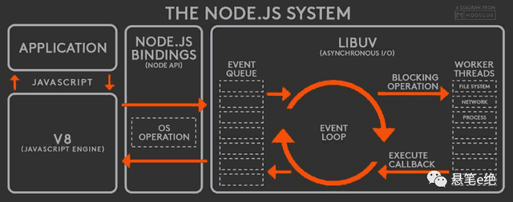
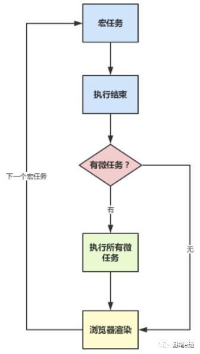

# 事件循环

事件循环是集合不是队列，是堆结构（堆类似树形结构），会先去拿到当前最优先可执行事件，

## 浏览器 和 node

### nodejs中事件循环和浏览器的异同

1.底层不同 一个基于浏览器；一个基于libuv库(libuv 实现 setTimeout)

2.宏任务微任务的执行机制不同

（1）node11之前
    1）执行完一个阶段所有同类型的宏任务     
    2）执行完nextTick队列里面的内容
    3）然后执行完微任务队列的内容，
（2）Node11之后
    宏任务和微任务的执行结果，跟浏览器一致了；
    执行首个宏任务 -> 执行这个宏任务中的所有微任务 -> event loop执行完毕，执行下一个eventloop
    
### 相同点  

（1）事件循环event loop的目的：处理同步和异步事件的一种事件调度机制；

（2）循环是没有终点的，只要进程在，就会有新任务，就会去执行；

libuv

## 浏览器中的事件循环
1.机制如下：
浏览器的事件循环，是在渲染进程中的；
执行一个宏任务，栈中没有就从事件队列中获取；
执行过程中如果遇到微任务，就添加到微任务的队列中；
当前这个宏任务执行完毕后，立即执行当前微任务队列的所有微任务；
当前宏任务执行完毕，GUI线程接管渲染；
渲染完毕后，JS线程继续接管，开始下一个宏任务；

简化就两步：执行一个宏任务，执行完它对于的所有微任务；

## 宏任务 macrotask

script主代码块、setTimeout 、setInterval 、nodejs的setImmediate 、MessageChannel（react的fiber用到）、postMessage、网络I/O、文件I/O、用户交互的回调等事件、UI渲染事件（DOM解析、布局计算、绘制）等等

时间粒度比较大，执行的时间间隔是不能精确控制的，消息队列中就有可能被插入很多系统级的任务，对一些高实时性的需求就不太符合了；
所有设计了微任务，通俗的讲微任务可以插队，本轮宏任务最后，插在下一轮宏任务之前，微任务队列的任务一次性全部执行完；

每个宏任务可以创建自己的一个微任务队列；

## 微任务 microtask

浏览器端有3个
1）new Promise().then 回调
2）MutationObserver，监控dom节点变化；
MutationObserver使用“异步”+“微任务”的方式，替代旧版mutation event这个同步事件，
异步解决同步操作的性能问题；微任务解决了实时性的问题；
3）Object.observe，已经废弃了，用Proxy对象替代；

nodejs有2个
1） process.nextTick
2） new Promise().then 回调

nodejs中process.nextTick >new Promise().then(回调) > MutationObserver

