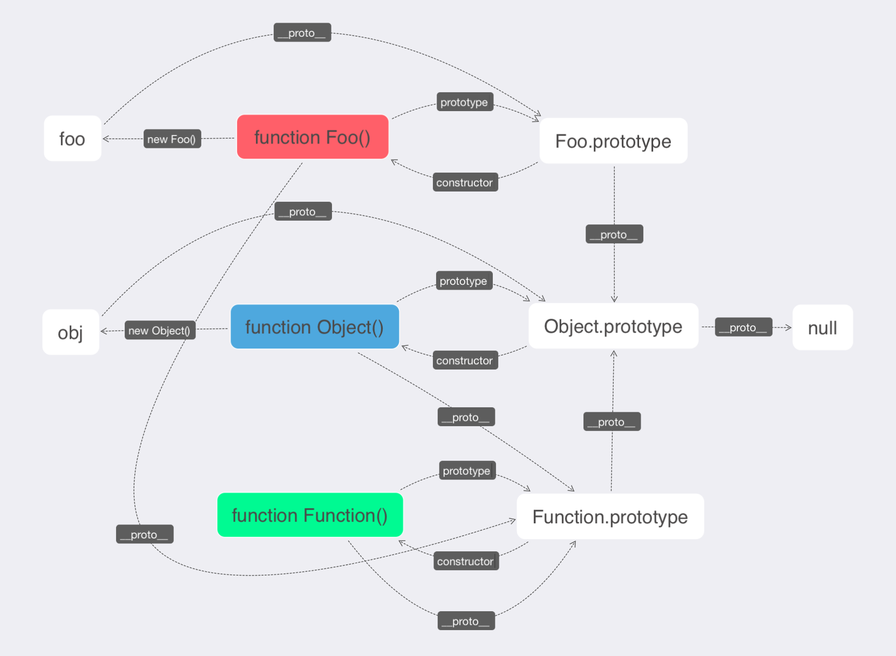

# prototype



# 属性继承

```js
function father(age, name, sex) {
  this.age = 48;
  this.name = "lhy";
  this.sex = "man";
}

function son(age, name, sex, ll, woman) {
  father.call(this, age, name, sex);
  // father.apply(this,[age,name,sex]);
  this.son = ll;
  this.lover = woman;
}

var a = new son("21", "ll", "man", "小龙", "美女");
console.log(a.age, a.name, a.sex, a.son, a.lover); //48 'lhy' 'man' '小龙' '美女'
```

# 原型继承

```js
function big() {
  this.num = 1;
}
big.prototype.way = function () {
  console.log(this.num);
};

function samll() {
  big.call(this);
}
```

## 第一种继承 圣杯模式

```js
function inherit(target, origin) {
  //替代者
  function news() {}
  news.prototype = origin.prototype;
  target.prototype = new news(); //圣杯模式 解决 继承者 添加新方法时候不会影响 被继承者;如(samll.prototype=big.prototype)则会影响
  target.prototype.constructor = target; //改变原型上的指向 为自己 否则是big
  target.prototype.user = origin; //自定义方法：存储自己原型继承自谁
}
inherit(samll, big); //samll 继承 big原型
```

## 第二种 混合式继承

```js
var _prototype = Object.create(big.prototype); //创建副本 function big(throw error('请使用Object.create 方式 不要new 去调用我 否则我将执行两次'))
_prototype.constructor = samll; //修正
_prototype.user = big; //自定义方法
samll.prototype = _prototype;

```

```js
  	var samll=new samll();
		console.log(samll instanceof big)//原型是不是来自big  true
		
		samll.way();//1 
		console.log(samll.constructor + "指向自己");
    // 原型 指向 function samll(){
		// 	big.call(this)
		// }指向自己
		console.log(samll.user + "继承自它");
    // 继承自谁
    // function big(){
		// 	this.num=1;
		// }继承自它
```