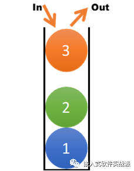
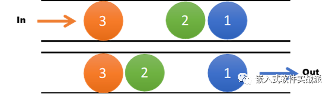

# 栈和队列

## 栈和队列的结构特点

### 栈
  栈是一种特殊的线性表，它只能在一个表的一个固定端进行数据结点的插入和删除操作。
 

### 队列
  队列和栈类似，也是一种特殊的线性表。和栈不同的是，队列只允许在表的一端进行插入操作，而在另一端进行删除操作。

 

  从上面两个图可以看出，栈的出入口只有一个，而队列的入口和出口是分开的。我们就用两个专业名称来说明这两个特性，后进先出（LIFO）和先进先出（FIFO）。

    很明显，栈是LIFO，而队列是FIFO。

    对于栈，放入数据称为Push（压栈），取出数据称为Pop（出栈）