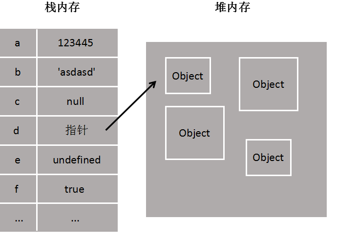
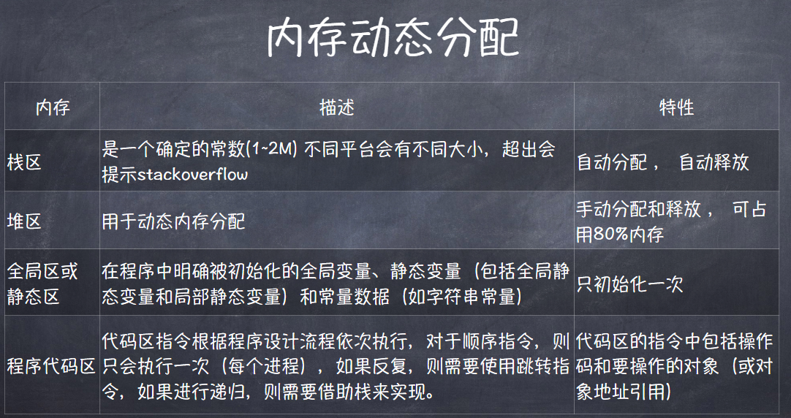

1. 栈内存中的变量一般都是已知大小或者有范围上限的
2. 堆内存存储的对象类型数据对于大小，一般都是未知的

3. 栈内存线性有序存储，容量小，系统分配效率高。而堆内存首先要在堆内存新分配存储区域，之后又要把 "指针存储" 到栈内存中，效率相对就要低一些了。
4. 垃圾回收方面，栈内存变量基本上用完就回收了，而推内存中的变量因为存在很多不确定的引用，只有当所有调用的变量全部销毁之后才能回收。
