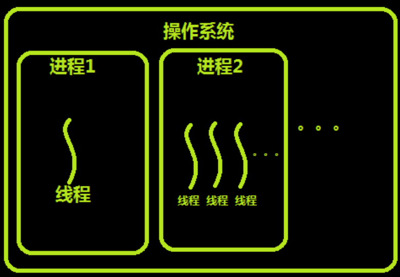
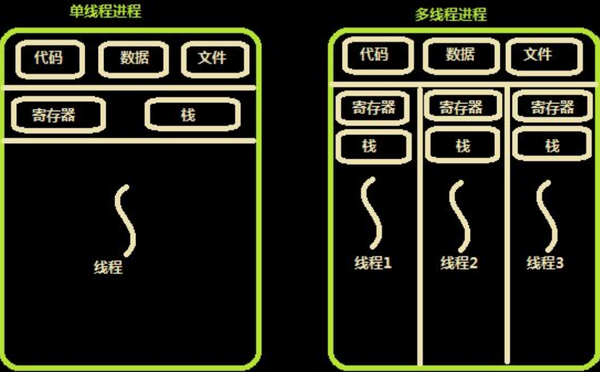
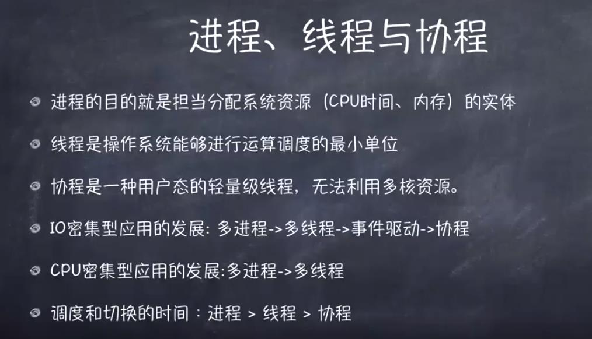

> 操作系统

> **1. 对硬件资源的调度（cpu、内存）** > **2. 操作系统的设计：**

    （1）以多进程形式，允许多个任务同时运行；

    （2）以多线程形式，允许单个任务分成不同的部分运行；

    （3）提供协调机制，一方面防止进程之间和线程之间产生冲突，另一方面允许进程之间和线程之间共享资源。

> 进程

> **1. 进程是系统资源分配的最小单位。 系统由一个个进程(程序)组成 一般情况下，包括文本区域（text region）、数据区域（data region）和堆栈（stack region）** > **2. 进程的创建和销毁都是相对于系统资源,所以是一种比较昂贵的操作** > **3. 进程有三个状态**

        等待态：等待某个事件的完成
        就绪态：等待系统分配处理器以便运行
        运行态：占有处理器正在运行

> **4.进程是抢占式的争夺 CPU 运行自身,而 CPU 单核的情况下同一时间只能执行一个进程的代码,但是 多进程的实现则是通过 CPU 飞快的切换不同进程 ,因此使得看上去就像是多个进程在同时进行.** > **5. 通信问题:    由于进程间是隔离的,各自拥有自己的内存内存资源,因此相对于线程比较安全, 所以不同进程之间的数据只能通过信号系统*IPC(Inter-Process Communication)*进行通信共享.\*\*\*** >**6. 进程就是包换上下文切换的程序执行时间总和** = **CPU 加载上下文+CPU 执行+CPU 保存上下文**

    CPU看来所有的任务都是一个一个的轮流执行的，具体的轮流方法就是：***先加载程序A的上下文，然后开始执行A，保存程序A的上下文，调入下一个要执行的程序B的程序上下文，然后开始执行B,保存程序B的上下文*

---

    例子：

    计算机的核心是CPU，它承担了所有的计算任务。它就像一座工厂，时刻在运行。

    假定工厂的电力有限，一次只能供给一个车间使用。也就是说，一个车间开工的时候，其他车间都必须停工。背后的含义就是，单个CPU一次只能运行一个任务。

    进程就好比工厂的车间，它代表CPU所能处理的单个任务。任一时刻，CPU总是运行一个进程，其他进程处于非运行状态

> 线程

> **1. 线程是 CPU 调度的最小单位。线程属于进程** > **2. 线程共享进程的内存地址空间** > **3. 线程几乎不占有系统资源 通信问题:    进程相当于一个容器,而线程而是运行在容器里面的,因此对于容器内的东西,线程是共同享有的,因此线程间的通信可以直接通过全局变量进行通信,但是由此带来的例如多个线程读写同一个地址变量的时候则将带来不可预期的后果,因此这时候引入了各种锁的作用,例如互斥锁等** > **4.同时多线程是不安全的,当一个线程崩溃了,会导致整个进程也崩溃了,即其他线程也挂了, 但多进程而不会,一个进程挂了,另一个进程依然照样运行。** > **5.线程和进程的上下文切换**

    进程切换分3步:

    1.  切换页目录以使用新的地址空间
    2.  切换内核栈
    3.  切换硬件上下文

    而线程切换只需要第2、3步,因此进程的切换代价比较大

---

    例子：

    一个车间里，可以有很多工人。他们协同完成一个任务。

    线程就好比车间里的工人。一个进程可以包括多个线程。

    车间的空间是工人们共享的，比如许多房间是每个工人都可以进出的。这象征一个进程的内存空间是共享的，每个线程都可以使用这些共享内存。

    可是，每间房间的大小不同，有些房间最多只能容纳一个人，比如厕所。里面有人的时候，其他人就不能进去了。这代表一个线程使用某些共享内存时，其他线程必须等它结束，才能使用这一块内存。

    一个防止他人进入的简单方法，就是门口加一把锁。先到的人锁上门，后到的人看到上锁，就在门口排队，等锁打开再进去。这就叫["互斥锁"]()（Mutual exclusion，缩写 Mutex），防止多个线程同时读写某一块内存区域。

    还有些房间，可以同时容纳n个人，比如厨房。也就是说，如果人数大于n，多出来的人只能在外面等着。这好比某些内存区域，只能供给固定数目的线程使用。

    这时的解决方法，就是在门口挂n把钥匙。进去的人就取一把钥匙，出来时再把钥匙挂回原处。后到的人发现钥匙架空了，就知道必须在门口排队等着了。这种做法叫做["信号量"]()（Semaphore），用来保证多个线程不会互相冲突。

**互斥锁 ?**

    当多个线程几乎同时修改一个共享数据的时候，需要进行同步控制，线程同步能够保证多个线程安全的竞争资源，最简单的同步机制就是引入互斥锁

    如何运行：某个线程需要更改共享数据的时候，先锁定，此时资源状态为锁定状态，其他线程不能更改，直到该线程释放资源，将资源的状态变成非锁定状态，其他线程才能再次锁定该资源，互斥锁保证每次只有一个线程进行操作，从而保证多线程情况的数据正确性!

    优点：确保某段关键代码只能有一个线程从头到尾完整的执行

    缺点：A--阻止了多线程的并发，包含锁的某段代码只能以单线程的模式执行，效率大打折扣。B--由于可以存在多个锁，不同的线程持有不同的锁，并试图获取对方的锁，可能会造成死锁！

> **1. 协程是属于线程的。协程程序是在线程里面跑的，因此协程又称微线程和纤程等** >**2. 协程的调度切换是用户(程序员)手动切换的,因此更加灵活,因此又叫用户空间线程.线程和进程切换时操作系统控制的** >**3. 原子操作性。由于协程是用户调度的，所以不会出现执行一半的代码片段被强制中断了，因此无需原子操作锁** >**4. 协程没有线程的上下文切换消耗大。 线程切换从系统层面远不止保存和恢复 CPU 上下文这么简 单，所以线程的切换非常耗性，在一个线程中的某个函数，可以在任何地方保存当前函数的一 些临时变量等信息，然后切换到另外一个函数中执行（切换保存上下文）**

> 进程和线程的区别

    多线程用于IO密集型，如socket，爬虫，web，适合脚本语言

    多进程用于计算密集型，如金融分析，适合C语言

    进程和线程都是一个时间段的描述，是CPU工作时间段的描述，不过是颗粒大小不同

    进程是系统进行资源的分配和调度的一个独立单位

    线程:能够完成多任务,例如在同一个QQ可以开多个聊天窗口

    线程属于进程,是进程的一个实体,是cpu调度和分配的基本单位,能更小的独立运行的基本单位，线程自己使用系统资源

    1 一个程序至少有一个进程,一个进程至少有一个线程

    2 线程的划分尺度小于进程(就是占用资源比进程少)

    3 进程在执行过程中拥有独立的内存单元，而多个线程共享进程的内存地址空间,提高工作效率

    4 线程不能独立的运行，必须依存在进程中

    5 进程就好比工厂的流水线,线程就好比流水线的员工

    优缺点：线程执行开销小，效率高,，但不利于资源的管理和保护；而进程正相反

---

**流程：.exe 可执行程序 => run => 进程 => 分配线程(协程比线程轻量比进程轻量)
例如：一台电脑上可以运行多个 QQ（独立上下文，进程）,QQ 可以开多个聊天窗口（独立上下文，共享内存空间，线程）,多个聊天窗口（执行不同功能，保存上下文，切换到另一个线程函数，协程）**

