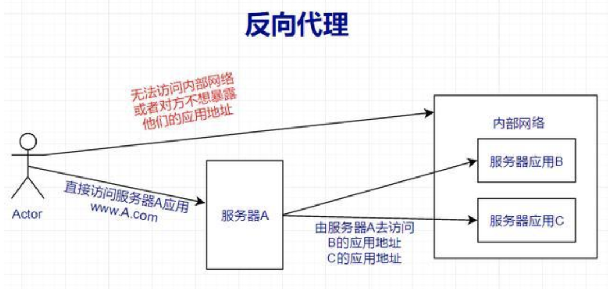
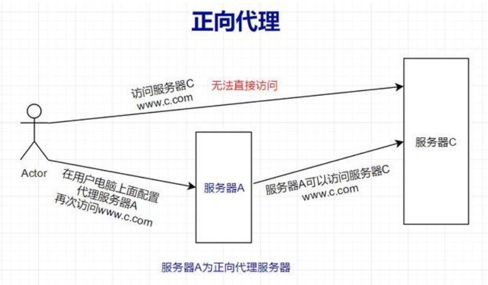

    nginx常用做静态内容服务和代理服务器，直接外来请求转发给后面的应用服务器（tomcat，Django等），tomcat更多用来做一个应用容器，让javaweb app泡在里面的东西。

    严格意义上来讲，Apache和nginx应该叫做HTTP Server，而tomcat是一个Application Server是一个Servlet/JSO应用的容器。

    客户端通过HTTP Server访问服务器上存储的资源（HTML文件，图片文件等），HTTP Server是中只是把服务器上的文件如实通过HTTP协议传输给客户端。

    应用服务器往往是运行在HTTP Server的背后，执行应用，将动态的内容转化为静态的内容之后，通过HTTP Server分发到客户端

    注意：nginx只是把请求做了分发，不做处理！！！

> Nginx 和 Apache 的区别

    Apache是同步多进程模型，一个连接对应一个进程，而nginx是一步的，多个连接（万级别）可以对应一个进程。

    nginx轻量级，抗并发，处理静态文件好

    Apache超稳定，对PHP支持比较检单，nginx需要配合其他后端用，处理动态请求有优势

    建议使用前端nginx抗并发，后端apache集群，配合起来会更好

> Nignx 的正向代理何反向代理

