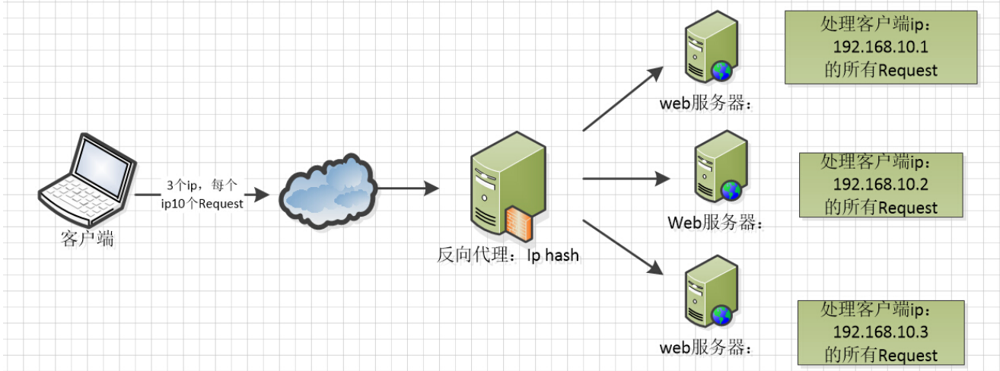
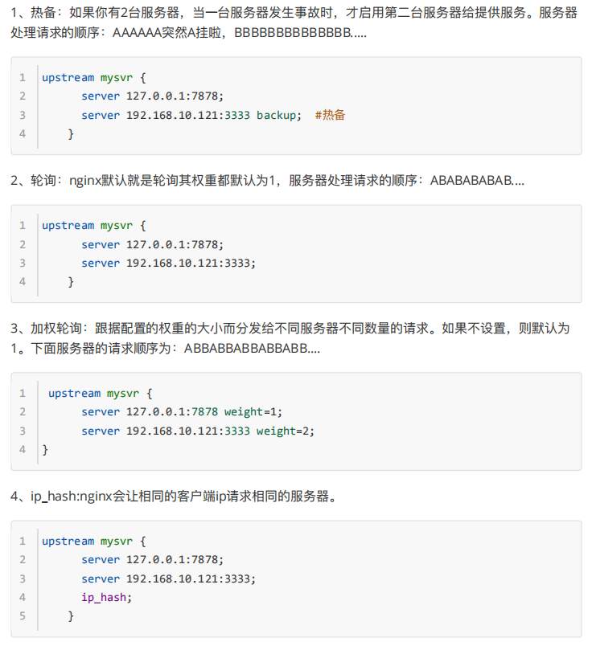

## Nginx 能做什么

> 1.反向代理  
> 2.负载均衡  
> 3.HTTP 服务器（包含动静分离）  
> 4.正向代理

以上就是我了解到的 Nginx 在不依赖第三方模块能处理的事情，下面详细说明每种功能怎么做

### **反向代理**

反向代理应该是 Nginx 做的最多的一件事了，什么是反向代理呢，以下是百度百科的说法：反向代理（Reverse Proxy）方式是指以代理服务器来接受 internet 上的连接请求，然后将请求转发给内部网络上的服务器，并将从服务器上得到的结果返回给 internet 上请求连接的客户端，此时代理服务器对外就表现为一个反向代理服务器。简单来说就是真实的服务器不能直接被外部网络访问，所以需要一台代理服务器，而代理服务器能被外部网络访问的同时又跟真实服务器在同一个网络环境，当然也可能是同一台服务器，端口不同而已。 下面贴上一段简单的实现反向代理的代码

```
server {
        listen       80;
        server_name  localhost;
        client_max_body_size 1024M;

        location / {
            proxy_pass http://localhost:8080;
            proxy_set_header Host $host:$server_port;
        }
    }

```

保存配置文件后启动 Nginx，这样当我们访问 localhost 的时候，就相当于访问 localhost:8080 了。

### **负载均衡**

负载均衡也是 Nginx 常用的一个功能，负载均衡其意思就是分摊到多个操作单元上进行执行，例如 Web 服务器、FTP 服务器、企业关键应用服务器和其它关键任务服务器等，从而共同完成工作任务。简单而言就是当有 2 台或以上服务器时，根据规则随机的将请求分发到指定的服务器上处理，负载均衡配置一般都需要同时配置反向代理，通过反向代理跳转到负载均衡。而 Nginx 目前支持自带 3 种负载均衡策略，还有 2 种常用的第三方策略。

#### 1、轮询*RR*(默认)

每个请求按时间顺序逐一分配到不同的后端服务器，如果后端服务器 down 掉，能自动剔除。

简单配置

```
upstream test {
    server localhost:8080;
    server localhost:8081;
}
server {
    listen       81;
    server_name  localhost;
    client_max_body_size 1024M;

    location / {
        proxy_pass http://test;
        proxy_set_header Host $host:$server_port;
    }
}

```

负载均衡的核心代码为

```
upstream test {
server localhost:8080;
server localhost:8081;
}

```

这里我配置了 2 台服务器，当然实际上是一台，只是端口不一样而已，而 8081 的服务器是不存在的,也就是说访问不到，但是我们访问http://localhost 的时候,也不会有问题，会默认跳转到http://localhost:8080 具体是因为 Nginx 会自动判断服务器的状态，如果服务器处于不能访问（服务器挂了），就不会跳转到这台服务器，所以也避免了一台服务器挂了影响使用的情况，由于 Nginx 默认是 RR 策略，所以我们不需要其他更多的设置。

#### 2、权重 balance

指定轮询几率，weight 和访问比率成正比，用于后端服务器性能不均的情况。 例如

```
upstream test {
    server localhost:8080 weight=9;
    server localhost:8081 weight=1;
}

```

那么 10 次一般只会有 1 次会访问到 8081，而有 9 次会访问到 8080

#### 3、ip_hash

上面的 2 种方式都有一个问题，那就是下一个请求来的时候请求可能分发到另外一个服务器，当我们的程序不是无状态的时候（采用了 session 保存数据），这时候就有一个很大的很问题了，比如把登录信息保存到了 session 中，那么跳转到另外一台服务器的时候就需要重新登录了，所以很多时候我们需要一个客户只访问一个服务器，那么就需要用 iphash 了，iphash 的每个请求按访问 ip 的 hash 结果分配，这样每个访客固定访问一个后端服务器，可以解决 session 的问题。

```
upstream test {
    ip_hash;
    server localhost:8080;
    server localhost:8081;
}

```



#### 4、fair（第三方）

按后端服务器的响应时间来分配请求，响应时间短的优先分配。

```
upstream backend {
    fair;
    server localhost:8080;
    server localhost:8081;
}

```

#### 5、url_hash（第三方）

按访问 url 的 hash 结果来分配请求，使每个 url 定向到同一个后端服务器，后端服务器为缓存时比较有效。 在 upstream 中加入 hash 语句，server 语句中不能写入 weight 等其他的参数，hash_method 是使用的 hash 算法。

```
upstream backend {
    hash $request_uri;
    hash_method crc32;
    server localhost:8080;
    server localhost:8081;
}

```

以上 5 种负载均衡各自适用不同情况下使用，所以可以根据实际情况选择使用哪种策略模式,不过 fair 和 url_hash 需要安装第三方模块才能使用，由于本文主要介绍 Nginx 能做的事情，所以 Nginx 安装第三方模块不会再本文介绍。

### **图片举例**



### HTTP 服务器

Nginx 本身也是一个静态资源的服务器，当只有静态资源的时候，就可以使用 Nginx 来做服务器，同时现在也很流行动静分离，就可以通过 Nginx 来实现，首先看看 Nginx 做静态资源服务器。

```
server {
    listen       80;
    server_name  localhost;
    client_max_body_size 1024M;


    location / {
           root   e:wwwroot;
           index  index.html;
       }
}

```

这样如果访问http://localhost 就会默认访问到 E 盘 wwwroot 目录下面的 index.html，如果一个网站只是静态页面的话，那么就可以通过这种方式来实现部署。

#### 动静分离

动静分离是让动态网站里的动态网页根据一定规则把不变的资源和经常变的资源区分开来，动静资源做好了拆分以后，我们就可以根据静态资源的特点将其做缓存操作，这就是网站静态化处理的核心思路。

upstream test{  
server localhost:8080;  
server localhost:8081;  
}

```
  server {
      listen       80;
      server_name  localhost;

      location / {
          root   e:wwwroot;
          index  index.html;
      }

      # 所有静态请求都由nginx处理，存放目录为html
      location ~ .(gif|jpg|jpeg|png|bmp|swf|css|js)$ {
          root    e:wwwroot;
      }

      # 所有动态请求都转发给tomcat处理
      location ~ .(jsp|do)$ {
          proxy_pass  http://test;
      }

      error_page   500 502 503 504  /50x.html;
      location = /50x.html {
          root   e:wwwroot;
      }
  }

```

这样我们就可以吧 HTML 以及图片和 css 以及 js 放到 wwwroot 目录下，而 tomcat 只负责处理 jsp 和请求，例如当我们后缀为 gif 的时候，Nginx 默认会从 wwwroot 获取到当前请求的动态图文件返回，当然这里的静态文件跟 Nginx 是同一台服务器，我们也可以在另外一台服务器，然后通过反向代理和负载均衡配置过去就好了，只要搞清楚了最基本的流程，很多配置就很简单了，另外 localtion 后面其实是一个正则表达式，所以非常灵活

### 正向代理

正向代理，意思是一个位于客户端和原始服务器(origin server)之间的服务器，为了从原始服务器取得内容，客户端向代理发送一个请求并指定目标(原始服务器)，然后代理向原始服务器转交请求并将获得的内容返回给客户端。客户端才能使用正向代理。当你需要把你的服务器作为代理服务器的时候，可以用 Nginx 来实现正向代理，但是目前 Nginx 有一个问题，那么就是不支持 HTTPS，虽然我百度到过配置 HTTPS 的正向代理，但是到最后发现还是代理不了，当然可能是我配置的不对，所以也希望有知道正确方法的同志们留言说明一下。

```
resolver 114.114.114.114 8.8.8.8;
server {

    resolver_timeout 5s;

    listen 81;

    access_log  e:wwwrootproxy.access.log;
    error_log   e:wwwrootproxy.error.log;

    location / {
        proxy_pass http://$host$request_uri;
    }
}

```

resolver 是配置正向代理的 DNS 服务器，listen 是正向代理的端口，配置好了就可以在 ie 上面或者其他代理插件上面使用服务器 ip+端口号进行代理了。

### 最后说两句

Nginx 是支持热启动的，也就是说当我们修改配置文件后，不用关闭 Nginx，就可以实现让配置生效，当然我并不知道多少人知道这个，反正我一开始并不知道，导致经常杀死了 Nginx 线程再来启动。。。

Nginx 重新读取配置的命令

```
nginx -s reload
```
