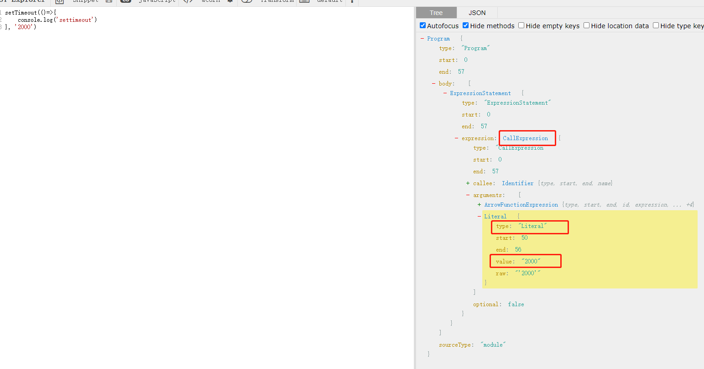
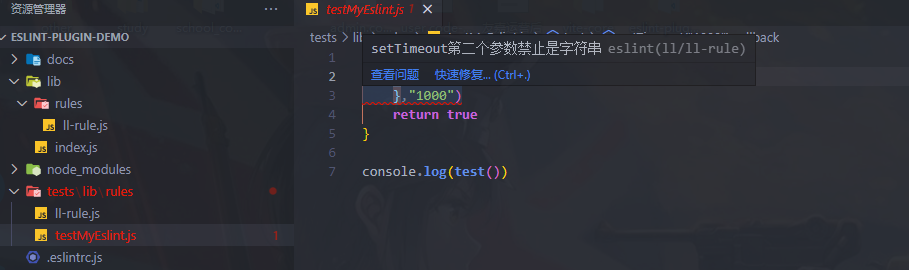

# 手写一个Eslint

## 创建项目并生成模板

ESLint 官方为了方便开发者开发插件，提供了使用 Yeoman 模板 [generator-eslint](https://www.npmjs.com/package/generator-eslint) 

`npm install -g yo generator-eslint`

### 创建一个文件夹：

`mkdir eslint-plugin-demo`

`cd eslint-plugin-demo`

### 进入命令行交互流程

```js
? What is your name? OBKoro1
? What is the plugin ID? korolint   // 这个插件的ID是什么
? Type a short description of this plugin: XX公司的定制ESLint rule // 输入这个插件的描述
? Does this plugin contain custom ESLint rules? Yes // 这个插件包含自定义ESLint规则吗?
? Does this plugin contain one or more processors? No // 这个插件包含一个或多个处理器吗
// 处理器用于处理js以外的文件 比如.vue文件
   create package.json
   create lib/index.js
   create README.md
```

### 上面的代码主要是创建了 eslint 的项目模板，现在我们来创建 rule 相关的文件

```js
? What is your name? OBKoro1
? Where will this rule be published? (Use arrow keys) // 这个规则将在哪里发布？
❯ ESLint Core  // 官方核心规则 (目前有200多个规则)
  ESLint Plugin  // 选择ESLint插件
? What is the rule ID? settimeout-no-number  // 规则的ID
? Type a short description of this rule: setTimeout 第二个参数禁止是数字  // 输入该规则的描述
? Type a short example of the code that will fail:  占位  // 输入一个失败例子的代码
   create docs/rules/settimeout-no-number.md
   create lib/rules/settimeout-no-number.js
   create tests/lib/rules/settimeout-no-number.js
```

### 结构

```js

├── README.md
├── docs // 使用文档
│   └── rules // 所有规则的文档
│       └── settimeout-no-number.md // 具体规则文档
├── lib // eslint 规则开发
│   ├── index.js 引入+导出rules文件夹的规则
│   └── rules // 此目录下可以构建多个规则
│       └── settimeout-no-number.js // 规则细节
├── package.json
└── tests // 单元测试
    └── lib
        └── rules
            └── settimeout-no-number.js // 测试该规则的文件

```

### 安装

`npm install`

### Eslint 运行原理

- eslint 通过解释器把我们写的代码转换成对应的 AST 抽象语法树，不同的语法需要用不同的解析器来解析，如Vue、TSX
- AST 选择器很多，ESLint官方专门有一个仓库列出了所有类型的选择器: estree
- 在遍历过程中，规则会对对应的选择器进行监听，一旦匹配到对应的选择器，就会触发对应的回调
- 语法分析：将词法分析出的代码转换成对应的树结构，如果语法有错误会抛出

###  astexplorer.net

查看代码被解析成AST的样子

### 开始

1. 通过AST 观察结构 



 生成校验文件  `lib/rules/ll-rule.js`

```js
/**
 * @fileoverview setTimeout 禁止第二个参数是字符串
 * @author ll-eslint
 */

module.exports = {
  meta: {
    type:"problem", //指定检测的级别是 问题 or 建议 or 标点
    docs: {
      description: "setTimeout 禁止第二个参数是字符串",
    },
    schema:[],
    fixable: 'code', // Or `code` or `whitespace`
  },

  // rule 核心 返回一个对象，对象的属性设为选择器，ESLint会收集这些选择器，在AST遍历过程中会执行所有监听该选择器的回调。
  create(context) {
  // 公共变量和函数应该在此定义

    return {
        // 返回事件钩子
        'CallExpression': (node) => { //node =>  AST 语法解析结果
          if (node.callee.name !== 'setTimeout') return // 不是定时器即过滤
          const timeNode = node.arguments && node.arguments[1] // 获取第二个参数
          if (!timeNode) return // 没有第二个参数
          // 检测报错第二个参数是字符串 报错
          if (timeNode.type === 'Literal' && typeof timeNode.value === 'string') {
              context.report({ //context.report()：这个方法是用来通知ESLint这段代码是警告或错误的
                  node,
                  message: 'setTimeout第二个参数禁止是字符串'
              })
          }
      }
    };
  },
};

```

2. 测试用例

 生成文件  `tests/lib/rules/ll-rule.js`

 ```js
 /**
 * @fileoverview setTimeout 禁止第二个参数是字符串 for ll
 * @author ll-eslint
 */
 "use strict";
 var rule = require("../../../lib/rules/ll-rule"), // 引入rule
     RuleTester = require("eslint").RuleTester;
 
 var ruleTester = new RuleTester({
     parserOptions: {
         ecmaVersion: 7, // 默认支持语法为es5 
     },
 });
 // 运行测试用例
 ruleTester.run("ll-rule", rule, {
     // 正确的测试用例
     valid: [
         {
             code: 'let someNumber = 1000; setTimeout(()=>{ console.log(11) },someNumber)'
         },
         {
             code: 'setTimeout(()=>{ console.log(11) },someNumber)'
         }
     ],
     // 错误的测试用例
     invalid: [
         {
             code: "setTimeout(()=>{ console.log(11) },'2000')",
             errors: [{
                 message: "setTimeout第二个参数禁止是字符串", // 与rule抛出的错误保持一致
                 type: "CallExpression" // rule监听的对应钩子
             }]
         }
     ]
 });
 ```

3. 测试

 运行 `npm run lint`

4. 发布

 选择发布至本地 `verdaccio` 


5. 项目安装测试最终效果

  可选择就当前 `eslint-plugin-demo` 项目安装测试，或业务项目

  `npm install --save-dev xxx`

  `.eslintrc.js` 配置：

```js
{
    plugins: [ 'll' ],
    rules: { 
        "ll/ll-rule": 2,
    }
}
```

新建效果测试文件 `testMyEslint.js`

```js

function test(){
    setTimeout(()=>{
    },"1000")
    return true
}

console.log(test()) 
```

效果


    
