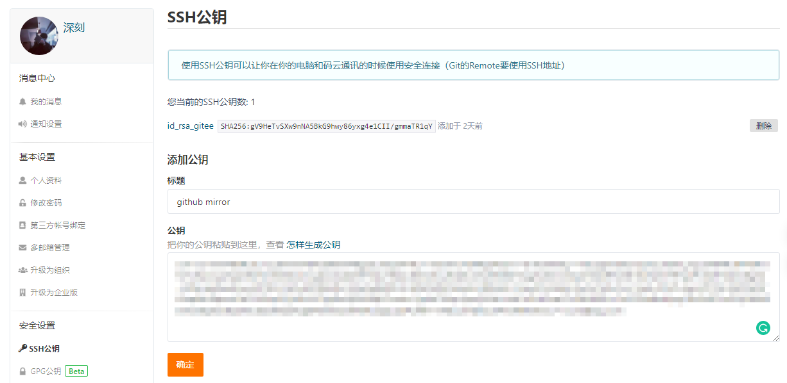
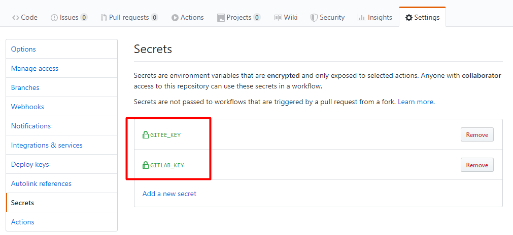

##  通过 GitHub Actions 将 GitHub 仓库自动备份同步到 Gitee

### 1. gitee 配置ssh公钥 


### 2. 将ssh 私钥 配置 github 项目设置  Secrets ，命名 GITEE_SYNC



### 3. github 项目配置 workflow

  根目录创建 `.github/workflows/mirror.yml`

  ```yml

  name: 'GitHub Actions Mirror'

    on: [push,pull_request]

    jobs:
    mirror_to_gitee:
        runs-on: ubuntu-latest
        steps:
        - name: 'Checkout'
            uses: actions/checkout@v1
        - name: 'Mirror to gitee'
            uses: pixta-dev/repository-mirroring-action@v1
            with:
            target_repo_url:
                git@gitee.com:username/project-name.git
            ssh_private_key:
                ${{ secrets.GITEE_SYNC }}  

  ```

### 4. 代码push 到github仓库 触发 action , gitee 会自动同步备份 