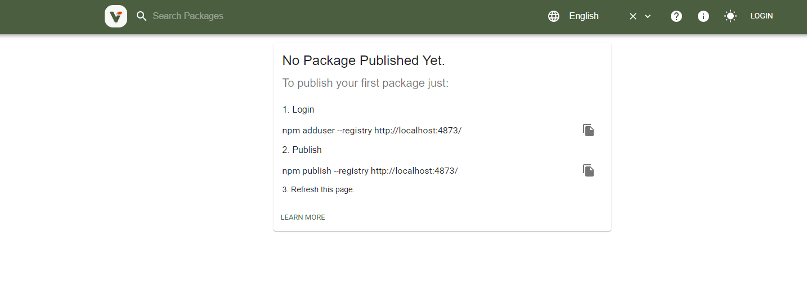

##  使用verdaccio 搭建私有npm 服务器

### 1. 安装 `npm install –global verdaccio`

### 2. 运行 `verdaccio`

 

### 3. 当前npm 服务指向 本地

    npm set registry http://localhost:4873

### 4. 注册用户

    npm adduser –registry http://localhost:4873

### 5. 查看当前用户,是否是注册用户.

    npm who am i

### 6. 发布包 `npm publish`

