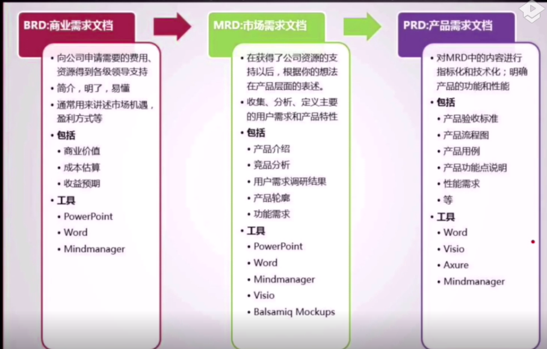

## 1.BRD 商业需求文档

> 发现并讲清楚你发现的商业价值 （Business Requirement Document）

#### 1.1 方案形成背景

1.  市场环境分享
2.  我们要做什么
3.  要解决什么问题

- 该问题是否迫切，频率高不高

4.  我们要如何做，优势在哪里
5.  得出结论

#### 1.2 方案价值

1.  我们将得到什么好处

- 非经济类
  - 战略优势等
- 经济类
  - 收入

2.  自己预测

#### 1.3 产品规划

1.  产品结构(大功能结构，非功能结构)

2.  产品路线图

#### 1.4 盈利模式

1.  如何通过一系列方法实现方案价值

#### 1.5 收益与成本评估

1.  各团队部门的预算

#### 1.6 风险和对策

1. 风险类型

   - 政策风险
   - 经济风险
   - 市场风险
   - 行业风险
   - 公司风险
   - 技术风险
   - 资本风险

2. 应对方法

   - 规避
   - 接受
   - 降低
   - 分担
   - 转移

## 2.MRD 市场需求文档

> 如何实现商业目标的方式 (Market Requirement Document)

#### 2.1 文档说明

- 文档信息
  1. 公司名称
  2. 文档名称
  3. 创建日期/人/部门/职务
  4. 修改记录=>人/日期/版本/内容标题/审核人
- 文档目的
  1. 说明相关市场，用户，产品规划，路线图，产品目标

#### 2.2 市场分析

- 市场定位 （例如：通讯市场，设备市场，手机发烧友，白领，学生）
- 现有市场存在的问题和机会
  1. 产品方面（例如：产品复杂，体验差）
  2. 技术方面（例如：技术落后）
  3. 运营方面
  4. 用户方面
  5. 商业模式方面
- 市场规模及趋势

#### 2.3 用户分析

- 目标用户群体（年龄，学历，职业，兴趣，地区，收入）
  tip: 可以尝试建立虚拟用户角色（形象化）
  （张三 22 本科，待业，玩游戏，北京，无）
- 群体特征 (爱玩游戏...)
- 目标用户动机总结
- 影响目标用户使用主要因素

#### 2.4 产品说明

- 产品定位 （用什么产品满足用户市场需求）
  1. 陌陌：地理移动社交
  2. QQ 空间：分享交流平台，QQ 的通讯补充工具
- 产品核心目标 （解决用户和市场的需求）
  1. 360:解决电脑安全使用问题
- 产品结构
- 产品路线图（产品成长中以时间为节点的任务组合图）

## 3. PRD 产品需求文档

> 把这种方式具体实现的方法描述出来 (Product Requirement Document)

