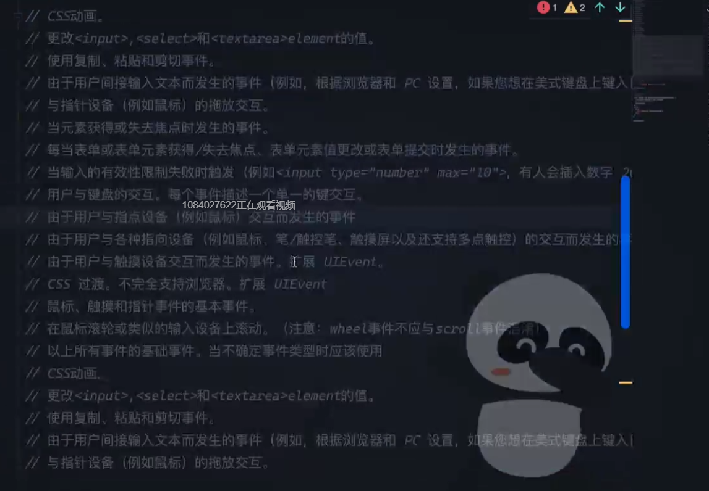

# 笔记

- `FC(function component)` 带 `children` `vfc` `不带children`,`fc` 不推荐，多余
- `{}` 是万能类型 但与 `object` 相等,小写`object`只表示类型
- `xxx!  useRef(HTMLElement)(null!)` 可用于骗ts,不用去层层判断非null 
- `Function` 不要做类型使用
- `interface` 在不知道数据是什么类型，如对接接口，写 sdk 时使用。在自己声明对象是不需要用，ts 会自动类型推断
  ```ts
  interface A {
    str: string;
    num: number;
  }
  //不需要 interface
  const a: A = {
    str: "123",
    num: 123,
  };
  ```
- 解构数组时

  ```ts
  function test() {
    const str = "str";
    const num = 1;
    //错误
    // return [str, num] //这样使用时 t 和 f 都是联合类型 string | number

    //正确
    // return [str, num] as const //这样使用时 t 是string  f 是 number 更精确
    return tr(str, num); //使用封装工具
  }
  const [t, f] = test();
  console.log(t);
  console.log(f);

  //强制转换为数组
  function tr<T extends unknown[]>(...ele: T): T {
    return ele;
  }
  ```

- `React.SyntheticEvent<HTMLInputElement>` `SyntheticEvent`事件是 React 合成事件总事件，如果像类似表单中 event 不知道用什么，就用这个
  ```ts
  const onChange = (e: React.SyntheticEvent<HTMLInputElement>) => {
    const target = e.target as typeof e.target; //反推target类型
  };
  ```
- 组件 `defaultProps`
  ```ts
   interface IProps{
    name:string;
   }
   const defaultProps={
      age:25
   };
  //类型组合
   const MyComponent=({name,age}:IProps & typeof defaultProps)=>(
    <div>{name,age} </div>
   );
  //组件默认值
  MyComponent.defaultProps=defaultProps
  ```

 - 获取继承某组件的传值
    ```ts
    type ComponentProps<T>=T extends  
      | React.Component<infer p>
      | React.ComponentType<infer p>
      ? JSX.LibraryManagedAttributes<T,P>:never;

    const TestComponent=(props:ComponentProps<typeof MyComponent>)=>{
      return <div>{props.age}</div>
    }
    
    return <TestComponent name='test'/>

    ```

- 常用类型

  
  
  

- lib.es5.d.ts 官方源码文件