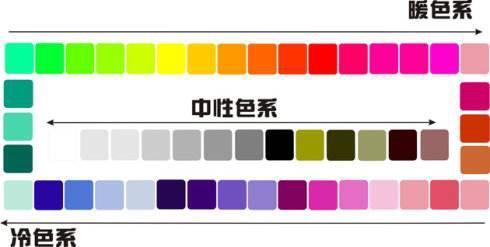

> ## 基础

- 特征：冷暖，性别，轻重，大小，味道
- 搭配：单色，类比色，补色，分裂补色，原色
- 比列：底色多，主色，次，辅助色（强调色）少 70% 25% 5%

> ## 补色

    色环相距 180° 对立的两种颜色称之为补色搭配

> ## 原色

    色环相距120°对立的两种颜色称之为原色搭配

> ## 消色

    消色指黑白灰，本身无色性，属于万用搭配色，由于本身无色性，必须和色性较强的颜色搭配比较出效果,多用于背景色

> ## 三色

    三色搭配
    强调色：5%
    主色：25%
    底色：70%

> ## 不同网站色彩主题

    红色：喜庆，热情，火焰，浪漫
    橙色：温暖，食物，友好，财富，金钱，活动抽奖
    黄色：活跃，光明，活动专题，食物
    绿色：生命，安全，环境，公益，儿童
    蓝色：正式网站，安全，游戏
    紫色：浪漫，女性，高贵，时尚，节日
    黑色：正统，严肃，城中，能力，精致，黑暗
    灰色：平凡，随意，宽容，冷漠
    白色：纯洁，神圣,干净，底色

